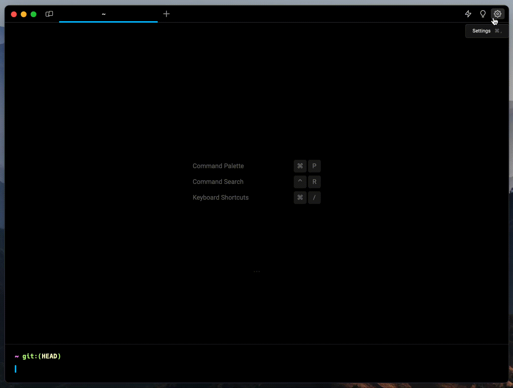

# What is Warp?

## Demo

To learn more about Warp, check out this demo video by our [Developer Advocate](https://www.warp.dev/about-us), [Jess Wang](https://twitter.com/daRubberDuckiee) (April 2023).


Warp Demo


## Warp Essentials

The Warp Essentials panel is a resource center that contains keyboard shortcuts, an updated changelog, and tips for getting started. Access it by clicking on the light bulb icon 💡 or by pressing `CTRL-SHIFT-/`.

<figure><figcaption>
Open the Warp Essentials panel for resources.
</figcaption></figure>

## Join the community

Stay connected to the team at Warp and get updates on latest releases:

* Visit Warp's [Blog](https://www.warp.dev/blog) to read about new features and engineering topics.
* Subscribe to Warp's [YouTube](https://www.youtube.com/channel/UCKONdcQCTP3aozARj1ntKhw) and [TikTok](https://www.tiktok.com/@warp.dev) channels for longer demos and insider stories.
* Join Warp's [Discord](https://www.warp.dev/community) to interact directly with Warp engineers and other developers.
* Follow Warp on [Twitter](https://twitter.com/warpdotdev) for updates and terminal tips.
