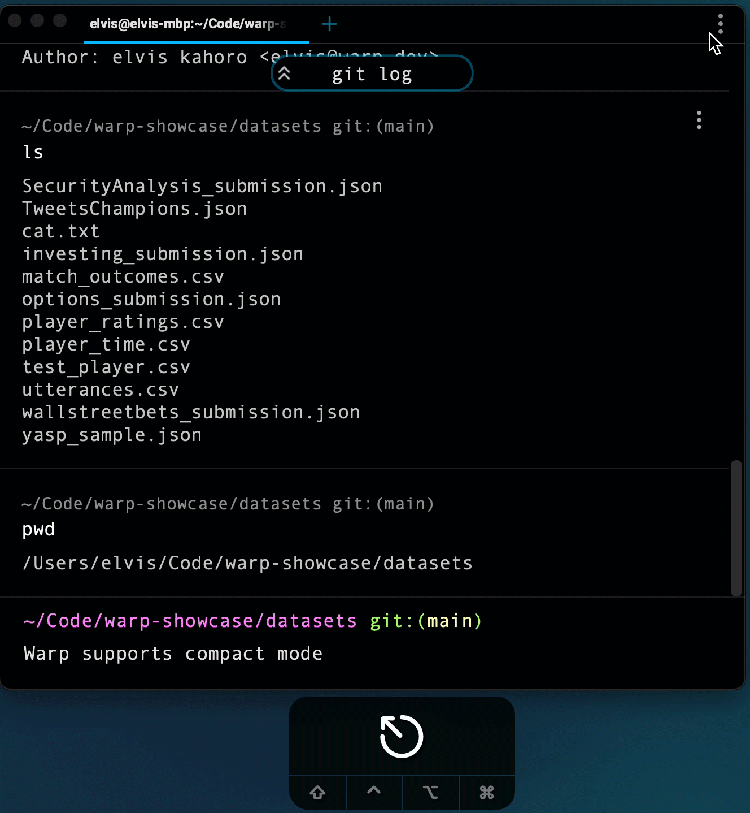

# Compact Mode

## How to access it

1. Compact Mode can be toggled through `Settings > Appearance > Compact Mode` or through the Command Palette search for "Compact mode" to toggle.


Warp will open with the same compact settings in future sessions.


## How it works

<figure><figcaption>
Compact Mode Demo
</figcaption></figure>
