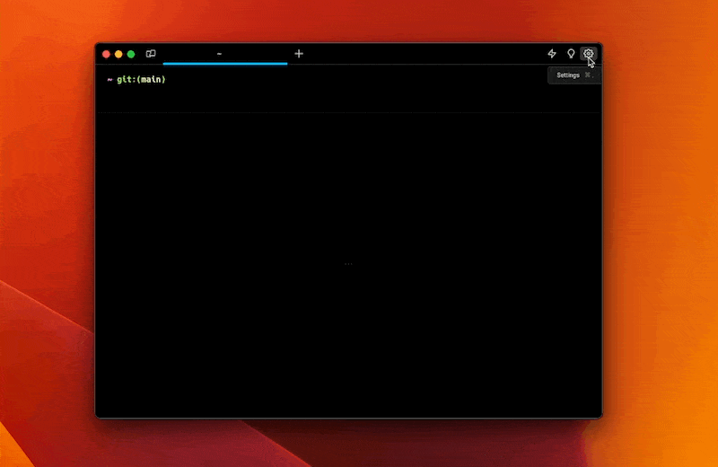

# Size, Opacity, & Blurring

## What is it

Warp supports settings for Window size, opacity ( transparency ), and blurring effects. This can help setting up specific terminal layouts, and with seeing any other tasks or processes behind the terminal window.

## How to use it

### Window Size

### Window Opacity

To access it, go to `Settings > Appearance > Themes`

* The slider supports setting the opacity value between `1` and `100` where `100` is completely opaque or solid.

### Window Blurring

After removing Opacity ( moving the slider to a value less than `100)`, you can also blur the background using the blur slider.

* Increasing the slider increases the blur radius that's applied to the background image.


Large blur radiuses may cause affect performance, especially on Retina displays.


## How it works

<figure><figcaption>
Window Size Demo
</figcaption></figure>


Window Opacity and Blurring Demo

