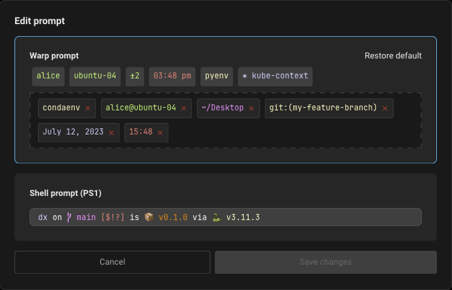
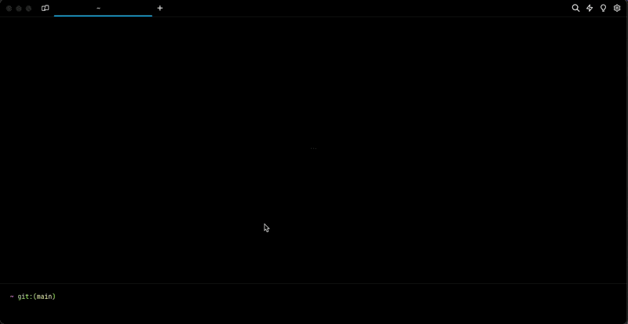

# Prompt

### Warp Prompt

Warp has a native prompt that is customizable and can show a variety of information including cwd, git, svn, kubernetes, pyenv, date, time, etc.

#### Git and Subversion

Git and Subversion context chips show which branch you are on locally, as well as the number of uncommitted changed files. This includes any new files, modified files, and deleted files that are staged or unstaged.

#### Kubernetes

Kubernetes context chip shows relevant information when you're using one of the following commands:

`kubectl|helm|kubens|kubectx|oc|istioctl|kogito|k9s|helmfile|flux|fluxctl|stern|kubeseal|skaffold|kubent|kubecolor|cmctl|sparkctl|etcd|fubectl`


Warp respects the `KUBECONFIG` environmental variable, make sure you set it to your preferred configuration file location, if it's not the default path of `~/.kube/config`


### Custom Prompt

You can also set up a custom prompt by configuring the **PS1** variable or installing a supported shell prompt plugin, see [Custom Prompt Compatibility Table](prompt.md#custom-prompt-compatibility-table). _Note:_ The PS1 is a variable used by the shell to generate the prompt, it represents the primary prompt string (hence the “PS”) - which is what the terminal typically displays before typing new commands.

#### Multi-Line and Right-Sided Prompts

Warps custom prompt supports multi-line or right-sided prompts in zsh and fish, not bash. However, you can't have a multiline right-side prompt, only a multiline left prompt. You also can't have the cursor on the same line as the prompt (we're working on supporting [this](https://github.com/warpdotdev/Warp/issues/2304)). Warp renders the cursor on a fresh new line within the [Input Editor](../features/editor/), a separate UI element from the prompt.

## How to access it

* Toggle the custom prompt by right-clicking on the prompt area above the input and selecting "Edit prompt" or select "Prompt" from the `Settings > Appearance` page. There you will be able to select and customize the default prompt or select the Custom prompt (PS1).
* When right-clicking the prompt, you can copy the entire prompt, working directory, current git branch, etc.

<figure><figcaption><p>Edit Warp Prompt Modal</p></figcaption></figure>

## How it works

<figure><figcaption><p>Warp Prompt + Custom Prompt Demo</p></figcaption></figure>


Installing Powerlevel10k



Please note the installing powerlevel10k video mentions enabling a custom prompt in `Settings > Features`, but it's now in `Settings > Appearance`, see [above](prompt.md#how-to-access-it) for the updated steps.


### Custom Prompt Compatibility Table

| Shell               | Tool                                                              | Does it work?                                                   |
| ------------------- | ----------------------------------------------------------------- | --------------------------------------------------------------- |
| bash \| zsh         | [PS1](https://www.warp.dev/blog/whats-so-special-about-ps1)       | Working                                                         |
| bash \| zsh \| fish | [Starship](https://github.com/starship/starship)                  | [Working\*](prompt.md#starship)                                 |
| bash \| zsh \| fish | [oh-my-posh](https://github.com/JanDeDobbeleer/oh-my-posh)        | Working                                                         |
| zsh                 | [Powerlevel10k](https://github.com/romkatv/powerlevel10k)         | [Working\*](prompt.md#powerlevel10k)                            |
| zsh                 | [Spaceship](https://github.com/spaceship-prompt/spaceship-prompt) | [Working\*](prompt.md#spaceship)                                |
| zsh                 | [oh-my-zsh](https://github.com/ohmyzsh/ohmyzsh)                   | Working                                                         |
| zsh                 | [prezto](https://github.com/sorin-ionescu/prezto)                 | Working                                                         |
| ssh                 |                                                                   | Working                                                         |
| zsh                 | [zplug](https://github.com/zplug/zplug)                           | Not supported                                                   |
| bash                | [SBP](https://github.com/brujoand/sbp)                            | Not supported                                                   |
| bash \| zsh         | [Powerline-shell](https://github.com/b-ryan/powerline-shell)      | Not supported                                                   |
| fish                | [tide](https://github.com/IlanCosman/tide)                        | [Not supported](https://github.com/warpdotdev/Warp/issues/3358) |
| fish                | [oh-my-fish](https://github.com/oh-my-fish/oh-my-fish)            | [Not supported](https://github.com/warpdotdev/Warp/issues/3796) |

## Known incompatibilities

If you’re having issues with prompts, please see below or our [Known Issues](../help/known-issues.md#configuring-and-debugging-your-rc-files) for more troubleshooting steps.

### Starship

#### Starship Settings

Some \~/.config/starship.toml settings are known to cause errors in Warp. `#` or `DEL` the following lines to resolve known errors:

```
# Get editor completions based on the config schema
'' = 'https://starship.rs/config-schema.json'

# Disables the custom module
[custom]
disabled = false
```

StarshipFor `fish` shell (optional for `bash|zsh`), disable the multi-line prompt in starship by putting the following in your `~/.config/starship.toml`:

```
[line_break]
disabled = true
```

#### Starship + Bash

Starship prompt may not render properly if your [default shell](../getting-started/using-warp-with-shells.md#changing-default-shell) is `/bin/bash`. To workaround the issue, we recommend you upgrade bash, find the path with `echo $(which bash)`, then put the path in your `Settings > Features > Session > "Startup shell for new sessions" > Custom`, as noted in [#3066](https://github.com/warpdotdev/Warp/issues/3066#issuecomment-1548643121).

#### Powerlevel10k

Powerlevel10k prompt may display the arrow dividers as grey instead of color. The color for those chars is rendered grey due to Warp's minimum contrast setting, as Warp updates colors to enforce a minimum contrast ratio for readability.\
To [fix](https://github.com/warpdotdev/Warp/issues/2851#issuecomment-1605005256) this issue, go to `Settings > Appearance > Text > Enforce minimum contrast` and set it to "Never".

<figure><figcaption><p>Example of the grey dividers in p10k</p></figcaption></figure>

Warp does support [p10k](https://github.com/romkatv/powerlevel10k#installation) version 1.19.0 and above. Make sure you have the latest version installed as well as restart Warp after the installation/update of p10k. Then enable the custom prompt as stated [above](prompt.md#how-to-access-it) and it should work.


Warp still doesn't fully support some p10k features like transient prompt and visual features like gradients.


#### Spaceship

This prompt can cause an [issue](https://github.com/warpdotdev/Warp/issues/1973) with typeahead in Warp's input editor.\
To workaround the issue, run `echo "SPACESHIP_PROMPT_ASYNC=FALSE" >>! ~/.zshrc`

### Disabling unsupported prompts for Warp

We advise using Warp's default prompt or installing one of the supported tools, see [Compatibility Table](prompt.md#custom-prompt-compatibility-table). You can disable unsupported prompts for Warp as such:

```
if [[ $TERM_PROGRAM != "WarpTerminal" ]]; then
##### WHAT YOU WANT TO DISABLE FOR WARP - BELOW

    # Unsupported Custom Prompt Code

##### WHAT YOU WANT TO DISABLE FOR WARP - ABOVE
fi
```

### iTerm2

The iTerm2 shell integration breaks Warp and your custom prompt will not be able to be visible with this on. If you're coming from iTerm2 please check your dotfiles for it. We advise disabling the integration for Warp like so:

```
if [[ $TERM_PROGRAM != "WarpTerminal" ]]; then
##### WHAT YOU WANT TO DISABLE FOR WARP - BELOW

test -e "${HOME}/.iterm2_shell_integration.zsh" && source "${HOME}/.iterm2_shell_integration.zsh"

##### WHAT YOU WANT TO DISABLE FOR WARP - ABOVE
fi
```
