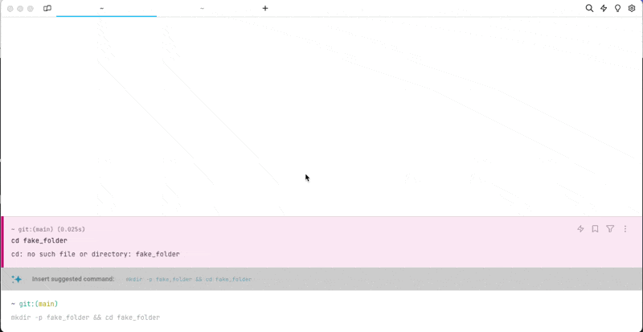

# Tab Indicators

## How to toggle Tab Indicators

* **Through Settings:** Navigate to `Settings > Appearance > Tabs`, and switch the "Show Tab Indicators" option. This setting enables you to enable or disable tab indicators based on your preference.
* **Using the Command Palette (CMD-P):** Utilize the Command Palette by pressing CMD-P, then search for "tab indicators." From the results, enable or disable tab indicators as needed. This method provides a quick and convenient way to toggle tab indicators directly within your workflow.

<figure><figcaption>
Tab Indicator Demo
</figcaption></figure>

By adjusting the visibility of tab indicators, you can customize your workspace to align with your preferences, enhancing your overall user experience.
