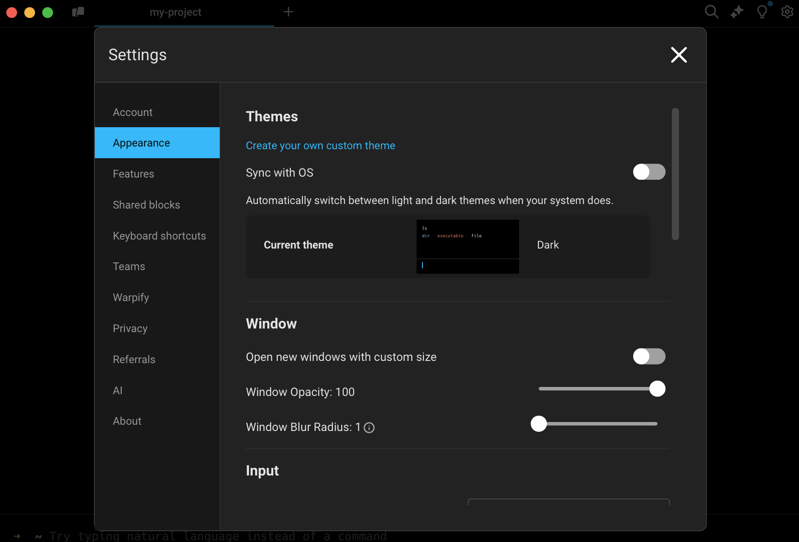
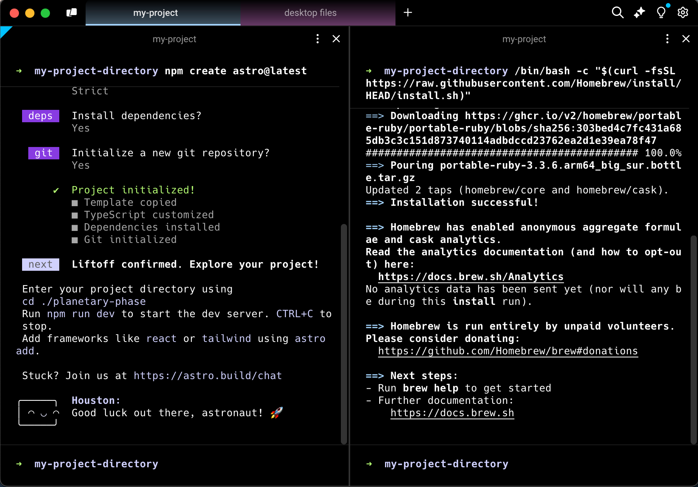

# Quickstart Guide



**Platform support:** Warp is supported on macOS (Intel and Mac Silicon), Windows (x86\_64 and ARM64), and Linux (x86\_64 and ARM64)


## Install Warp


**Visit** [Known Issues](help/known-issues.md) **to get more details on setting up and troubleshooting Warp.**





**Minimum requirements:** Intel or Apple silicon macOS 10.14 or above and hardware that supports [Metal](https://support.apple.com/en-us/HT205073).


**Download Warp and drag into your Applications folder**


Download Warp


**Install using Homebrew by running the command below**

```bash
brew install --cask warp
```

After installation, you can find Warp in your Applications folder.




**Minimum requirements:** Warp is supported on Windows 10, build 18309 or or Windows Server 2019 later. This is a requirement for [conPTY](https://devblogs.microsoft.com/commandline/windows-command-line-introducing-the-windows-pseudo-console-conpty/).


**Download Warp, then open and run the installer**


Download Warp


**Install using WinGet by running the command below**

```powershell
winget install Warp.Warp
```

After installation, you can find Warp in the Start menu.




**Minimum requirements:** Linux distribution with glibc >= 2.31 (released Feb. 2020) and support for _either_ [OpenGL ES 3.0+ or Vulkan](https://github.com/gfx-rs/wgpu?tab=readme-ov-file#supported-platforms).

This includes (but is not limited to) the following:

* Ubuntu 20.04
* Debian 11 ("bullseye")
* Fedora 32
* Arch Linux


**Visit the Warp download page for the full list of Linux installation options**


Download Warp


**Debian- and Ubuntu-based distributions**

The easiest way to install Warp is to download [x64 .deb package](https://app.warp.dev/download?package=deb) or [ARM64 deb package](https://app.warp.dev/download?package=deb_arm64). After downloading, you can install the package with:

```
sudo apt install ./<file>.deb
```

Installing the .deb package will automatically set up the Warp apt repository and signing key needed to automatically update Warp and verify the integrity of the downloaded packages.

Alternatively, you can manually configure the Warp apt repository and install Warp by running the following commands:

```
sudo apt-get install wget gpg
wget -qO- https://releases.warp.dev/linux/keys/warp.asc | gpg --dearmor > warpdotdev.gpg
sudo install -D -o root -g root -m 644 warpdotdev.gpg /etc/apt/keyrings/warpdotdev.gpg
sudo sh -c 'echo "deb [arch=amd64 signed-by=/etc/apt/keyrings/warpdotdev.gpg] https://releases.warp.dev/linux/deb stable main" > /etc/apt/sources.list.d/warpdotdev.list'
rm warpdotdev.gpg
sudo apt update && sudo apt install warp-terminal
```

**RHEL-, Fedora-, and CentOS-based distributions**

The easiest way to install Warp is to download the [x64 .rpm package](https://app.warp.dev/download?package=rpm) or [ARM64 .rpm package](https://app.warp.dev/download?package=rpm_arm64). After downloading, you can install the package with:

```bash
sudo dnf install ./<file>.rpm
```

Installing the .rpm package will automatically set up the Warp yum repository. On first update, `dnf` will retrieve the signing key needed to verify the integrity of the downloaded packages.

Alternatively, you can manually configure the Warp yum repository and install Warp by running the following commands:

```bash
sudo rpm --import https://releases.warp.dev/linux/keys/warp.asc
sudo sh -c 'echo -e "[warpdotdev]\nname=warpdotdev\nbaseurl=https://releases.warp.dev/linux/rpm/stable\nenabled=1\ngpgcheck=1\ngpgkey=https://releases.warp.dev/linux/keys/warp.asc" > /etc/yum.repos.d/warpdotdev.repo'
sudo dnf install warp-terminal
```

**Arch Linux-based distributions**

The easiest way to install Warp is to download the [x64 .pkg.tar.zst package](https://app.warp.dev/download?package=pacman) or [ARM64 pacman package](https://app.warp.dev/download?package=pacman_arm64). After downloading, you can install the package with:

```bash
sudo pacman -U ./<file>.pkg.tar.zst
```

The first time you update Warp through the app, it will guide you through setting up the Warp pacman repository and signing key.

Alternatively, you can manually configure the Warp pacman repository and install Warp by running the following commands:

```bash
sudo sh -c "echo -e '\n[warpdotdev]\nServer = https://releases.warp.dev/linux/pacman/\$repo/\$arch' >> /etc/pacman.conf"
sudo pacman-key -r "linux-maintainers@warp.dev"
sudo pacman-key --lsign-key "linux-maintainers@warp.dev"
sudo pacman -Sy warp-terminal
```

**OpenSUSE- and SLE-based distributions**

The Warp yum repository also works for OpenSUSE- and SLE-based systems. Download the [x64 .rpm package](https://app.warp.dev/download?package=rpm) or [ARM64 .rpm package](https://app.warp.dev/download?package=rpm_arm64). After downloading, you can install the package with:

```bash
sudo zypper install ./<file>.rpm
```

Installing the .rpm package will automatically set up the Warp yum repository. On first update, `zypper` will retrieve the signing key needed to verify the integrity of the downloaded packages.

Alternatively, you can manually configure the Warp yum repository and install Warp by running the following commands:

```bash
sudo rpm --import https://releases.warp.dev/linux/keys/warp.asc
sudo sh -c 'echo -e "[warpdotdev]\nname=warpdotdev\ntype=rpm-md\nbaseurl=https://releases.warp.dev/linux/rpm/stable\nenabled=1\nautorefresh=1\ngpgcheck=1\ngpgkey=https://releases.warp.dev/linux/keys/warp.asc\nkeeppackages=0" > /etc/zypp/repos.d/warpdotdev.repo'
sudo zypper install warp-terminal
```

**AppImage**

We also provide an [AppImage](https://appimage.org), a single-file executable version of Warp. Installing Warp via a package manager is recommended, as it will ensure your system has all necessary dependencies installed.

You can download the Warp AppImage with the following commands:

```bash
# On x64 systems
curl -L "https://app.warp.dev/download?package=appimage" -o Warp-x64.AppImage
chmod +x Warp-x64.AppImage
```

```bash
# On ARM64 systems
curl -L "https://app.warp.dev/download?package=appimage_arm64" -o Warp-ARM64.AppImage
chmod +x Warp-ARM64.AppImage
```

**Running Warp on Linux**

If you installed a package, find Warp in your desktop manager or run `warp-terminal` on your terminal. If you're using the AppImage, you can launch it by navigating to the directory where the AppImage is located and running `./Warp-*.AppImage`.



## Initial Setup

### Log in to Warp (Optional)

After installation, you have the option to create a Warp account thru the "Sign up" bottom on the top right or in `Settings > Account > Sign up`. You have the option to skip this step. If you're having issues logging in, you can check out the [Login Troubleshooting](help/troubleshooting-login-issues.md) page.


If you sign up using Google or GitHub, Warp only gets access to the associated email address. Visit the [Privacy](getting-started/privacy.md) page for more details on Warp's approach to privacy.


### Onboarding Survey (Optional)

Warp will ask a few questions within the app after you sign up. The survey is optional. You can skip all questions if you’d like. Why do we ask these? Understanding how you use the terminal helps us improve the product and prioritize the right features to build.

### Use Warp offline

You will only need an active internet connection when you open the Warp app for the first time. Once opened, [Warp is able to run with no internet connection](help/using-warp-offline.md), although certain features that require an internet connection will be unavailable.

### Import your settings

If you are migrating to Warp from another terminal like iTerm2, you can easily import your settings, such as keyboard shortcuts and color themes. For more details, visit the [Migrate to Warp](getting-started/migrate-to-warp.md) docs.

### Set up your Warp default shell

Warp tries to load your login shell by default. Currently, Warp supports bash, fish, zsh, and PowerShell (pwsh). If your login shell is set to something else (for example, Nushell) Warp will load zsh by default.

Zsh is the default login and interactive shell on macOS (starting with macOS Catalina in 2019), replacing the bash shell. For most Linux distributions, the default shell is bash.

You can change your default shell by going to `Settings > Features > Session`. In the Startup shell for new sessions section, you can choose which shell you want Warp to use.

### Customize Warp's Appearance

Warp has many Appearance settings you can configure:

* [Themes](https://docs.warp.dev/appearance/themes): You can choose from pre-loaded themes or create your own [custom theme](https://docs.warp.dev/appearance/custom-themes), using .yaml or based on a background image you upload.
* [Text and fonts](https://docs.warp.dev/appearance/text-fonts-cursor): You can customize your font type and font size. You can also adjust the font to improve readability and accessibility.
* [Input position](https://docs.warp.dev/appearance/input-position): Set your prompt and command line to the top or bottom of your terminal window.

Navigate to `Settings > Appearance` to customize your setup.

<figure><figcaption><p>Settings > Appearance</p></figcaption></figure>

### Modify behavior settings

There are a number of behavior settings and features that will help you customize your terminal to best suit your needs:

* [Dedicated window](https://docs.warp.dev/features/windows/global-hotkey#dedicated-window): Dedicated hotkey window (also known as Quake Mode) allows you to customize your window’s position, width, and height ratio relative to your active screen size.
* [Tabs](features/windows/tabs.md): Organize your windows into multiple terminal sessions, and customize them with different titles and/or colors.
* [Split panes](https://docs.warp.dev/features/windows/split-panes): Divide any tab into multiple panels, side-by-side or stacked.

<figure><figcaption><p>Organize tabs and divide them into multiple panels</p></figcaption></figure>

* [Auto suggestions](https://docs.warp.dev/features/command-completions/autosuggestions): As you type, Warp will automatically suggest commands based on shell history and possible completions.
* [Completions](https://docs.warp.dev/features/command-completions/completions): When you press TAB, Warp will suggest commands, option names, and path parameters for you. Customize your TAB key behavior under `Settings > Features`.
* [Vim keybindings](https://docs.warp.dev/features/editor/vim): Warp supports default Vim keybindings, allowing for keyboard-driven text editing.
* [Keyboard shortcuts](https://docs.warp.dev/features/keyboard-shortcuts): Warp supports commonly used keyboard shortcuts. You can also set custom keyboard shortcuts by creating new commands or editing existing shortcuts.
* [Open files and links](https://docs.warp.dev/features/files-and-links): Using your cursor, you can open files, folders, and URL links that are within Blocks. You can also [configure the default editor to open files](https://docs.warp.dev/features/files-and-links#files-and-links-1).
* [Command Corrections](features/entry/command-corrections.md): Get auto-correct suggestions on commands to catch typos, forgotten flags, and general console errors.
