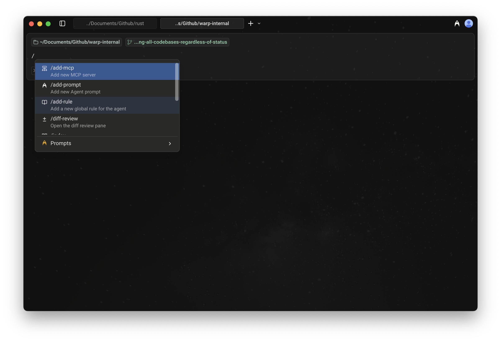
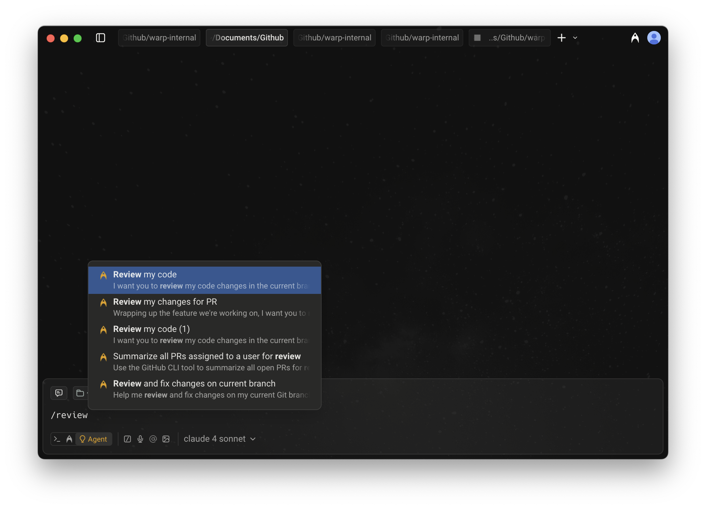
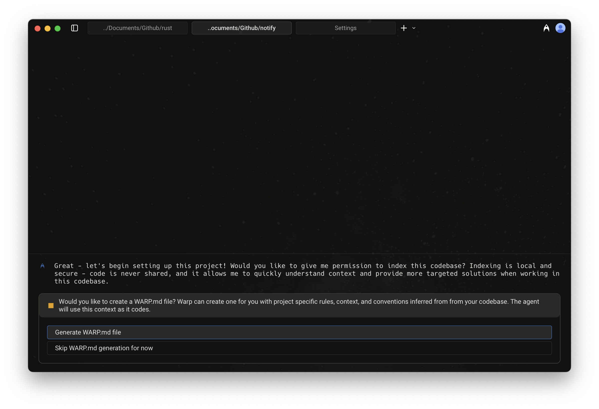
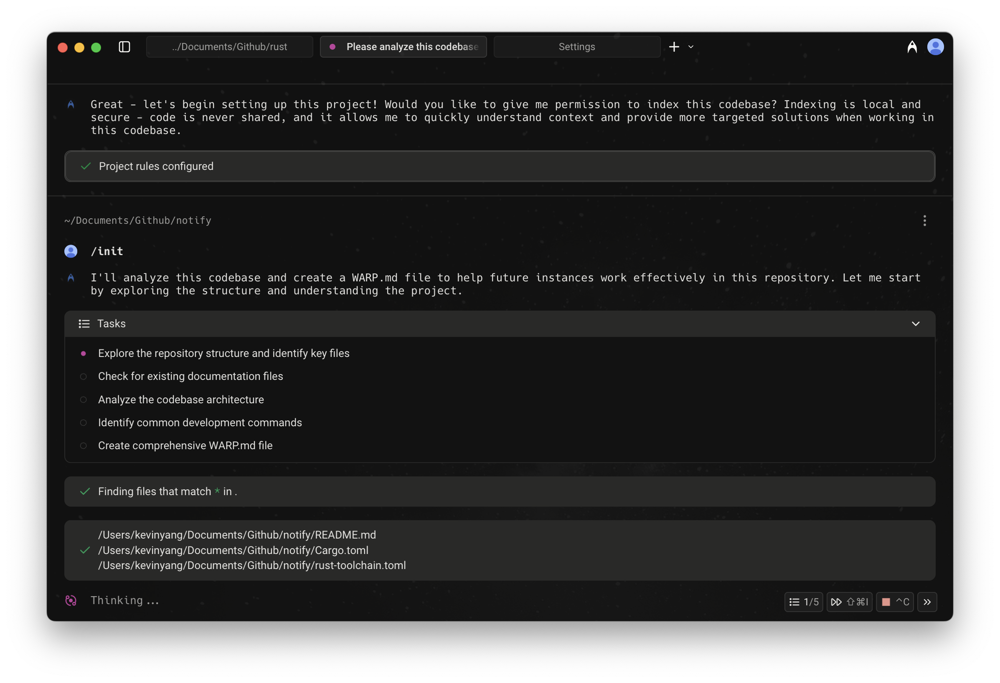

# Slash Commands

When using Agent Mode or Auto-Detection Mode, typing `/` in the input field opens the Slash Commands menu.

<figure><figcaption>
Slash Commands menu
</figcaption></figure>

As you type, the menu filters results in real time, making it easy to find and run the command or prompt you need.

## Static Slash Commands

Warp currently supports the following built-in Slash Commands:

<table><thead><tr><th width="211.64453125">Slash Command</th><th>Description</th></tr></thead><tbody><tr><td><code>/add-mcp</code></td><td>Add a new <a href="https://docs.warp.dev/knowledge-and-collaboration/mcp">MCP server</a>.</td></tr><tr><td><code>/add-prompt</code></td><td>Add a new <a href="https://docs.warp.dev/knowledge-and-collaboration/warp-drive/prompts">Agent Prompt</a> in Warp Drive.</td></tr><tr><td><code>/add-rule</code></td><td>Add a new <a href="https://docs.warp.dev/knowledge-and-collaboration/rules">Global Rule</a> for the Agent.</td></tr><tr><td><code>/compact</code></td><td>Free up context by summarizing convo history.</td></tr><tr><td><code>/create-environment</code></td><td>Create a <a href="https://docs.warp.dev/agent-platform/integrations/integrations-overview">Warp Environment</a> (Docker image + repos) via guided setup. <code>*</code></td></tr><tr><td><code>/create-new-project</code></td><td>Have the agent walk you through creating a new coding project. <code>*</code></td></tr><tr><td><code>/diff-view</code></td><td>Open the <a href="https://docs.warp.dev/code/reviewing-code">diff view pane</a>.</td></tr><tr><td><code>/fork</code> </td><td><a href="using-agents/agent-conversations/conversation-forking.md">Forks the current conversation</a> into a new thread with the full context and history of the original.   You can optionally include a prompt that will be sent immediately in the forked conversation.</td></tr><tr><td><code>/fork-and-compact</code></td><td><a href="using-agents/agent-conversations/conversation-forking.md">Forks the current conversation</a> and automatically compacts the forked version.  Useful when you want a fresh, summarized starting point that preserves relevant context while trimming the rest.</td></tr><tr><td><code>/index</code></td><td>Index the current codebase using <a href="https://docs.warp.dev/code/codebase-context">Codebase Context</a>.</td></tr><tr><td><code>/init</code></td><td>Index the current codebase and generate an <a href="https://docs.warp.dev/knowledge-and-collaboration/rules">AGENTS.md file</a>. <code>*</code></td></tr><tr><td><code>/new-conversation</code></td><td>Start a new <a href="using-agents/agent-conversations/">agent conversation</a>.</td></tr><tr><td><code>/open-skill</code></td><td>Open an interactive menu to browse and edit project or global <a href="skills.md">skills</a>.</td></tr><tr><td><code>/plan</code></td><td>Prompt the agent to do some research and create a <a href="using-agents/planning.md">plan</a> for a task.</td></tr><tr><td><code>/open-project-rules</code></td><td>Open the <a href="https://docs.warp.dev/knowledge-and-collaboration/rules#project-rules">Project Rules</a> file (<code>AGENTS</code>).</td></tr><tr><td><code>/view-mcp</code></td><td>View the status of your <a href="https://docs.warp.dev/knowledge-and-collaboration/mcp">MCP servers</a>.</td></tr></tbody></table>


Slash commands marked with a `*` consume credits to complete the task.


#### Using Prompts via Slash Commands

In addition to static commands, the menu also shows [Agent Prompts](https://docs.warp.dev/knowledge-and-collaboration/warp-drive/prompts) saved in your [Warp Drive](https://docs.warp.dev/knowledge-and-collaboration/warp-drive/).

* These prompts can be custom ones you’ve created or ones shared with you.
* As you type after `/`, prompts are filtered dynamically, so you can quickly run them without leaving the input field.

<figure><figcaption>
Slash Commands menu with filtered Agent Prompts
</figcaption></figure>

### Tips

* **Context-aware:** Many Slash Commands use your current working directory or file selection as context.
* **Quick access:** Use `/` from anywhere in Agent Mode or Auto-Detection Mode to avoid navigating through menus.

### Example of using a Slash Command

Below is an example interaction when `/init` is ran:

<figure><figcaption>
/init setup flow; 1 of 2
</figcaption></figure>

<figure><figcaption>
/init setup flow; 2 of 2
</figcaption></figure>
