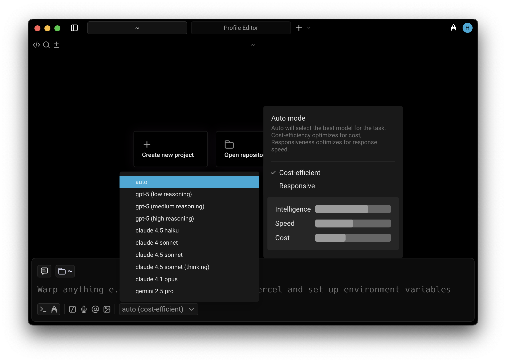

# Model Choice

## Available models

Warp lets you choose from a curated set of Large Language Models (LLMs) to power your Agentic Development Environment.

**Warp supports the following models:**

* OpenAI:
  * `GPT-5.3 Codex` (_low, medium, high_, and _extra high_ reasoning)
  * `GPT-5.2 Codex` (_low, medium, high_, and _extra high_ reasoning)
  * `GPT-5.2` (_low, medium, high_, and _extra high_ reasoning)
  * `Galapagos` (_low, medium, high_, and _extra high_ reasoning)
  * `GPT-5.1 Codex Max` (_low, medium, high_, and _extra high_ reasoning)
  * `GPT-5.1 Codex` (_low, medium,_ and _high_ reasoning)
  * `GPT-5.1` (_low, medium,_ and _high_ reasoning)
  * `GPT-5` (_low, medium,_ and _high_ reasoning)
  * `GPT-5 Mini`
* Anthropic:
  * `Claude Opus 4.6` (_default_ and _max_ effort)
  * `Claude Sonnet 4.6` (_default_ and _max_ effort)
  * `Claude Opus 4.5` (_off_ and _thinking_ mode)
  * `Claude Sonnet 4.5` (_off_ and _thinking_ mode)
  * `Claude Opus 4.1`
  * `Claude Haiku 4.5`
  * `Claude Sonnet 4` (_off_ and _thinking_ mode)
* Google:
  * `Gemini 3.1 Pro`
  * `Gemini 3 Pro`
  * `Gemini 2.5 Pro`
  * `Gemini 2.5 Flash`
* xAI:
  * `Grok 4`
* z.ai (hosted in the US, by [Fireworks AI](https://fireworks.ai)):
  * `GLM 5`
  * `GLM 4.7`
  * `Kimi K2.5`
  * `Minimax 2.5`

### Auto Models

Warp also offers three _Auto_ modes that intelligently select the best model for your task based on the context and request type:

1. **Auto (Cost-efficient)**: Optimizes for lower credit consumption while maintaining strong output quality, helping extend your available usage.
2. **Auto (Responsive)**: Prioritizes the highest-quality results using the fastest available model, though it may consume credits more quickly.
3. **Auto (Genius)**: Adapts to the complexity of your task and selects Warp’s most capable model when it’s worth it. Best for deep debugging, architecture decisions, and /plan-style sessions where you want maximum reasoning quality.

All Auto models perform well across all agent workflows and are ideal if you prefer Warp to manage model selection dynamically.

### How to change models

You can use the model picker in your prompt input to quickly switch between models. The currently active model appears directly in the input editor.

<figure><figcaption>
Model selector in Warp's Universal Input.
</figcaption></figure>

To change models, click the displayed model name (for example, _Claude Sonnet 4.5_) to open a dropdown with all supported options. Your selection will automatically persist for future prompts.

### Model fallback

Warp uses a model fallback system to ensure uninterrupted service if your selected model becomes temporarily unavailable due to provider outages or capacity issues.

**How it works:**
* If your selected model isn't available, Warp automatically uses a fallback model from a predefined chain to continue your conversation without errors.
* As soon as your originally selected model becomes available again, Warp automatically switches back to it.
* The fallback model is selected to provide comparable quality and capabilities to your original choice.

### Configuring models per Agent Profile

You can configure the base model for each [Agent Profiles & Permissions](../capabilities/agent-profiles-permissions.md), defining the Agent's autonomy, tool access, and other permissions. The base model is also used for [Planning](planning.md).

Edit your default profile or more profiles directly in **Settings** > **AI** > **Agents** > **Profiles**.

### Zero Data Retention Policies

Warp integrates with multiple Large Language Model (LLM) providers to power its AI-driven features.

**These providers include, but are not limited to:**

* OpenAI
* Anthropic
* Google
* xAI
* Fireworks AI
* Baseten

Warp has executed **Zero Data Retention (ZDR)** agreements with these providers. This means that, by default across all plans:

* LLM providers commit not to train their models on any customer-generated data processed through Warp’s services.
* LLM providers commit to delete inputs and outputs after generating the relevant output, within a fixed time period.

Warp enforces these commitments through both technical measures and contractual safeguards with the LLM providers.
