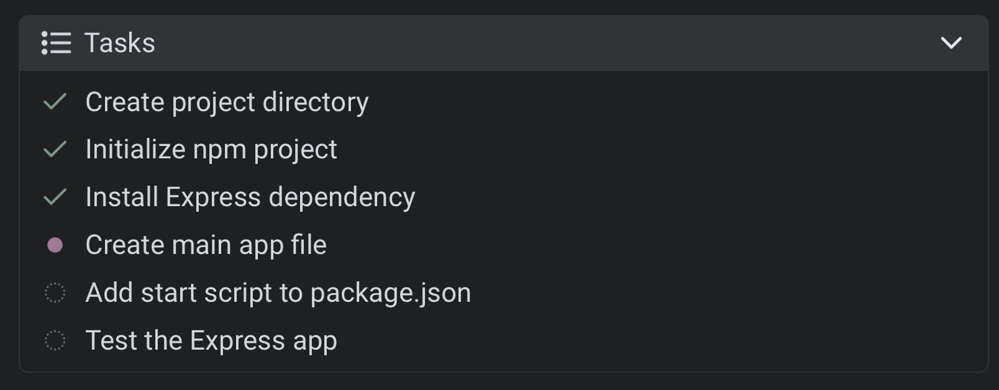
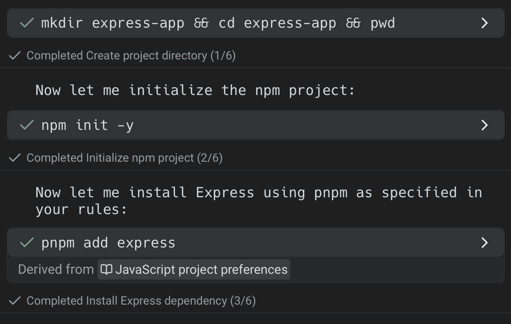
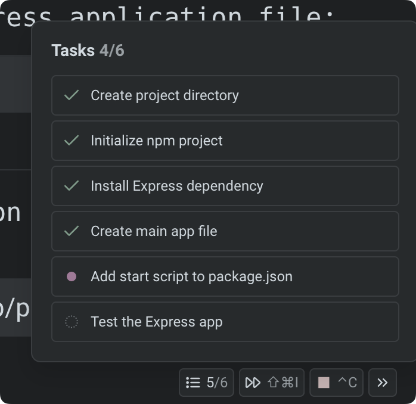
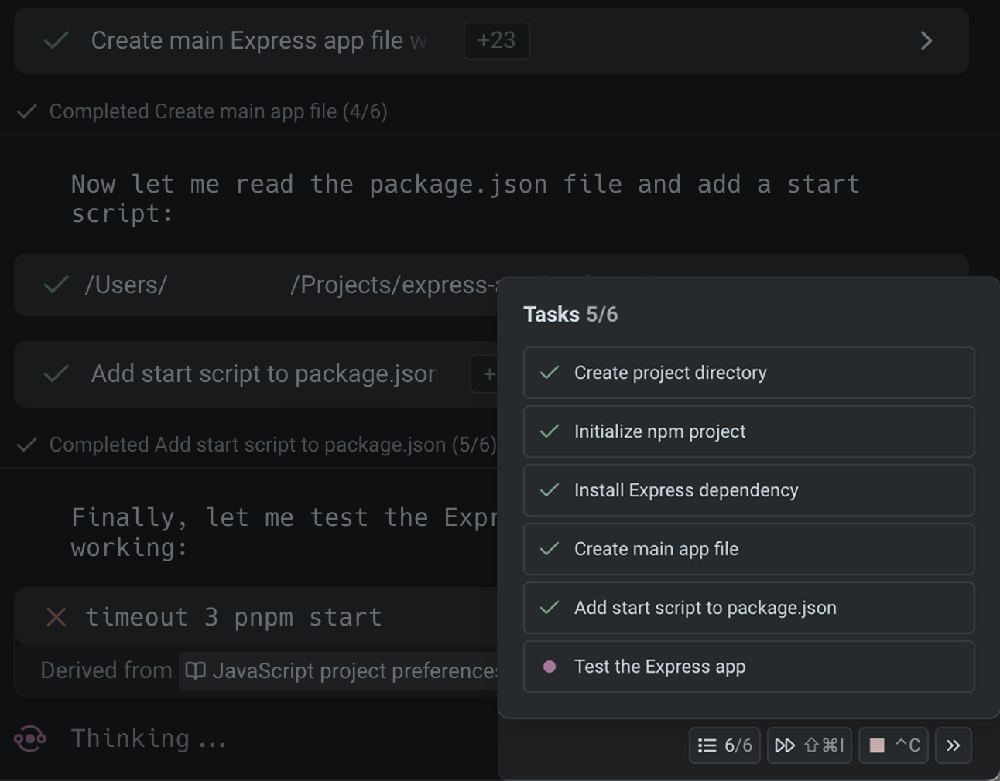

# Agent Task Lists

The Agent can automatically break down complex requests into clear, trackable steps in the form of a task list with to-do items.\
\
When you make a sufficiently complex request that requires multiple actions, the Agent will automatically create a list of steps, execute them in order, and track progress from start to finish. There’s no need to adjust settings or enable a special mode—the Agent detects and creates task lists automatically.

<figure><figcaption>
An example of a Task List in progress.
</figcaption></figure>

### **How Task Lists work**

1. **Automatic task creation** — For complex requests, the Agent generates a structured list of tasks to complete.
2. **Step-by-step execution** — The Agent works through each task in sequence, updating statuses in real time.
3. **Summary** — Once all tasks are complete, the Agent provides a concise summary of what was done, including outputs, results, and relevant context. If any tasks were skipped or couldn’t be completed, it explains why.

After each step is completed, there is also a completion marker in the Agent conversation.

<figure><figcaption>
Completion markers inside the Agent conversation after each task is completed.
</figcaption></figure>

### Task statuses

Each task in the list has a visual indicator so you can quickly see its progress.

<table><thead><tr><th width="145.5">Status</th><th width="186.2265625">Icon</th><th>Meaning</th></tr></thead><tbody><tr><td>Current task</td><td>● (filled circle)</td><td>The Agent is actively working on this task.</td></tr><tr><td>Completed</td><td>✔︎</td><td>The Agent has finished this task successfully.</td></tr><tr><td>Not started</td><td>○ (empty circle)</td><td>The task is in the queue but work hasn’t begun.</td></tr><tr><td>Cancelled</td><td>■ (filled square)</td><td>The task was stopped before completion.</td></tr></tbody></table>

<figure><figcaption></figcaption></figure>

### Task List access

During any Agent conversation, a task list chip appears at the bottom-right of the screen (when input is pinned to the bottom; otherwise, it may appear along the right side).

* Click the chip to open the current task list.
* You can collapse or expand the view at any time without interrupting the Agent.

<figure><figcaption>
Access the Task List during an Agent conversation in the Task List chip in the conversation.
</figcaption></figure>
