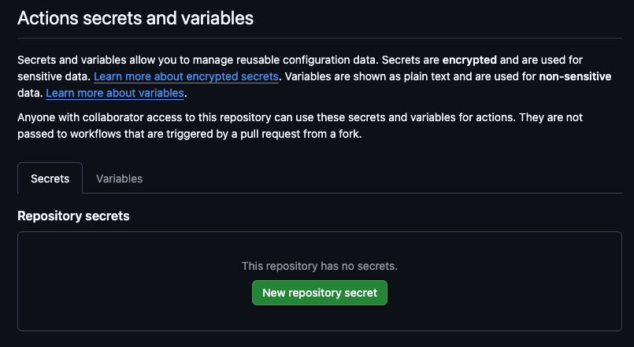

# Github Actions

Warp’s GitHub Actions integration lets you run Warp agents directly inside your CI workflows. Using the `warp-agent-action` Github Action, you can delegate tasks such as code review, issue triage, bug fixing, or automated maintenance to the agent as part of a standard Actions pipeline.

The agent runs inside your workflow, uses your repository context, and can open pull requests or comment on issues using your GitHub permissions.


For more detailed setup instructions, please refer to the [Warp Agent Actions](https://github.com/warpdotdev/warp-agent-action) repo.


This page explains what the integration does, how to use it in workflows, and common patterns for automating development tasks with Warp.



In this demo

* Automated PR reviews with both summary feedback and inline suggestions
* One-click batching and committing of agent suggestions directly from the GitHub UI
* Automatically fixing failing CI checks by opening a suggested PR
* Suggesting fixes for small review comments (“nits”) without checking out code locally

***

### What the GitHub Actions integration does

The `warp-agent-action` is a GitHub Action that wraps the Warp CLI and:

* Runs a Warp agent inside an Actions job
* Caches package installation for faster builds
* Captures the agent’s output for use in subsequent workflow steps
* Lets you pass workflow context, event data, and previous step outputs into the agent prompt
* Allows the agent to comment on PRs, post results, or open branches via the GitHub CLI
* Supports inline code suggestions that can be batched and committed directly from the GitHub pull request UI

### Requirements

To use Warp agents in GitHub Actions, you need:

* A [**Warp API Key**](https://docs.warp.dev/reference/cli/cli#generating-api-keys) stored as a [GitHub secret](https://docs.github.com/en/actions/concepts/security/secrets)
* A workflow with permissions that match your intended actions (for example, write access to PRs if the agent should commit or comment)
* The `warp-agent-action` step added to your workflow
* Familiarity with GitHub Actions concepts — see the official docs for [GitHub Actions](https://docs.github.com/en/actions)

The agent runs using your GitHub account’s permissions for the workflow run.

### Quickstart

_For detailed setup instructions, please refer to the_ [_Warp Agent Actions_](https://github.com/warpdotdev/warp-agent-action) _repo._

To run Warp agents from GitHub Actions, **you must store your Warp API Key as a GitHub Actions secret**. This allows your workflow to authenticate with Warp securely.

#### Add your Warp API Key to GitHub Secrets

1. Go to your repository on GitHub.
2. Navigate to: **Settings > Secrets and variables > Actions**
3. Select **New repository secret**
4. Set the secret name to `WARP_API_KEY`
5. Paste your Warp API Key into the **Secret** field
6. Click **Add secret**

Your secret will now appear in the list of available Actions secrets:

<figure><figcaption></figcaption></figure>

<figure><figcaption></figcaption></figure>

#### Add the Warp Agent Action to your workflow

Once your `WARP_API_KEY` secret is set, add a step to your workflow:

```yaml
- name: Review code changes in Warp
  uses: warpdotdev/warp-agent-action@main
  with:
    prompt: |
      Review the code changes on this branch:
      1. Use the `git` command to identify changes from the base branch.
      2. Analyze the diff for style, security, or correctness issues.
      3. If you have suggestions, use the `gh` command to comment on the PR.
    warp_api_key: ${{ secrets.WARP_API_KEY }}
```

The agent will run inside your workflow and return its output to subsequent steps.

#### Working with agent output

The action sets the following output:

```
steps.<step_id>.outputs.agent_output
```

Use `output_format: json` for structured, machine-readable results:

```yaml
with:
  output_format: json
```

This allows downstream steps to branch, format messages, or post results programmatically.


Because the agent is fully prompt-driven, you can insert it anywhere in a GitHub Actions workflow, pass in files or event context, and control whether the output is human-readable comments or structured JSON for downstream automation.


#### Debugging and session sharing

For debugging workflows, you can enable session sharing so teammates can open a live interactive agent session:

```yaml
with:
  share: true
```

This posts an [Ambient Agents Session Sharing link](https://docs.warp.dev/knowledge-and-collaboration/session-sharing/ambient-agents-session-sharing) to the job logs. Anyone with the link can inspect the agent's execution directly.

The session sharing option also accepts multi-line configuration for the recipients of the share link.

```
with:
  share:
    | jane@example.com
    | john@example.com
```

***

## Common use cases

The `warp-agent-action` supports several automation patterns commonly used in CI.

### 1. Responding to comments with @ mentions

* **File**: [`examples/respond-to-comment.yml`](https://github.com/warpdotdev/warp-agent-action/blob/main/examples/respond-to-comment.yml)
* **Use case**: Add “@warpdotdev fix this typo” or similar comments to a PR or Issue.

What it does:

* Listens for comments containing a trigger phrase
* Sends the comment and thread context into the agent
* Agent replies directly to the comment
* If code changes are requested, the agent commits fixes to the PR branch

**When to use:**

* Interactive coding assistance during review or issue triage.

### 2. Automated pull request review

* **File**: [`examples/review-pr.yml`](https://github.com/warpdotdev/warp-agent-action/blob/main/examples/review-pr.yml)
* **Use case**: Provide automated agent feedback when a PR is opened or marked ready for review.

What it does:

* Automatically runs when PRs open or switch to “ready for review”
* Agent inspects changed files, analyzes the diff, and comments inline
* Optionally posts a summary comment

**When to use:**

* Fast initial review before human reviewers step in.

### 3. Automatically fix issues

* **File**: [`examples/auto-fix-issue.yml`](https://github.com/warpdotdev/warp-agent-action/blob/main/examples/auto-fix-issue.yml)
* **Use case**: Apply the `warp-agent` label on an Issue to trigger automated fixes.

What it does:

* Detects when the label is added
* Agent analyzes the issue description and repo context
* Creates a PR with a fix (fix/issue-NUMBER)
* Or comments explaining why automation wasn’t possible

**When to use:**

* Automating bug fixes, small features, or maintenance tasks.

### 4. Daily issue summaries

* **File**: [`examples/daily-issue-summary.yml`](https://github.com/warpdotdev/warp-agent-action/blob/main/examples/daily-issue-summary.yml)
* **Use case**: Scheduled summaries of newly opened issues.

What it does:

* Runs daily at 09:00 UTC
* Fetches issues created in the past 24 hours
* Generates a categorized summary
* Sends the summary to Slack via webhook

**When to use:**

* Daily visibility into new work across your repositories.

### 5. Fixing failing CI checks

* **File**: [`examples/fix-failing-checks.yml`](https://github.com/warpdotdev/warp-agent-action/blob/main/examples/fix-failing-checks.yml)
* **Use case**: Automatically attempt fixes when a workflow or test suite fails.

What it does:

* Triggers when specified CI workflows fail
* Pulls failure logs
* Attempts to diagnose and fix the root cause
* Opens a PR with the fix and comments with a link

**When to use:**

* Reducing downtime from failing builds or flaky tests.

### 6. Suggest fixes for review comments

* **File**: [`examples/suggest-review-fixes.yml`](https://github.com/warpdotdev/warp-agent-action/blob/main/examples/suggest-review-fixes.yml)
* Use cases: Automatically propose code suggestions for small, actionable review comments such as typos, naming tweaks, and minor refactors.

**What it does:**

* Triggers when a pull request review is submitted
* Fetches review comments and stores them in review\_comments.json
* Sends comments and context to a Warp agent to decide which ones are simple, actionable fixes
* Generates `responses.json` with explanations and suggestion blocks for each fixable comment
* Replies inline to the original review comments with the generated suggestions

**When to use:**

* Quickly addressing straightforward review feedback such as typos, naming tweaks, style nits, and small refactors.
