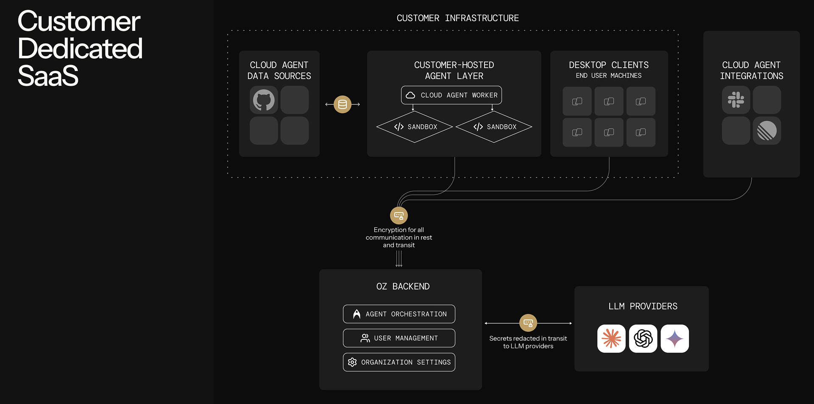

# Self-Hosting


**Enterprise feature**: Self-hosted Oz cloud agents are available exclusively to teams on an Enterprise plan. To enable self-hosting for your team, [contact sales](https://warp.dev/contact-sales).


Self-hosting allows your team to run Oz cloud agent workloads on your own infrastructure instead of Warp-managed servers. This is ideal for enterprises that need code and execution to remain within their network boundary while still benefiting from Oz's orchestration and visibility model.

<figure><figcaption></figcaption></figure>

***

## How it works

With self-hosting:

* **Oz orchestrator** still manages task lifecycle, observability, and the management experience.
* **Execution happens on your infrastructure**. You run a worker process that connects to Oz and claims tasks routed to it.
* **Your team controls the compute**. The worker runs on machines you provision and manage.

This means you get the same orchestration, session sharing, and team visibility features as Warp-hosted execution, but the agent runs inside your network.

***

## Prerequisites

Before setting up a self-hosted worker, ensure you have:

* **A machine to run the worker** — This can be a VM, a server, or even a local machine. The worker host can run on macOS, Linux, or Windows — any machine that runs Docker. Linux is recommended for production deployments.
* **Docker installed** — The worker uses Docker to run agent tasks. Verify Docker is installed and running with `docker info`.
* **Enterprise plan with self-hosting enabled** — [Contact sales](https://warp.dev/contact-sales) if self-hosting is not yet enabled for your team.
* **A team API key** — In the Warp app, go to `Settings > Platform` to create a team-scoped API key.


Task containers require a **linux/amd64** or **linux/arm64** Docker daemon. The worker host itself can be any OS — Docker Desktop on macOS and Windows runs a Linux VM that satisfies this requirement.


***

## Installation

### Install Docker

If Docker is not already installed, follow the [official Docker installation guide](https://docs.docker.com/get-docker/) for your platform.

Verify Docker is running:

```bash
docker info
```

***

## Running the worker

The worker is open source. See the [oz-agent-worker repository](https://github.com/warpdotdev/oz-agent-worker) for source code, issues, and contribution guidelines.

There are three ways to run the worker: via Docker (recommended), via `go install`, or by building from source.

### Set your API key

In the Warp app, go to `Settings > Platform` to create a team API key. Then export it as an environment variable:

```bash
export WARP_API_KEY="your_team_api_key"
```

### Option 1: Docker (recommended)

The worker needs access to the Docker daemon to spawn task containers. Mount the host's Docker socket into the container:

```bash
docker run -v /var/run/docker.sock:/var/run/docker.sock \
  -e WARP_API_KEY="$WARP_API_KEY" \
  warpdotdev/oz-agent-worker --worker-id "my-worker"
```

### Option 2: Go install

```bash
go install github.com/warpdotdev/oz-agent-worker@latest
oz-agent-worker --api-key "$WARP_API_KEY" --worker-id "my-worker"
```

### Option 3: Build from source

```bash
git clone https://github.com/warpdotdev/oz-agent-worker.git
cd oz-agent-worker
go build -o oz-agent-worker
./oz-agent-worker --api-key "$WARP_API_KEY" --worker-id "my-worker"
```

***

## Worker flags reference

The following flags are available when starting the worker:

**Required:**

* `--worker-id` — A string identifying this worker. This is the value you pass to `--host` when routing tasks. Choose something meaningful for your team (e.g., `prod-runner-1` or `ci-worker`). Multiple workers can share the same ID for load balancing (see below).
* `--api-key` or `WARP_API_KEY` env var — Your team API key for authentication. When running via Docker, pass it as `-e WARP_API_KEY="..."`. When running the binary directly, use `--api-key` or the environment variable.

**Optional:**

* `--log-level` — Log verbosity. One of `debug`, `info`, `warn`, `error`. Defaults to `info`.
* `--no-cleanup` — Do not remove task containers after execution. Useful for debugging failed tasks—you can inspect the container's filesystem and logs after the run.
* `-v` / `--volumes` — Mount host directories into task containers. Format: `HOST_PATH:CONTAINER_PATH` or `HOST_PATH:CONTAINER_PATH:MODE` (where MODE is `ro` or `rw`). Can be specified multiple times.
* `-e` / `--env` — Set environment variables in task containers. Format: `KEY=VALUE` (explicit value) or `KEY` (pass through from host environment). Can be specified multiple times.


Worker IDs starting with `warp` are reserved and cannot be used. The worker will refuse to start if `--worker-id` begins with `warp`.


**Example with all flags:**

```bash
docker run -v /var/run/docker.sock:/var/run/docker.sock \
  -e WARP_API_KEY="$WARP_API_KEY" \
  warpdotdev/oz-agent-worker \
  --worker-id "prod-runner-1" \
  --log-level debug \
  --no-cleanup \
  -v /opt/shared-cache:/cache:ro \
  -e NPM_TOKEN=your_token \
  -e GITHUB_TOKEN
```


When running the worker via Docker, there are two levels of `-e` flags. Docker's `-e` passes env vars to the **worker container** (e.g., `WARP_API_KEY`). The worker's `-e` / `--env` flags pass env vars into the **task containers** that the worker spawns. Keep these distinct:

```bash
# Docker -e: passes WARP_API_KEY to the worker container
# Worker -e: passes MY_SECRET to task containers
docker run \
  -e WARP_API_KEY="$WARP_API_KEY" \
  warpdotdev/oz-agent-worker \
  --worker-id "my-worker" \
  -e MY_SECRET=hunter2
```


Once started, the worker:

* Connects to Oz via WebSocket
* Waits for tasks routed to this worker ID
* Runs each task in an isolated Docker container
* Reports status and results back to Oz
* Automatically reconnects with exponential backoff if the connection drops

You can run multiple workers with the same `--worker-id` for redundancy — tasks are distributed across connected workers using round-robin load balancing.

***

## Docker connectivity

The worker uses the standard Docker client discovery mechanism to find the Docker daemon:

1. **`DOCKER_HOST`** environment variable (e.g., `unix:///var/run/docker.sock`, `tcp://localhost:2375`)
2. **Default socket** (`/var/run/docker.sock` on Linux, `~/.docker/run/docker.sock` for rootless Docker)
3. **Docker context** via `DOCKER_CONTEXT` environment variable
4. **Config file** (`~/.docker/config.json`) for context settings

Additional Docker environment variables:

* `DOCKER_API_VERSION` — Specify Docker API version
* `DOCKER_CERT_PATH` — Path to TLS certificates
* `DOCKER_TLS_VERIFY` — Enable TLS verification


If the worker itself runs in Docker, you must mount any relevant config files (e.g., `~/.docker/config.json`) into the worker container for Docker context and credential discovery to work.


**Example: Connecting to a remote Docker daemon**

```bash
export DOCKER_HOST="tcp://remote-host:2376"
export DOCKER_TLS_VERIFY=1
export DOCKER_CERT_PATH="/path/to/certs"
oz-agent-worker --api-key "$WARP_API_KEY" --worker-id "my-worker"
```

***

## Private Docker registries

The worker automatically uses credentials from your Docker config (`~/.docker/config.json`) when pulling task images. If your [environments](environments.md) use images from a private registry, make sure the worker's host has been authenticated:

```bash
docker login your-registry.example.com
```

When running the worker via Docker, mount the Docker config into the container:

```bash
docker run \
  -v /var/run/docker.sock:/var/run/docker.sock \
  -v ~/.docker/config.json:/root/.docker/config.json:ro \
  -e WARP_API_KEY="$WARP_API_KEY" \
  warpdotdev/oz-agent-worker --worker-id "my-worker"
```


Sidecar images (the Warp agent binary and dependencies) are pulled from public registries and do not require authentication.


***

## Routing runs to self-hosted workers

To run an Oz cloud agent on your self-hosted worker, specify the `--host` flag with your worker ID. The `--host` value must match the `--worker-id` of a connected worker exactly.

### From the CLI

```bash
oz agent run-cloud --prompt "Refactor the authentication module" --host "my-worker"
```

You can combine `--host` with any other `run-cloud` flags, such as `--environment`, `--model`, `--mcp`, `--skill`, `--computer-use`, and `--attach`.

### From scheduled agents

When creating or updating a schedule, specify the host:

```bash
oz schedule create --name "daily-cleanup" \
  --cron "0 9 * * *" \
  --prompt "Run dead code cleanup" \
  --environment ENV_ID \
  --host "my-worker"

oz schedule update SCHEDULE_ID --host "my-worker"
```

### From integrations

When creating or updating an integration, specify the host:

```bash
oz integration create slack --host "my-worker" ...
oz integration update linear --host "my-worker" ...
```

All tasks created through that integration will be routed to your self-hosted worker.

### From the API / SDKs

When creating a run via the [Oz Agent API](https://docs.warp.dev/reference/api-and-sdk/agent), include `worker_host` in the config:

```bash
curl -X POST https://app.warp.dev/api/v1/agent/run \
  --header 'Authorization: Bearer YOUR_API_KEY' \
  --header 'Content-Type: application/json' \
  --data '{
    "prompt": "Refactor the authentication module",
    "config": {
      "environment_id": "ENV_ID",
      "worker_host": "my-worker"
    }
  }'
```

### From the web UI

When creating a run, schedule, or integration in the [Oz web app](https://oz.warp.dev), select your self-hosted worker from the host dropdown.

***

## Environments with self-hosted workers

Self-hosted workers fully support [environments](environments.md). When a task specifies an environment, the worker:

1. Pulls the Docker image defined in the environment (or falls back to `ubuntu:22.04` if none is specified).
2. Clones the repositories and runs setup commands as configured.
3. Executes the agent inside the prepared container.

The same environment can be used for both Warp-hosted and self-hosted runs without modification. See [Environments](environments.md) for details on creating and configuring environments.


The architecture of the environment's Docker image must match the architecture of the worker's Docker daemon. For example, an `arm64` image will not run on a worker with an `amd64` Docker daemon.



Musl-based Docker images (such as Alpine Linux) are not supported as task images. The agent runtime requires glibc. Use glibc-based images like Debian, Ubuntu, or the default (non-Alpine) variants of official Docker Hub images.


***

## Monitoring runs

Self-hosted runs have the same observability as Warp-hosted runs:

* **Management UI** — View task status, history, and metadata in the [Oz dashboard](https://oz.warp.dev).
* **Session sharing** — Authorized teammates can attach to running tasks to monitor progress.
* **APIs and SDKs** — Query task history and build monitoring using the [Oz Agent API](https://docs.warp.dev/reference/api-and-sdk/agent).

***

## Security considerations

* **Docker socket access** — The worker requires access to the Docker daemon to create task containers. When running the worker via Docker, this means mounting `/var/run/docker.sock`. Ensure appropriate access controls on the host.
* **Network egress** — The worker needs outbound WebSocket connectivity to Oz (`wss://oz.warp.dev`). No inbound ports need to be opened.
* **API key management** — Store your `WARP_API_KEY` securely (e.g., in a secrets manager). Avoid hardcoding it in scripts or config files.
* **Task isolation** — Each task runs in its own Docker container. Containers are removed after execution by default (disable with `--no-cleanup` for debugging).
* **Volume mounts** — If using `-v` / `--volumes`, be mindful of what host paths you expose to task containers.

***

## Troubleshooting

### Worker won't start

* Verify Docker is running: `docker info`.
* Ensure the Docker daemon platform is `linux/amd64` or `linux/arm64`.

### Worker won't connect

* Verify your API key is correct, not expired, and has team scope.
* Regenerate the API key in `Settings > Platform` if you suspect it is invalid.
* Ensure the machine has outbound internet access to Oz.
* Check that no firewall rules are blocking WebSocket connections to `wss://oz.warp.dev`.
* Increase log verbosity with `--log-level debug` to see connection details.

### Tasks not being picked up

* Confirm the worker is running and connected (check the worker logs).
* Verify the `--host` parameter matches your `--worker-id` exactly (case-sensitive).
* Ensure the worker's team matches the team creating the task.

### Task failures

* Check Docker is running: `docker info`.
* Review task logs in the Oz dashboard or via session sharing.
* Use `--no-cleanup` to keep the container around for inspection after failure.
* Use `--log-level debug` to see detailed container creation and execution logs.
* Ensure the worker machine has sufficient resources (CPU, memory, disk).
* If using a custom Docker image, verify it is glibc-based (not Alpine/musl).
* Verify the environment image architecture matches the worker's Docker daemon platform (e.g., an `amd64` image on an `amd64` daemon).

### Image pull failures

* If using a private registry, ensure Docker credentials are available to the worker (see [Private Docker registries](#private-docker-registries)).
* Try pulling the image manually with `docker pull <image>` on the worker host to verify access and diagnose authentication issues.
* Verify the image exists and the tag is correct.
* Check network connectivity to the registry.
