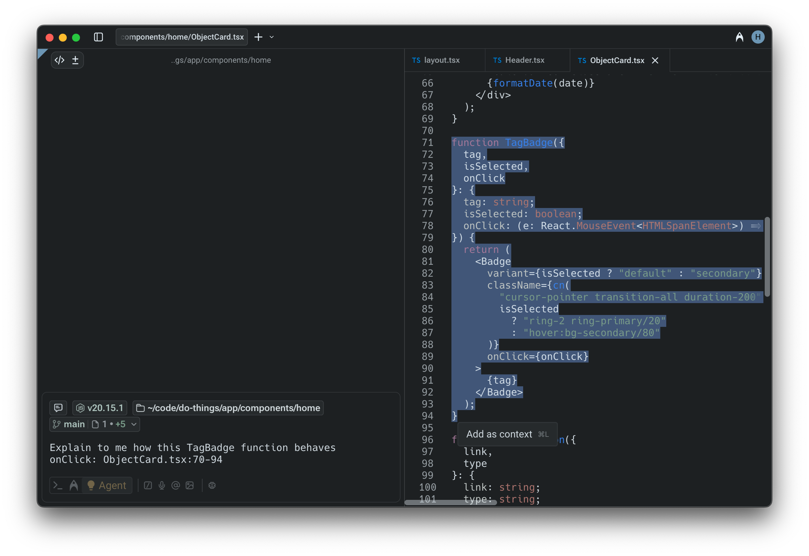

# Selection as Context

### Attaching selections from Warp's native code editor

When you have Warp’s [native code editor](https://docs.warp.dev/code/code-editor/) open beside a regular pane, you can easily attach specific lines of code as context:

1. **Select text** in the editor. A tooltip will appear in the bottom-right corner of the selection.
2. **Add as context** by clicking the tooltip or using the keyboard shortcuts `Cmd + L` (macOS) or `CTRL + SHIFT + L` (Windows or Linux).
3. Warp automatically adds the relative file path and context, in addition to the line numbers of the hunk, as a formatted string into the prompt.

This makes it easy to highlight just the lines you want the Agent to analyze or modify.

<figure><figcaption>
Selecting a function and attaching it as context from Warp's native code editor.
</figcaption></figure>

### Attaching selections from Warp’s Code Review panel

You can also directly attach context from the [Code Review panel](https://docs.warp.dev/code/code-review/):

1. Hover over any **diff hunk** to reveal the option to attach it as context.

<figure><figcaption>
On-hover option to attach diff as context into the prompt.
</figcaption></figure>

2. Attaching a diff will automatically insert the relevant file path and changed lines into your prompt.

This helps the Agent understand exactly what has been modified, making it easier to request explanations, feedback, or follow-up edits.

<figure><figcaption>
Code Review panel with diffs for review.
</figcaption></figure>
