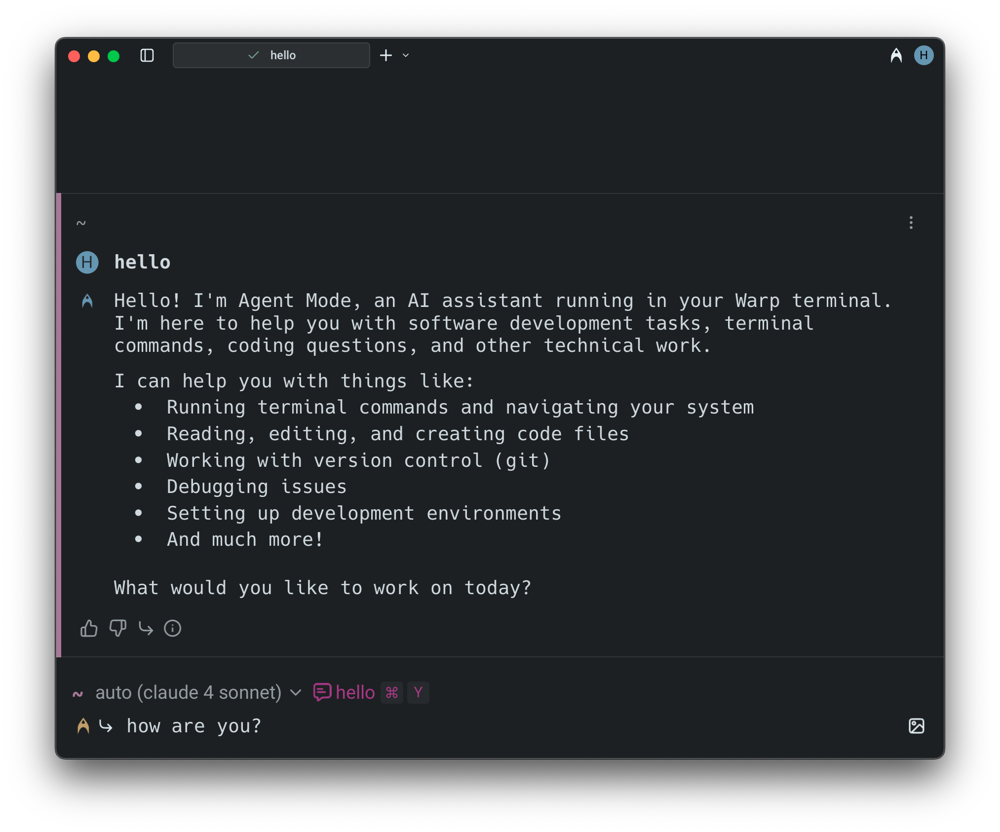
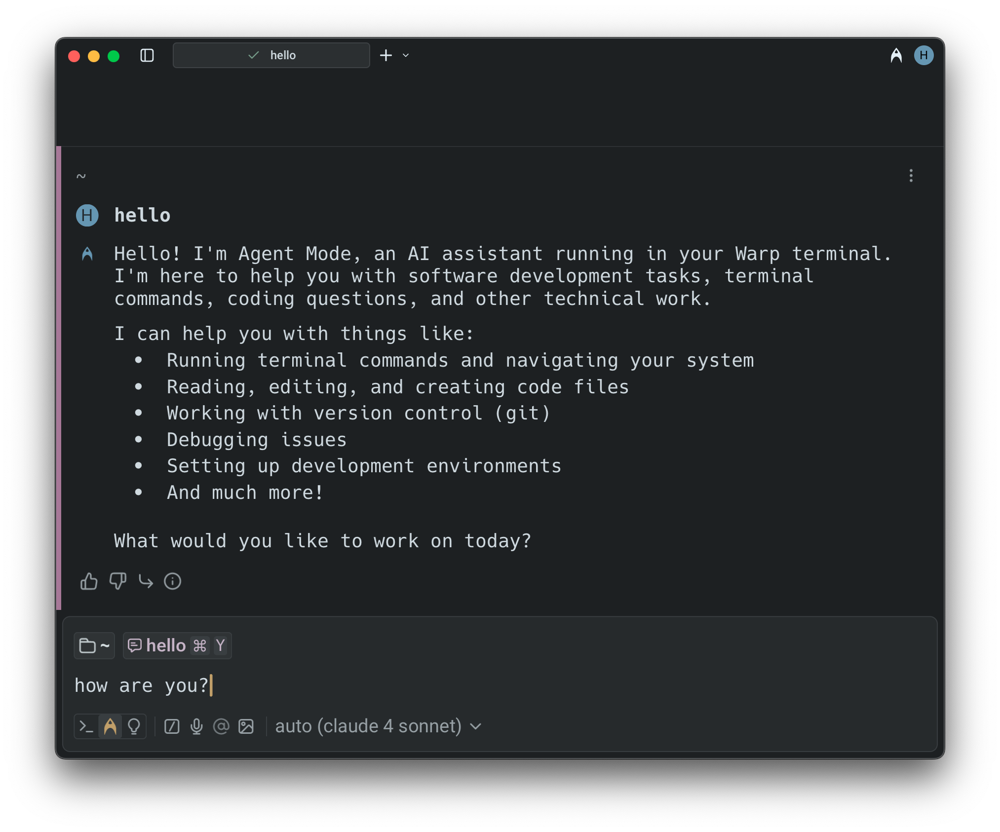
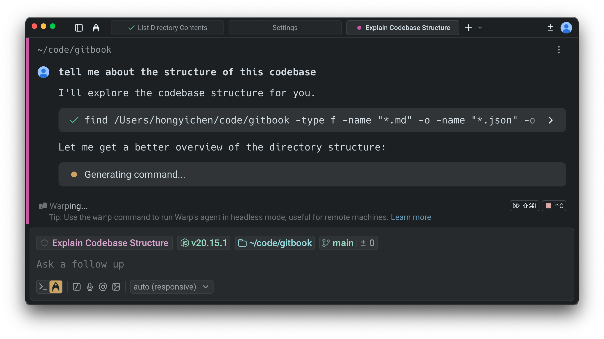
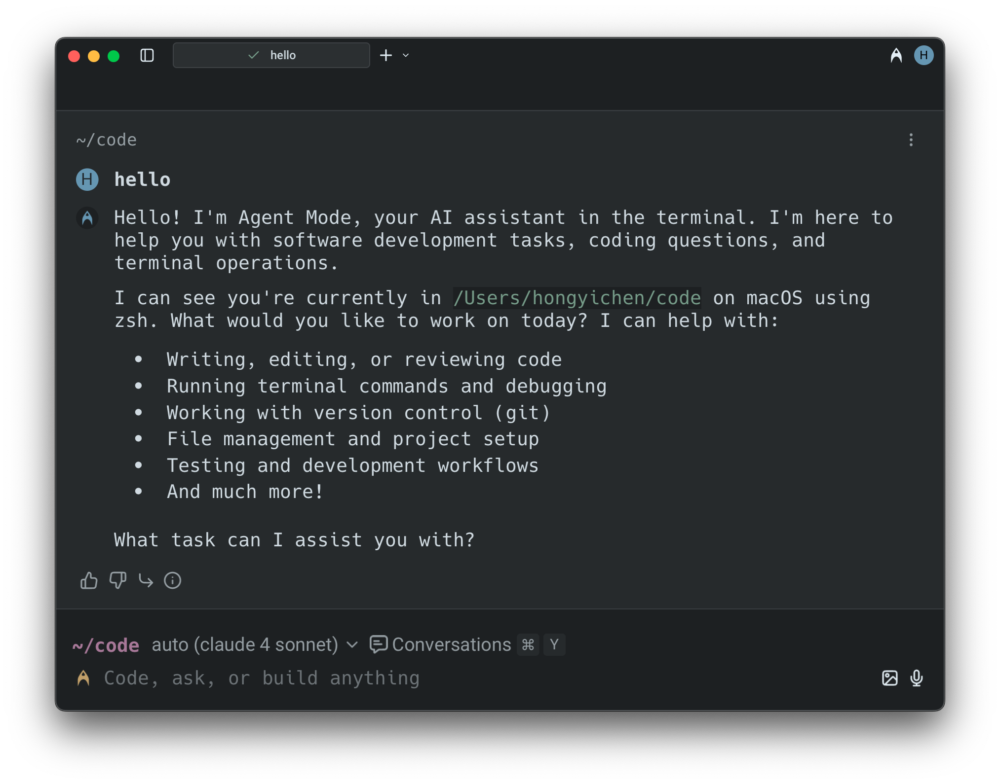
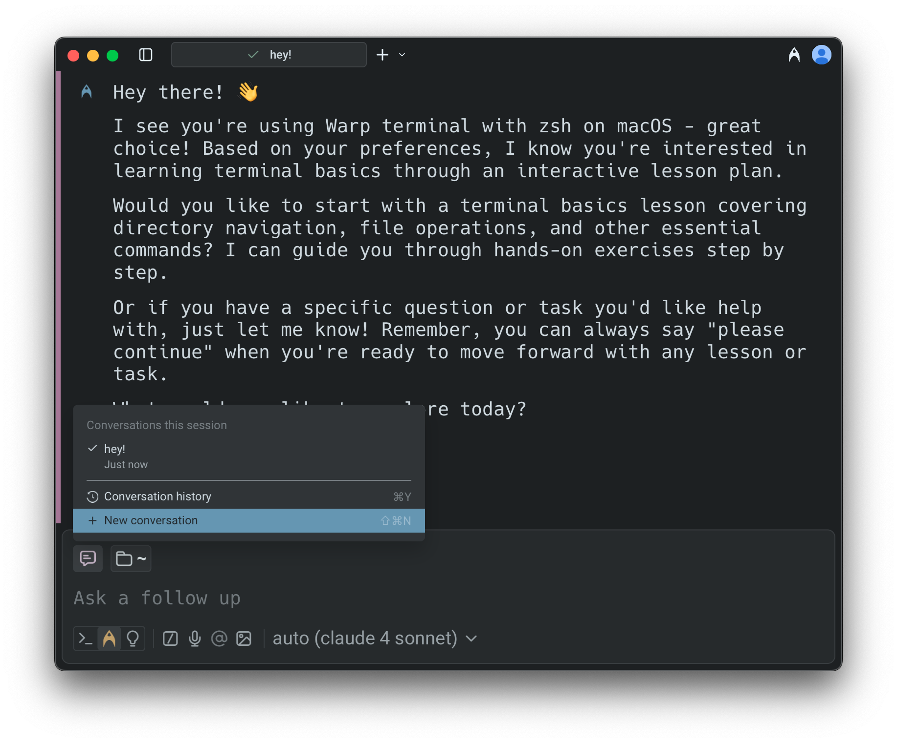
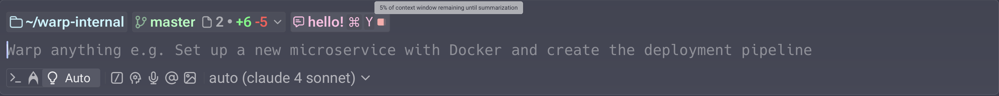
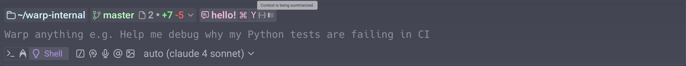
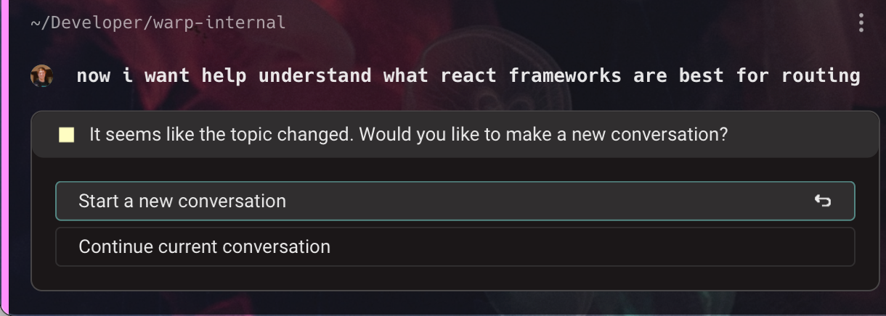

# Agent Conversations

## Conversations with Warp's Agent

Conceptually, a conversation is a sequence of AI queries and blocks. Conversations are tied to sessions and you can run multiple Agent Mode conversations simultaneously in different windows, tabs, or panes.

Conversations work best when the queries are related. If your new question builds on the last one, continue in the same conversation. If it is unrelated, it is better to start a new one so that the context remains relevant.


Long conversations can cause slower performance and lower-quality answers. When working on a separate task or question, start fresh rather than relying on context from earlier interactions.


### Staying in a Conversation (Follow-Ups)

By default, if you ask an AI query immediately after interacting in Agent Mode, your query is sent as a **follow-up** to the current conversation.

* In **Classic Input**, you’ll see both the pink highlight bar on the left side of the block and a bent follow-up arrow (↳) next to your input. The conversation input chip also shows which conversation you are in.
* In **Universal Input,** the pink highlight bar and the conversation input chip serve as the indicators, but the bent arrow is not shown.

**To follow-up on a previous conversation:**

* Simply continue prompting the agent if you are already in an active conversation.
* Open the **Conversations menu** (`CMD + Y` on macOS, `CTRL + SHIFT + Y` on Windows/Linux), select a conversation, and then enter your query.
* Alternatively, click the pink conversation chip in the input field to resume.

<figure><figcaption>
Continuing an Agent conversation in Classic Input (with indicator)
</figcaption></figure>

<figure><figcaption>
Continuing an Agent conversation in Universal Input
</figcaption></figure>

#### Agent tips in the input

While Warp’s agent is thinking and processing your request, Warp may surface short tips with helpful workflows and ways to use Warp. These tips appear under the Warping indicator.

<figure><figcaption></figcaption></figure>

You can enable or disable these tips in two places:

* **Settings**: `Settings` > `AI` > `Input` > `Show agent tips`
* **Command Palette**: Open the Command Palette (`CMD + P` on macOS, `CTRL + SHIFT + P` on Windows/Linux), then select "**Show Agent Tips**" or "**Hide Agent Tips**"

### **Managing Conversations**

You can view previous conversations or start a new conversation via the **Conversations Menu** (`CMD + Y` on macOS, `CTRL + SHIFT + Y` on Windows/Linux).




The "New Conversation" item disappears once you start searching for an actual conversation.


### **Starting a New Conversation**

Warp automatically creates a new conversation in a few situations. For example, if you ask an AI query after running a shell command or if three hours pass without activity, Agent Mode will start a fresh conversation.

Visual indicators differ slightly depending on input mode:

* In **Classic Input,** a new conversation begins when there is no follow-up arrow (↳) next to your input.
* In **Universal Input**, a new conversation begins when there is no pink highlight bar on the left side of the block. The conversation input chip also helps confirm whether you’re in a new or existing thread.



You can also start a new conversation manually at any time:

* In **Classic Input**, press `CMD + I` or press `BACKSPACE` while in follow-up mode.
* In **Universal Input**, press `CMD + SHIFT + N` or click directly on the conversation input chip.
* Open the **Conversations Menu** using `CMD + Y` and selecting "New Conversation".



You can also start a new conversation manually at any time:

* In **Classic Input**, press `CTRL + I` or press `BACKSPACE` while in follow-up mode.
* In **Universal Input**, press `CTRL + ALT + SHIFT + N` or click directly on the conversation input chip.
* Open the **Conversations Menu** using `CMD + SHIFT + Y` and selecting "New Conversation".



You can also start a new conversation manually at any time:

* In **Classic Input**, press `CTRL + I` or press `BACKSPACE` while in follow-up mode.
* In **Universal Input**, press `CTRL + ALT + SHIFT + N` or click directly on the conversation input chip.
* Open the **Conversations Menu** using `CMD + SHIFT + Y` and selecting "New Conversation".



<figure><figcaption>
Starting a new Conversation in Classic Input
</figcaption></figure>

<figure><figcaption>
Starting a new Agent Conversation in Universal Input
</figcaption></figure>

## Context Window Management

Every conversation with an agent consumes tokens stored in a **context window**. The context window (sometimes called _context length_) is the amount of text (measured in tokens) that a Large Language Model (LLM) can process at one time. **The size of the context window depends on the model you are using.**

As tokens accumulate and exceed the context window, performance and response quality may degrade. If the context window is exceeded, the model may lose track of earlier parts of the conversation, and **Warp will automatically summarize the conversation to free up space**.

### Warp provides a **context window usage indicator** to help you track this:

When less than 20% of the window is used, no indicator is shown. As more tokens accumulate, the usage bar progresses to reflect how much of the context window has been consumed.

<figure><figcaption></figcaption></figure>

<figure><figcaption></figcaption></figure>

As you approach the limit, the indicator turns red to warn that the context window is nearly full.

<figure><figcaption></figcaption></figure>

Once the limit is exceeded, Warp automatically summarizes the conversation so you can continue without losing important context.

<figure><figcaption></figcaption></figure>

The context window usage indicator is available only in **Universal Input**, which you can enable under `Settings > Appearance > Input`.


If you switch models during a conversation, the context usage indicator updates only after you send your next message.


## Conversation Segmentation

Warp automatically detects when your query has shifted to a new topic. When this happens, it suggests starting a new conversation instead of continuing in the same context.

These options appear in the blocklist, where you can decide whether to branch off into a new conversation or keep going with the current one.

<figure><figcaption></figcaption></figure>

You can also create a new conversation manually at any time by using the keyboard shortcut, opening a new tab, or opening a new pane.



* Start a new conversation: `CMD + SHIFT + N`
* Open a new tab: `CMD + T`
* Open a new pane: `CMD + D`



* Start a new conversation: `CTRL + SHIFT + N`
* Open a new tab: `CTRL + SHIFT + T`
* Open a new pane: `CTRL + SHIFT + D`



* Start a new conversation: `CTRL + SHIFT + N`
* Open a new tab: `CTRL + SHIFT + T`
* Open a new pane: `CTRL + SHIFT + D`


