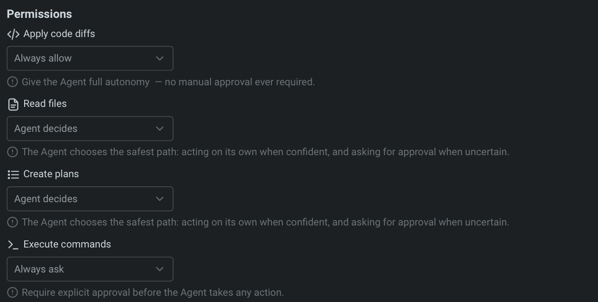

# Agent Permissions

Agent Permissions let you define how your Agent operates—control its autonomy, choose what tools or MCP servers it can access, and set when it should act independently or ask for approval. You can also fine-tune its natural language behavior and other capabilities.

### Agent Permissions

You can control how much autonomy the Agent has when performing different types of actions under `Settings > AI > Agents > Permissions` . Agent permission types:

* Read files
* Create plans
* Execute commands

<figure><figcaption>
Fine-tuning agent control: This permissions panel lets users customize how much autonomy the Agent has when applying code diffs, reading files, creating plans, and executing commands—balancing safety with automation.
</figcaption></figure>

**Each permission has different levels of autonomy:**

<table><thead><tr><th width="196.3369140625">Autonomy level</th><th>Description</th></tr></thead><tbody><tr><td>Agent Decides</td><td>Agent will act autonomously when it's confident, but prompt for approval when uncertain. This option balances speed with control, allowing the Agent to go ahead with common workflows while keeping you in the loop for more complex or risky steps.</td></tr><tr><td>Always ask</td><td>Agent will request explicit user approval before taking any action. Choose this for sensitive actions.</td></tr><tr><td>Always allow</td><td>Agent will perform the action without ever requesting explicit conformation. Use this for tasks you fully trust the Agent to handle on its own.</td></tr><tr><td>Never</td><td>Agent will not ever take the action (i.e. Create plans).</td></tr></tbody></table>


_When all Agent permissions are set to Always allow, the Agent gains full autonomy (“YOLO mode”); however, any denylist rules will still override these settings._


### Command allowlist

The Warp Agent lets you define an allowlist of commands that run automatically without confirmation. It’s empty by default, but users often add read-only commands such as:

* `which .*` - Find executable locations
* `ls(\s.*)?` - List directory contents
* `grep(\s.*)?` - Search file contents
* `find .*` - Search for files
* `echo(\s.*)?` - Print text output

You can add your own regular expressions to this list in `Settings > AI > Agents > Command allowlist`. Commands in the allowlist will always auto-execute, even if they are not read-only operations.

### Command denylist

For safety, the Agent always prompts for confirmation before executing potentially risky commands. The default denylist includes several examples, such as:

* `wget(\s.*)?` - Network downloads
* `curl(\s.*)?` - Network requests
* `rm(\s.*)?` - File deletion
* `eval(\s.*)?` - Shell code execution

The denylist takes precedence over both the allowlist and `Agent decides`. If a command matches the denylist, user permission will always be required, regardless of other settings. You can add your own regular expressions to this list in `Settings > AI > Agents > Command denylist`.

### Run until completion

During an Agent interaction, you can give the Agent full autonomy for the current task. When auto-approve is on, every suggested command runs immediately until the task finishes, or you stop it with `Ctrl + C`.



Auto-approve all Agent actions with: `CMD + SHIFT + I`



Auto-approve all Agent actions with: `CTRL + SHIFT + I`



Auto-approve all Agent actions with: `CTRL + SHIFT + I`



<figure><figcaption>
A button overlay in the lower-right corner lets you enable auto-approve or end the Agent interaction.
</figcaption></figure>


Note: _Run until completion_ ignores the denylist entirely. It’s the purest form of “YOLO” mode and essentially a fully “autonomous mode” where the Agent proceeds without asking for confirmation.


### MCP permissions

MCP servers let you extend the Agent with custom tools and data sources using standardized, plugin-like modules.

In this settings menu, you can configure which MCP servers the Agent is allowed to call:

* Use the MCP allowlist to give the Agent permission to call specific servers without asking.
* Use the MCP denylist to require approval before calling certain servers, even if they’re also in the allowlist.
* Or set the Agent to “decide” — it will act autonomously when confident, and ask for confirmation when uncertain.

<figure><figcaption>
Customize how the Agent interacts with MCP servers by choosing between “Agent decides,” allowlist, or denylist settings.
</figcaption></figure>

To learn how to build and configure your own MCP server, check out the [MCP feature docs](../knowledge-and-collaboration/mcp.md).
