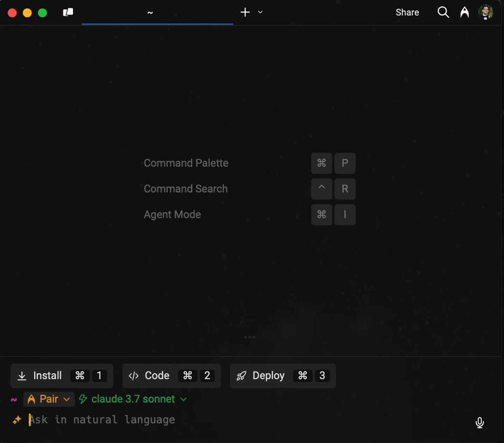
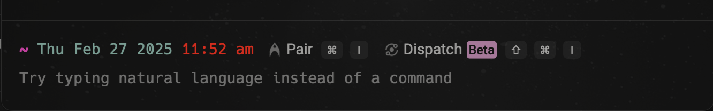

# Run to completion

### Model based auto-execution

Agent Mode can dynamically analyze command safety for automatic execution of read-only commands. This provides intelligent command safety analysis but follows a strict precedence order.

1. Denylist (highest priority) - Commands always require confirmation
2. Allowlist - Commands always auto-execute
3. Model-based analysis (lowest priority) - Agent Mode determines if a command is read-only safe

This behavior can be toggled in `Settings > AI > Autonomy > Model-based auto-execution`.

## Dispatch

_Dispatch_ is a form of Agent Mode that carries out complex tasks automatically. When you make a Dispatch query, the AI will:

1. Gather context about the task, using your [codebase](run-to-completion.md#codebase-context), [requested commands](run-to-completion.md#agent-mode-requested-commands), and followup questions.
2. Use a reasoning model to create a plan to carry out the task. You can refine the plan with AI, or edit it directly.
3. Automatically carry out the approved plan.

While Dispatch is executing a plan, it automatically runs commands and applies code changes. However, it will still obey your [command denylist](run-to-completion.md#command-denylist). The border along the left of the session will change color to indicate that Dispatch is running autonomously:

<figure><figcaption>
A completed Dispatch task
</figcaption></figure>


Dispatch is currently in beta, with ongoing improvements that will expand its capabilities over time.


### How to enter Dispatch

You can enter Dispatch in a few ways:



Press `CMD-SHIFT-I` to toggle between Dispatch and the terminal input, or to switch from pairing to Dispatch.



Press `CTRL-SHIFT-I` to toggle between Dispatch and the terminal input, or to switch from pairing to Dispatch.



Press `CTRL-SHIFT-I` to toggle between Dispatch and the terminal input, or to switch from pairing to Dispatch.



<figure><figcaption>
In addition, within Agent Mode, you can use the menu to switch between pairing and Dispatch
</figcaption></figure>

If you're using the [Warp prompt](../../terminal/appearance/prompt.md), you can also click the Dispatch context chip:

<figure><figcaption>
Context chips for entering Agent Mode
</figcaption></figure>
