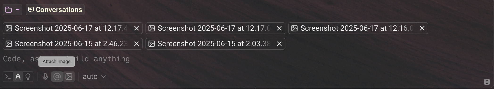
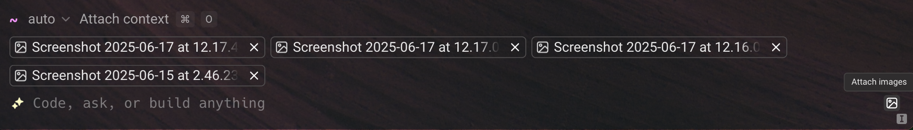

# Agent Context

In Warp, you can pass different types of input directly to the agent to guide its behavior and improve response quality. This includes blocks from your terminal output, images, files, code, and public websites.

These inputs are known as **agent context**: ad hoc pieces of information you manually supply during a session.

This is distinct from other persistent or automatic sources of context, such as [rules.md](../../knowledge-and-collaboration/rules.md "mention"), [warp-drive-as-agent-mode-context.md](../../knowledge-and-collaboration/warp-drive/warp-drive-as-agent-mode-context.md "mention"), and [mcp.md](../../knowledge-and-collaboration/mcp.md "mention"), which the agent also uses when available.

## Attaching blocks as context

Warp can gather context from your terminal sessions and tailor every command to your session and environment.

You can supply a block of context to your conversation with Agent Mode as part of your query. From the block in the terminal, click the AI sparkles icon to "Attach as Agent Mode context."

<figure><figcaption>
From a block of output, attach the block and ask Agent Mode to remove all untracked files.
</figcaption></figure>

The most common use case is to ask the AI to fix an error. You can attach the error in a query to Agent Mode and type "fix it."

If you're already in Agent Mode, use the following ways to attach or clear context from your query:



**Attach a previous block**

* To attach blocks to a query, you can use `CMD-UP` to attach the previous block as context to the query. While holding `CMD`, you can then use your `UP/DOWN` keys to pick another block to attach.
  * You may also use your mouse to attach blocks in your session. Hold `CMD` as you click on other blocks to extend your block selection.

**Clear a previous block**

* To clear blocks from a query, you can use `CMD-DOWN` until the blocks are removed from context.
  * You may also use your mouse to clear blocks in your session. Hold `CMD` as you click on an attached block to clear it.


When using "Pin to the top" [Input Position](../../terminal/appearance/input-position.md), the direction for attaching or detaching is reversed (i.e. `CMD-DOWN` attaches blocks to context, while `CMD-UP` clears blocks from context).




**Attach a previous block**

* To attach blocks to a query, you can use `CTRL-UP` to attach the previous block as context to the query. While holding `CTRL`, you can then use your `UP/DOWN` keys to pick another block to attach.
  * You may also use your mouse to select blocks in your session. Hold `CTRL` as you click on other blocks to extend your block selection.

**Clear a previous block**

* To clear blocks from a query, you can use `CTRL-DOWN` until the blocks are removed from context.
  * You may also use your mouse to clear blocks in your session. Hold `CTRL` as you click on an attached block to clear it.


When using "Pin to the top" [Input Position](../../terminal/appearance/input-position.md), the direction for attaching or detaching is reversed (i.e. `CTRL-DOWN` attaches blocks to context, while `CTRL-UP` clears blocks from context).




**Attach a previous block**

* To attach blocks to a query, you can use `CTRL-UP` to attach the previous block as context to the query. While holding `CTRL`, you can then use your `UP/DOWN` keys to pick another block to attach.
  * You may also use your mouse to select blocks in your session. Hold `CTRL` as you click on other blocks to extend your block selection.

**Clear a previous block**

* To clear blocks from a query, you can use `CTRL-DOWN` until the blocks are removed from context.
  * You may also use your mouse to clear blocks in your session. Hold `CTRL` as you click on an attached block to clear it.


When using "Pin to the top" [Input Position](../../terminal/appearance/input-position.md), the direction for attaching or detaching is reversed (i.e. `CTRL-DOWN` attaches blocks to context, while `CTRL-UP` clears blocks from context).




## **Attaching images as context**

To provide visual context, you can attach images directly to an agent prompt. This is useful for including screenshots, diagrams, or other visual references alongside your query.

To attach images, use the image upload button found on the toolbelt (either on the bottom left or right), depending on which input mode you're using:

<figure><figcaption>
Attaching 5 images on the new "Universal" input (bottom left toolbelt)
</figcaption></figure>

<figure><figcaption>
Attaching 4 images on the "Classic" input (bottom right)
</figcaption></figure>


Warp accepts the following image formats: `.jpg` , `.jpeg` , `.png` , and `.gif`&#x20;


You can attach up to **5 images per request**, and up to **20 images across a single conversation**. Each image is sent to the model provider and immediately discarded — nothing is stored on Warp's servers.

### Model behavior and image handling

All supported models listed in [model-choice.md](model-choice.md "mention") can interpret image input.

Attaching images will consume additional requests, proportional to the number of images added. To stay within model limits, Warp will intelligently resize images before passing it as context, minimizing token usage and respecting the model's maximum image dimensions.

At this time, all images must be selected from your device; URL attachments, copy-paste, and drag-and-drop are currently not supported but are on the roadmap.

***

## Referencing files and code using @

You can attach specific files or folders as context to a prompt using the @ symbol. When you’re inside a Git repository, typing @ opens a context menu that allows you to search for and select files or directories to include.

Attaching context with @ works in both natural language prompts (when interacting with Agents) and classic terminal commands for referencing file paths.

Note that search is always relative to the root of the Git repository, even when you're working in a subdirectory. This means you can reference any file or folder tracked in the repo, regardless of the current working directory.

<figure><figcaption>
Using the @ symbol to search for and attach a file or folder from the project root.
</figcaption></figure>

Additionally, no codebase indexing (via [codebase-context.md](../../codebase-context.md "mention")) is required — file search is available immediately in any Git-initialized directory. The search also respects `.gitignore` rules and will exclude ignored files from the results.

<figure><figcaption>
Filtering files using @app to locate files containing “app” in their name or path.
</figcaption></figure>

<figure><figcaption>
Referencing a folder or all files within it by typing @styles.
</figcaption></figure>

***

## Referencing websites via URLs

You can attach a public URL to a prompt to provide website content as context. When a URL is included, the agent will scrape the page and extract relevant information to inform its response.

This feature only works with publicly accessible pages. The full text of the page is sent to the model, which may increase AI request usage depending on the length of the content.

Note: this is not a search feature—the agent does not currently have browsing capabilities or access to real-time web search. Only the specific page you link will be used as context.
