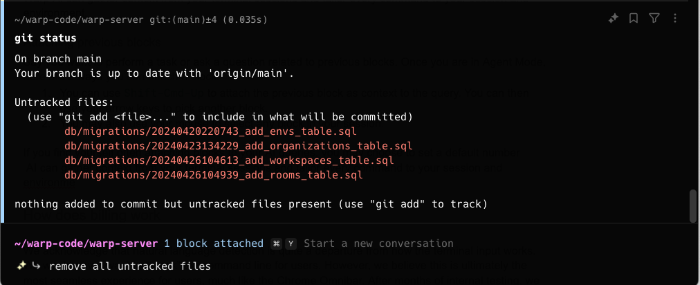

# Blocks as Context

## Attaching blocks as context

Warp’s Agent can use blocks from your Agent conversations as context to better understand your queries and generate more relevant responses.

You can attach a block directly from the terminal blocklist by clicking the AI sparkles icon on it and selecting “Attach as context.”

<figure><figcaption>
From a block of output, attach the block and ask Agent Mode to remove all untracked files.
</figcaption></figure>

The most common use case is to ask the AI to fix an error. You can attach the error in a query to Agent Mode and type "fix it."

**If you're already in Agent Mode, use the following ways to attach or clear context from your query:**



**Attach a previous block**

* To attach blocks to a query, you can use `CMD-UP` to attach the previous block as context to the query. While holding `CMD`, you can then use your `UP/DOWN` keys to pick another block to attach.
  * You may also use your mouse to attach blocks in your session. Hold `CMD` as you click on other blocks to extend your block selection.

**Clear a previous block**

* To clear blocks from a query, you can use `CMD-DOWN` until the blocks are removed from context.
  * You may also use your mouse to clear blocks in your session. Hold `CMD` as you click on an attached block to clear it.


When using "Pin to the top" [Input Position](../../../terminal/appearance/input-position.md), the direction for attaching or detaching is reversed (i.e. `CMD-DOWN` attaches blocks to context, while `CMD-UP` clears blocks from context).




**Attach a previous block**

* To attach blocks to a query, you can use `CTRL-UP` to attach the previous block as context to the query. While holding `CTRL`, you can then use your `UP/DOWN` keys to pick another block to attach.
  * You may also use your mouse to select blocks in your session. Hold `CTRL` as you click on other blocks to extend your block selection.

**Clear a previous block**

* To clear blocks from a query, you can use `CTRL-DOWN` until the blocks are removed from context.
  * You may also use your mouse to clear blocks in your session. Hold `CTRL` as you click on an attached block to clear it.


When using "Pin to the top" [Input Position](../../../terminal/appearance/input-position.md), the direction for attaching or detaching is reversed (i.e. `CTRL-DOWN` attaches blocks to context, while `CTRL-UP` clears blocks from context).




**Attach a previous block**

* To attach blocks to a query, you can use `CTRL-UP` to attach the previous block as context to the query. While holding `CTRL`, you can then use your `UP/DOWN` keys to pick another block to attach.
  * You may also use your mouse to select blocks in your session. Hold `CTRL` as you click on other blocks to extend your block selection.

**Clear a previous block**

* To clear blocks from a query, you can use `CTRL-DOWN` until the blocks are removed from context.
  * You may also use your mouse to clear blocks in your session. Hold `CTRL` as you click on an attached block to clear it.


When using "Pin to the top" [Input Position](../../../terminal/appearance/input-position.md), the direction for attaching or detaching is reversed (i.e. `CTRL-DOWN` attaches blocks to context, while `CTRL-UP` clears blocks from context).



