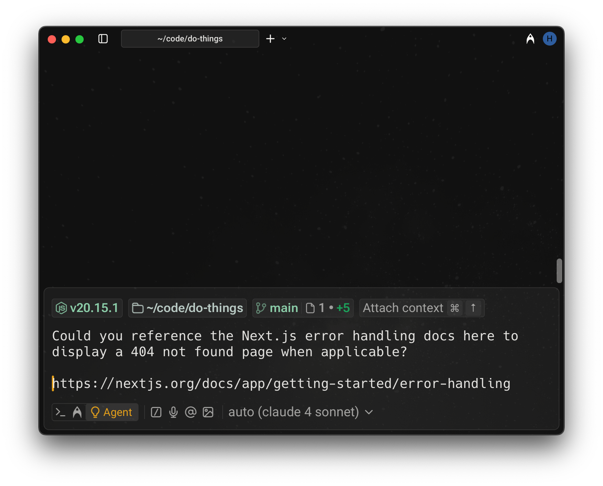

# URLs as Context

## Referencing websites via URLs

You can attach a public URL to a prompt to provide website content as context. When a URL is included, the agent will scrape the page and extract relevant information to inform its response.

This feature only works with publicly accessible pages. The full text of the page is sent to the model, which may increase AI request usage depending on the length of the content.

Note: this is not a search feature—the agent does not currently have browsing capabilities or access to real-time web search. Only the specific page you link will be used as context.

<figure><figcaption>
Example of referencing docs via a URL
</figcaption></figure>
