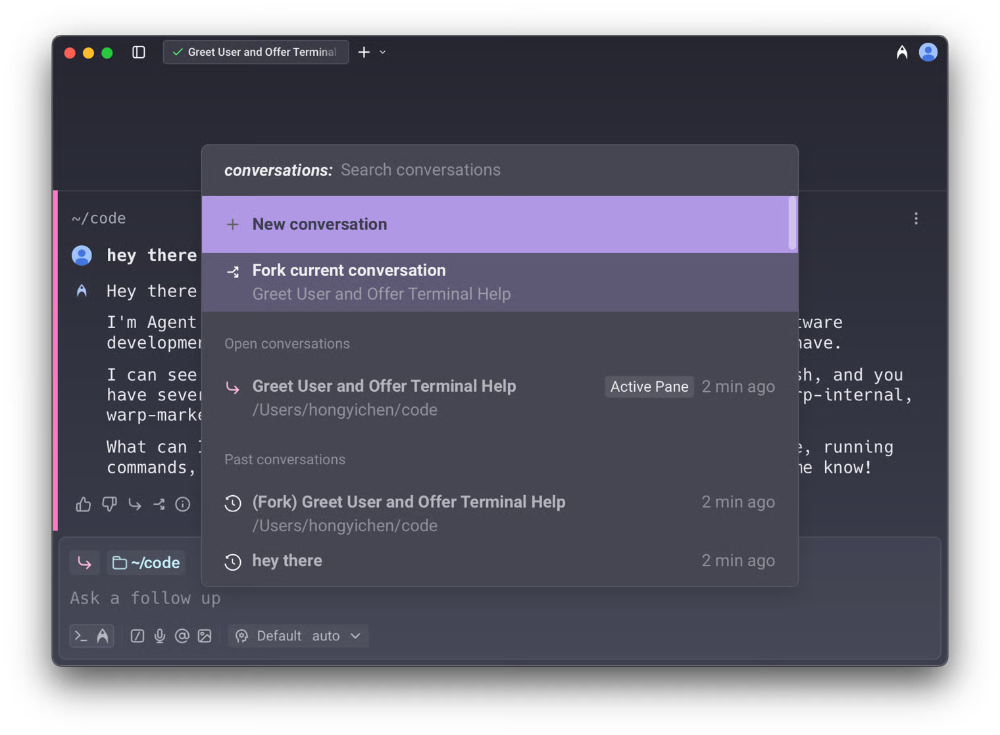
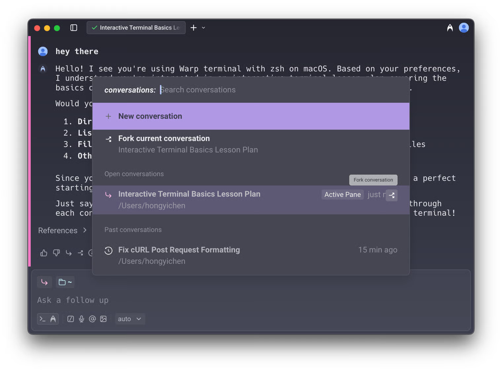
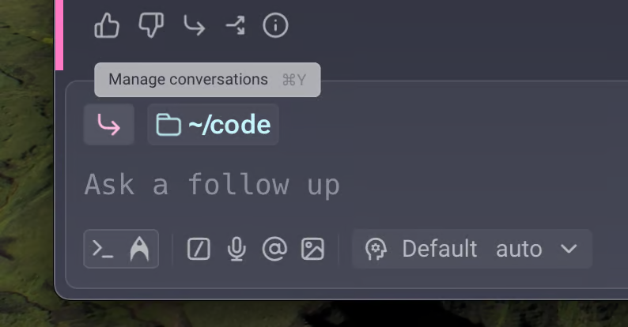
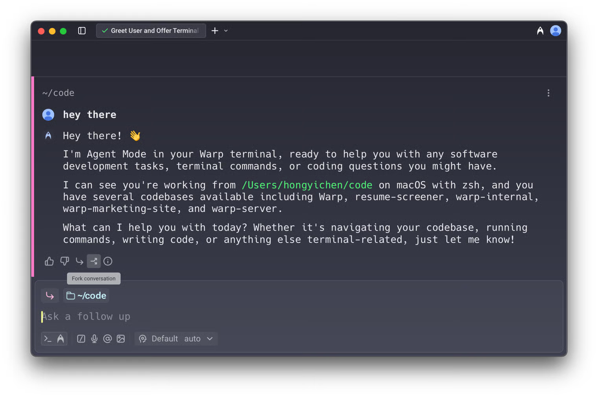

# Conversation Forking

Warp allows you to **fork conversations** to create a new thread that inherits all of the context, messages, and history from an existing conversation. This is useful when you want to branch off in a new direction without affecting the original conversation.



### How conversation forking works

* When you fork a conversation, the new thread starts with the same context and history as the original.
* Any follow-ups in the forked conversation do **not** impact the original. Likewise, continuing in the original conversation does not change the fork.
* Forked conversations behave just like any other conversation: you can move them into new windows, panes, or tabs.

_Example_: You can fork a conversation to explore an alternate solution, ask “what if” questions, or continue down two separate paths in parallel.

### Ways to fork a conversation

There are two ways to fork an existing conversation:

#### **1. From the command palette**

Open the menu using the command palette (`CMD + Y` on macOS / `CTRL + SHIFT + Y` on Windows/Linux).&#x20;

Select **Fork current conversation** to fork your current conversation, or fork a specific conversation from open conversations.

<figure><figcaption></figcaption></figure>

In addition, when you hover over any open conversation in the command palette, you’ll see a **fork button**. This lets you fork not only active conversations, but also inactive and historical ones.

<figure><figcaption></figcaption></figure>

You can also access this conversation view from the [universal input chip](https://app.gitbook.com/o/-MbqIZLCtzerswjFm7mh/s/-MbqIgTw17KQvq_DQuRr/~/diff/~/changes/1112/terminal/universal-input/~/overview) in the current conversation.

<figure><figcaption></figcaption></figure>

#### **2. From the footer of the most recent AI response block**

In any conversation in the blocklist, click the **fork button** in the footer of the most recent AI block. A new conversation opens in a separate pane with the full context of the original.

<figure><figcaption></figcaption></figure>

### Using forked conversations 

* Once forked, you can continue prompting as if you were still in the original conversation. The original conversation remains unchanged, allowing you to reference or continue both in parallel.
* For example, after forking you might ask _“Could you explain more?”_ and Warp will respond using the inherited context.

**Forking is especially useful when:**

* You want to explore different approaches without losing the original thread.
* You need to keep one conversation “clean” while experimenting in another.
* You want to reuse context or specific blocks from older conversations.
