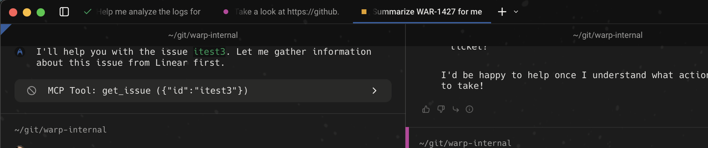
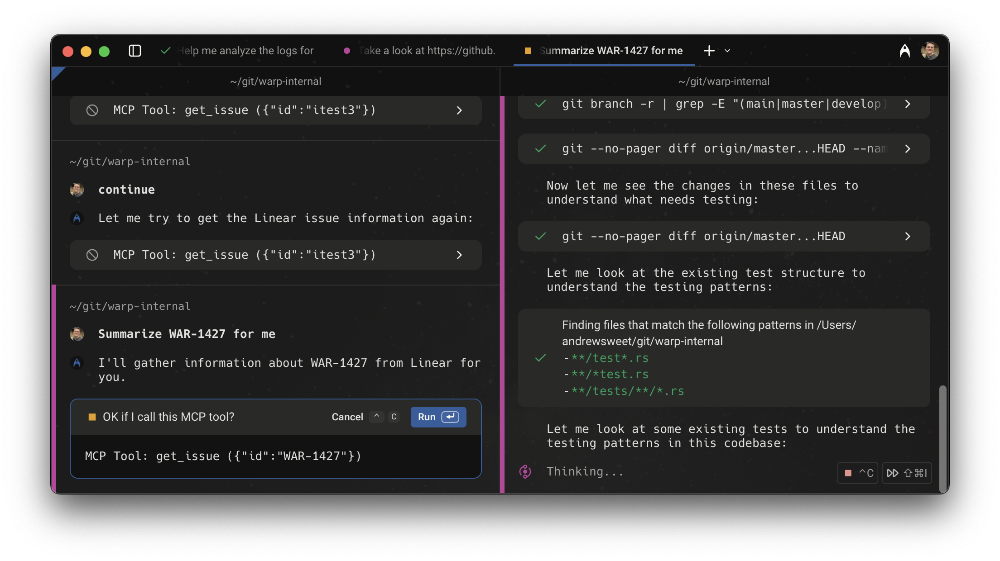
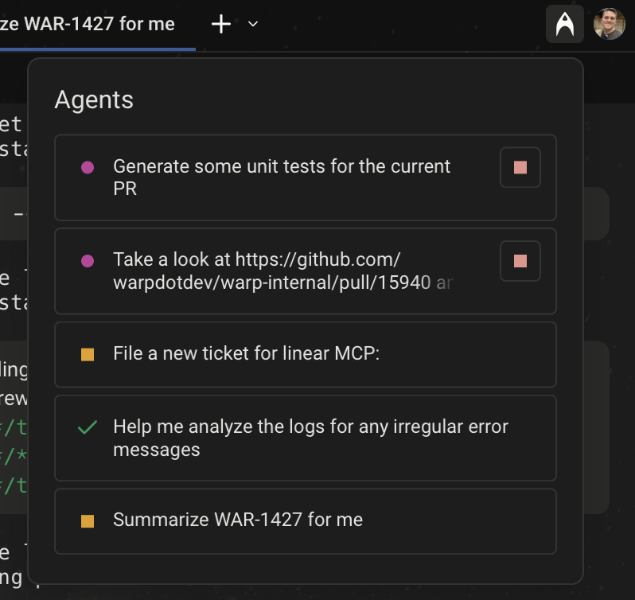

# Managing Agents

Warp’s agent management system is designed to support complex, multi-agent workflows across multiple terminal panes. You can run several agents at once, monitor their status, and step in when needed, without losing track of what’s happening across your sessions.

Agents will notify you when they need input, such as permission to run a command or approval to apply a code diff. This allows you to shift focus to other work, knowing you’ll be alerted when intervention is required. At any point, you can cancel an agent that’s stuck or going in circles. The agent will pause and wait for your input before continuing the task.

This page covers how agent statuses are displayed, how to use the Agent Management Panel, how notifications work, and how to configure agent autonomy and permissions.

### **Agent status indicators**

Each tab that contains an agent conversation will display a status icon indicating the agent’s current state.

<figure><figcaption>
Tabs with agents in different states, each displaying a corresponding status icon.
</figcaption></figure>

<table><thead><tr><th width="84.34765625">Icon</th><th>Agent status</th></tr></thead><tbody><tr><td>
<figure><figcaption></figcaption></figure>
</td><td>In progress. The agent is currently running.</td></tr><tr><td>
<figure><figcaption></figcaption></figure>
</td><td>Task delegated to agent has completed successfully.</td></tr><tr><td>
<figure><figcaption></figcaption></figure>
</td><td>Agent requires your attention (e.g. waiting for input or approval).</td></tr><tr><td>
<figure><figcaption></figcaption></figure>
</td><td>Agent was manually stopped and is idle.</td></tr><tr><td>
<figure><figcaption></figcaption></figure>
</td><td>An error occurred. This may be due to a model failure, an API issue (such as LLM provider downtime), a lost internet connection, or other unexpected problems.</td></tr></tbody></table>

**Notes:**

* Status icon colors follow Warp's semantic theme settings, so they appear as theme-specific variants rather than the exact shades shown above.
* If an agent encounters an error, the error will be surfaced in the last block of the affected conversation.
* In tabs with multiple agent interactions (across different panes), the status icon reflects the agent state of the most recently focused pane.

<figure><figcaption>
Agent status icons shown across multiple panes in a tab.
</figcaption></figure>

### **Agent Management Panel**

Warp includes an Agent Management Panel that provides a centralized view of all active agents across your sessions. You can monitor their status, cancel running tasks, review errors, and jump directly to conversations that need input.

This panel is accessible from the top right of the interface and is designed to keep you informed without disrupting your workflow.

<figure><figcaption>
Agent management panel, highlighting five agents with differing statuses.
</figcaption></figure>

The Agent Management Panel provides a centralized view of all agent activity across your sessions. From this panel, you can:

* View the current status of all agents across active terminal sessions
* Cancel agents that are currently in progress (only agents in the “in progress” state will show a stop option)
* Review agents that are waiting for input or have encountered an error
* Jump directly to the associated terminal pane or conversation

Once an agent is cancelled, it will stop executing and no further updates or notifications will be sent.

Agent activity is ordered by most recent interaction. If a single tab contains multiple agents across different panes, each conversation will appear separately in the panel, sorted by recency.

### **In-app agent notifications**

Warp provides two types of in-app notifications to keep you informed about agent activity:

1. **Toasts** appear briefly at the top right of the screen and link directly to the relevant conversation. If dismissed or ignored, they disappear from view but remain marked as unread in the Agent Management Panel.
2. The **red dot indicator** appears on the Agent Management button in the top-right corner when there are unread agent notifications. Opening the panel clears the red dot and marks all associated notifications as read.

These notifications ensure you don’t miss critical updates, such as when an agent encounters an error or requests manual approval.

### **Autonomy and controls**

You can configure how much autonomy and control agents have in `Settings > AI > Agents > Permissions` . From this settings page, you can:

* Require manual approval before the agent applies code diffs, reads files, creates plans, or runs commands
* Define allowlists or denylists to control agent behavior based on command types or patterns

These settings let you fine-tune how agents interact with your system and control the level of automation based on task sensitivity. For more information on autonomy, please reference: [agent-permissions.md](agent-permissions.md "mention").

