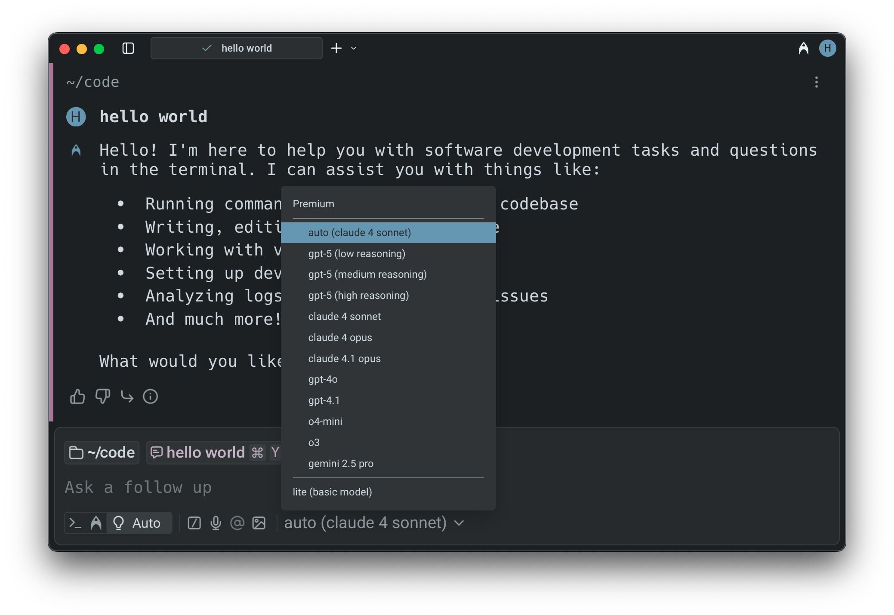
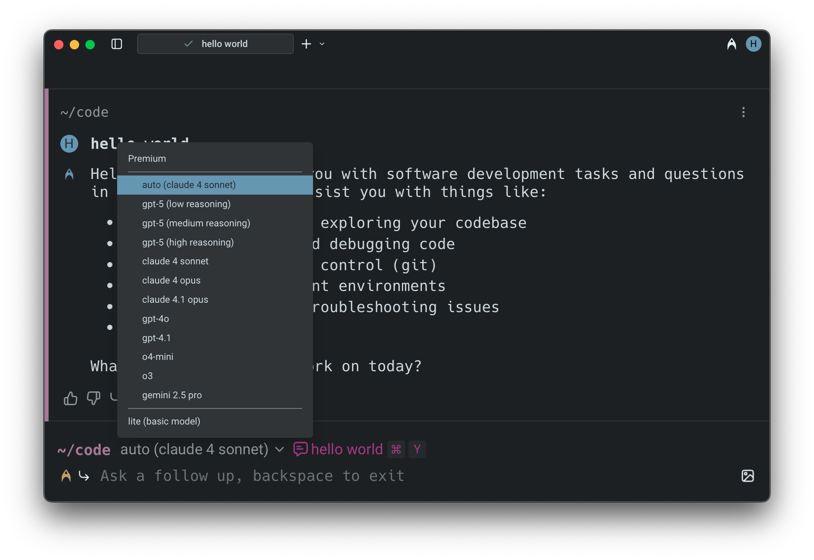
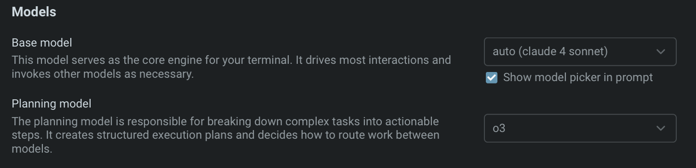

# Model Choice

Warp lets you choose from a curated set of LLMs to power your Agentic Development Environment.

**Warp supports the following models:**

* OpenAI: `GPT-5`, `GPT-4o`, `GPT-4.1`, `o4-mini`, `o3`
  * For `GPT-5` specifically, you can select between _low, medium,_ and _high_ reasoning modes.
* Anthropic: `Claude Sonnet 4.5`, `Claude Sonnet 4`, `Claude Opus 4.1`, `Claude Opus 4`
  * `Claude Sonnet 3.5` for _Lite_
* Google: `Gemini 2.5 Pro`

## How to change models

* **Base model**: this model serves as the core engine for your Agentic Development Environment. It drives most interactions and invokes other models as necessary.&#x20;
* **Planning model**: responsible for breaking down complex tasks into actionable steps and creating structured execution plans.

You can also select "**Auto**" to let Warp automatically choose the best model for your task based on factors like query type and context. There's an option in the app to show the model picker in the prompt as well. The current model that you have selected will be shown in the input.

<figure><figcaption>
Model picker in the universal input mode.
</figcaption></figure>

<figure><figcaption>
Model picker in the classic input mode.
</figcaption></figure>

To change the model being used, click the current model name, `claude 4 sonnet` in the example image above, to open a dropdown menu with the supported models. Your model choice will persist in future prompts.&#x20;

### Configuring models per Agent Profile

You can configure the base and planning models for each [agent-profiles-permissions.md](agent-profiles-permissions.md "mention"), defining the Agent’s autonomy, tool access, and other permissions. Edit your default profile or more profiles directly in `Settings > AI > Agents > Profiles`.

<figure><figcaption>
Model choice example, where the base model is Auto (Claude 4 Sonnet) and the planning model is o3.
</figcaption></figure>
