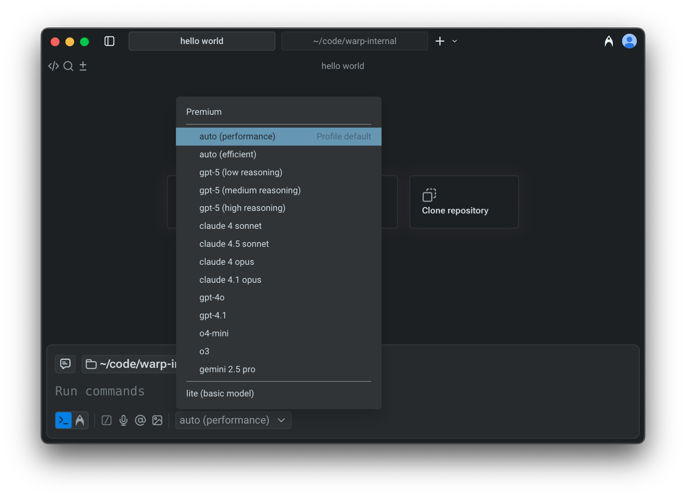
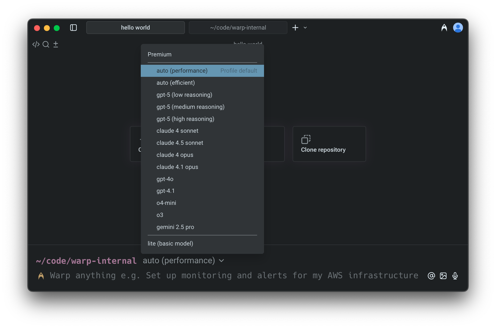

# Model Choice

## Available models

Warp lets you choose from a curated set of Large Language Models (LLMs) to power your Agentic Development Environment.

**Warp supports the following models:**

* OpenAI: `GPT-5`, `GPT-4o`, `GPT-4.1`, `o4-mini`, `o3`
  * For `GPT-5` specifically, you can select between _low, medium,_ and _high_ reasoning modes.
* Anthropic: `Claude Sonnet 4.5`, `Claude Sonnet 4`, `Claude Opus 4.1`, `Claude Opus 4`
* Google: `Gemini 2.5 Pro`

<figure><figcaption>
Model selector in Warp's universal input.
</figcaption></figure>

### Auto Models

Warp also offers two _Auto_ modes that intelligently select the best model for your task based on the context and request type:

1. **Auto (Performance)**: Prioritizes the highest-quality results using the most capable model available. May consume credits more quickly.
2. **Auto (Efficient)**: Optimizes for lower credit consumption while maintaining strong output quality, helping extend your available usage.

Both Auto models perform well across all agent workflows and are ideal if you prefer Warp to manage model selection dynamically.

### How to change models

You can use the model picker in your prompt input to quickly switch between models. The currently active model appears directly in the input editor.

<figure><figcaption>
Model selector in the classic input. You have to be in natural language mode to be able to view and change models.
</figcaption></figure>

To change models, click the displayed model name (for example, _Claude Sonnet 4.5_) to open a dropdown with all supported options. Your selection will automatically persist for future prompts.

### Configuring models per Agent Profile

You can configure the base and planning models for each [agent-profiles-permissions.md](agent-profiles-permissions.md "mention"), defining the Agent’s autonomy, tool access, and other permissions.&#x20;

Edit your default profile or more profiles directly in `Settings > AI > Agents > Profiles`.

<figure><figcaption>
Model choice example, where the base model is Auto (Claude 4 Sonnet) and the planning model is o3.
</figcaption></figure>
