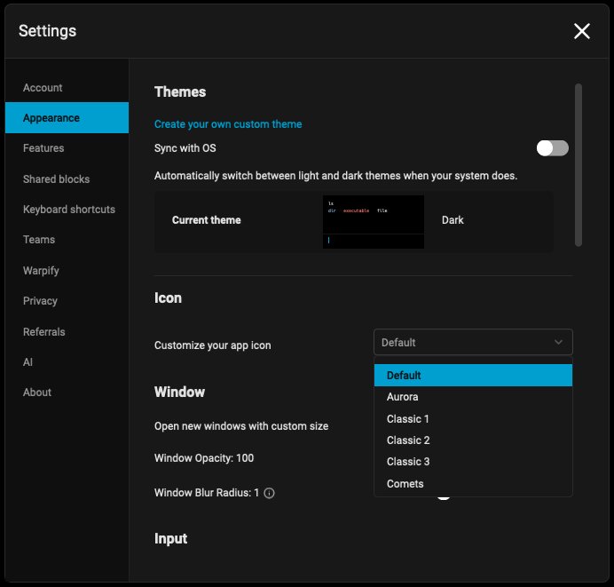
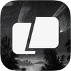

# Custom dock icons


Currently, the Docker extension is only available on macOS.


## How to change the dock icon

* Navigate to `Settings > Appearance > Icon`
* Select the desired dock icon from the drop down menu

<figure><figcaption>
Icon customization drop-down menu
</figcaption></figure>

## Dock icons

By default, Warp ships with these dock icons:

<table data-view="cards"><thead><tr><th align="center"></th><th align="center"></th></tr></thead><tbody><tr><td align="center"></td><td align="center">Default</td></tr><tr><td align="center"></td><td align="center">Aurora</td></tr><tr><td align="center"></td><td align="center">Classic 1</td></tr><tr><td align="center"></td><td align="center">Classic 2</td></tr><tr><td align="center"></td><td align="center">Classic 3</td></tr><tr><td align="center"></td><td align="center">Comets</td></tr><tr><td align="center"></td><td align="center">Glass Sky</td></tr><tr><td align="center"></td><td align="center">Glitch</td></tr><tr><td align="center"></td><td align="center">Glow</td></tr><tr><td align="center"></td><td align="center">Holographic</td></tr><tr><td align="center"></td><td align="center">Mono</td></tr><tr><td align="center"></td><td align="center">Neon</td></tr><tr><td align="center"></td><td align="center">Original</td></tr><tr><td align="center"></td><td align="center">Starburst</td></tr><tr><td align="center"></td><td align="center">Sticker</td></tr></tbody></table>
