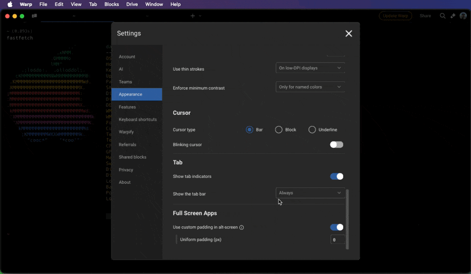

# Tab Indicators

Tab indicators provide visual cues in the tab bar under certain specific conditions: When the current pane is maximized, when panes or tabs are syncronized, and when a command exits with an error. These indicators serve as quick references.

## How to toggle Tab Indicators

* Navigate to `Settings > Appearance > Tabs`, and switch the "Show Tab Indicators" option.
* Utilize the [Command Palette](../features/command-palette.md), then search for "Tab indicators" to toggle the tab indicators.

<figure><figcaption>
Tab Indicator Demo
</figcaption></figure>

# Tab Bar

The tab bar provides easy navigation between open tabs. By default, the tab bar is visible in windowed mode but hides in fullscreen. To access the tab bar when hidden, hover near the top of the window. You can customize its visibility based on your preferences.

## How to configure the Tab Bar

* Navigate to `Settings > Appearance > Tabs > Show the tab bar` to toggle the visibility of the tab bar. Choose from the following options:
  * Always – Keeps the tab bar visible at all times.
  * Only on hover – Hides the tab bar in both modes.
  * When windowed – Displays the tab bar only in windowed mode.
* Utilize the [Command Palette](../features/command-palette.md), then search for "Tab bar" to change tab bar settings.


On macOS, traffic lights will not be shown when in windowed mode if the tab bar is set to show only on hover.


<figure><figcaption>
Tab Bar Demo
</figcaption></figure>
