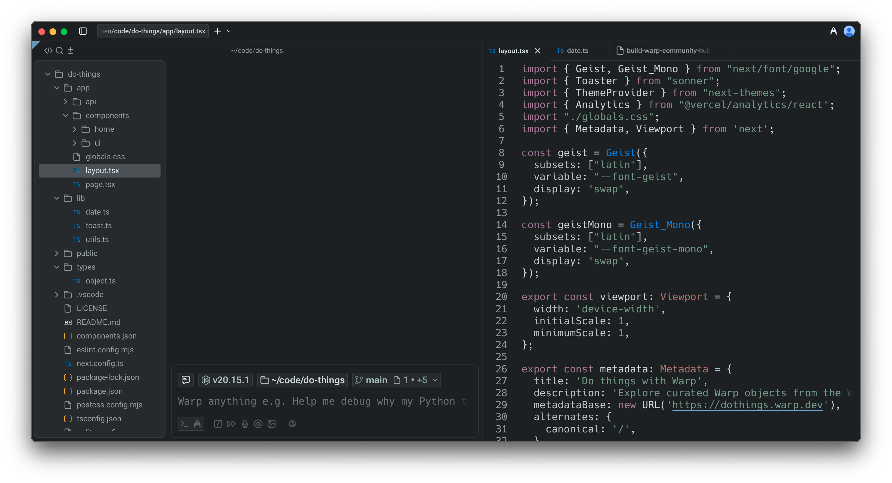
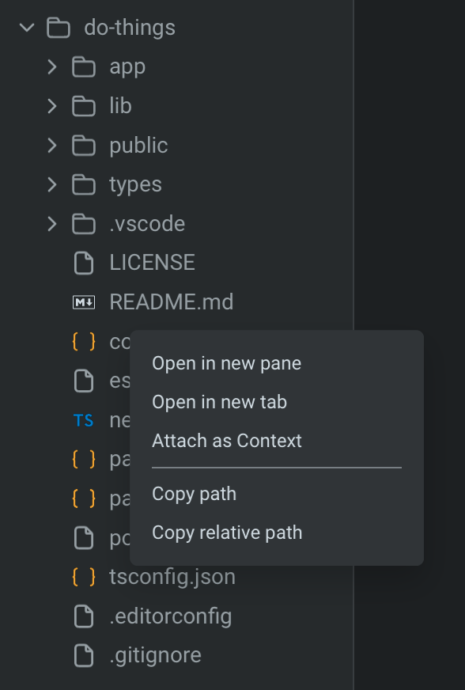
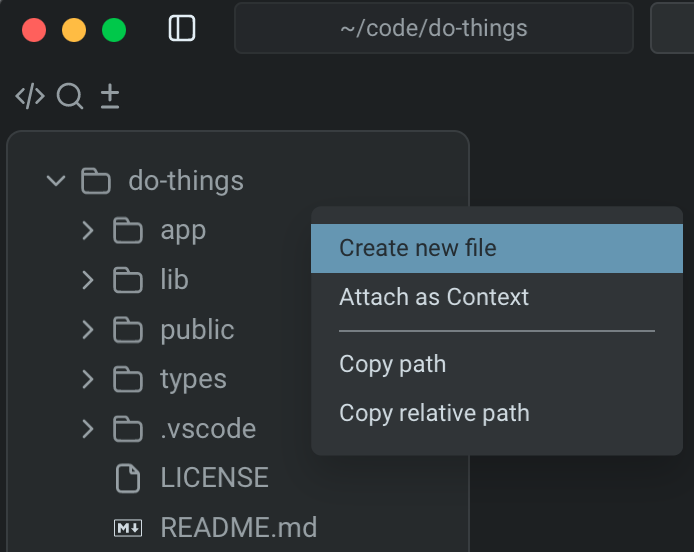

# File Tree

<figure><figcaption></figcaption></figure>

Warp includes a **native file tree** that makes it easy to explore and manage project files. The file tree is available whenever you’re working in a Git-tracked repository, and it automatically reflects your project structure as files are added, removed, or changed.

### Opening the file tree

You can open the file tree in two ways:

* **Pane coding toolbelt**: Click the `</>` button in the top left of a pane, whenever in a Git-tracked repo.
* **Keyboard shortcut**: Press `CMD + SHIFT + E` on macOS or `ALT + SHIFT + E` on Windows/Linux.


Warp supports icons for common file types. If a file type is missing an icon, please [file a GitHub issue](https://github.com/warpdotdev/Warp/issues) so we can review and add support.


### Browsing and opening files

Clicking on a file opens it directly in Warp’s [**native Code Editor**](./), where you can view and edit code in a separate pane or tab.

## File and Folder Actions

Right-clicking any **file** opens a context menu with several useful options:

* **Open in new pane**: Open the file in a side-by-side pane.
* **Open in new tab**: Open the file in a new tab.
* **Attach as context**: Insert the file into an agent prompt so the Agent can analyze or reference it.
* **Copy path**: Copy the absolute file path.
* **Copy relative path**: Copy the path relative to your current working directory.

<figure><figcaption>
Right-click context menu on a folder in the file tree.
</figcaption></figure>

Right-clicking any **folder** opens a context menu with the following options:

* **Create new file**: Add a new file directly from the tree.
* **Attach as context**: Insert the selected file into your agent prompt so the Agent can analyze or reference it.
* **Copy path**: Copy the absolute file path to your clipboard.
* **Copy relative path**: Copy the path relative to your current working directory.

<figure><figcaption>
Right-click context menu on a directory in the file tree.
</figcaption></figure>

