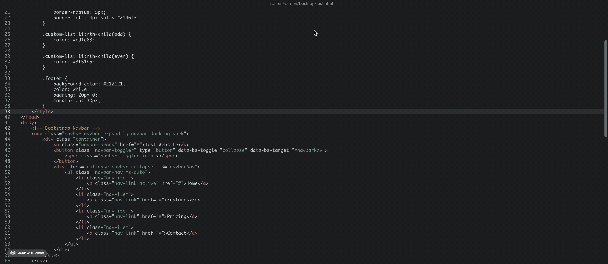
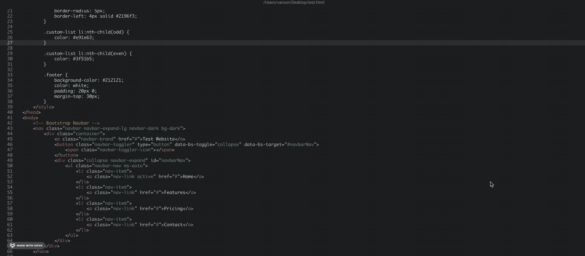

# Code Overview


Warps coding agent only work on local repositories. The agent can make changes on remote or docker repositories, but fallback to using terminal commands (i.e. `sed`, `grep` ) to make the changes.


## Coding capabilities

Warp includes advanced coding capabilities directly within your app window, which are triggered when the app detects an opportunity to generate a code diff. This powerful feature allows for seamless code generation, editing, and management tasks, all within the Warp environment.

<figure><figcaption>
Coding demo of a topological sort in Python.
</figcaption></figure>

### Examples of coding capabilities

Code responds to prompts related to code generation, editing, and analysis. Here are some examples:

* Code creation: “Write a function in JavaScript to debounce an input”
* Based on error outputs, suggest fixes: “Fix this TypeScript error.”
* Modify code within a file: “Update all instances of ‘var’ to ‘let’ in this file.”
* Apply changes across multiple files: “Add headers to all .py files in this directory”

When coding agent generates a code diff, you can review, refine, and decide whether to apply the changes.

### Built-in Code Editor

Warp’s [ADE (Agentic Development Environment)](https://www.warp.dev/blog/reimagining-coding-agentic-development-environment) lets you make quick file edits without leaving your agent conversation, keeping you in flow and avoiding an extra context-switch over to your IDE.

Our built-in text editor supports editing and syntax highlighting for a wide range of programming languages, including: \
\
Rust, Go, YAML, Python, JavaScript/TypeScript, JSX/TSX, Java/Groovy, C++, Shell/Bash, C#, HTML, CSS, C, JSON, HCL/Terraform, Lua, Ruby, PHP, TOML, Swift, Kotlin, Powershell, and Elixir. \
\
We’re continuously expanding language support to cover even more workflows.


You can open supported code files in Warp by clicking on a file path from the terminal output or an AI conversation and selecting "Open in Warp". To save your changes, press `CMD-S` on macOS or `CTRL-S` on Windows or Linux.


<figure><figcaption>
Opening code files in Warp
</figcaption></figure>

#### Find

Press `CMD-F` on macOS or `CTRL-F` on Windows and Linux to open the find menu. As you type, all matches in the file are highlighted, and the match closest to your cursor is selected.

* Press `ENTER` or use the down arrow to jump to the next match
* Press `SHIFT-ENTER` or use the up arrow to go to the previous match
* Click "Select All" to highlight all matches and close the menu

You can toggle regex and case-sensitive search options directly in the query editor.

<figure><figcaption>
Using the find menu in Warp
</figcaption></figure>

#### Replace

Click the dropdown to the left of the find menu to open the replace options.

* Press Enter to replace the currently selected match
* Use Replace All to replace all matches

Toggle Preserve Case to keep the original casing of replaced text. Case is preserved in text that contains PascalCase, camelCase, hyphens, and underscores. For example:

* Replacing “old” with “new” will turn “Old” into “New” and “OLD” into “NEW”
* Replacing “oldValue” with “NewValue” will result in “newValue”
* Replacing “OldValue” with “newValue” will result in “NewValue”
* Replacing “my-Old-VALUE” with “my-new-value” will result in “my-New-VALUE”

<figure><figcaption>
Using the replace menu in Warp
</figcaption></figure>

## Included Code features:

* [Code](code-overview.md) - Warp enables intelligent code generation and editing through AI-powered diffs, allowing you to review, refine, and apply changes seamlessly across your codebase.
* [Code Permissions](code-permissions.md) - Configure how the Coding agent behaves and fine-tune when it should act on its own or ask for your approval.
* [Codebase Context](codebase-context.md) - Warp indexes your Git-tracked codebase to help Agents understand your code and generate accurate, context-aware responses. No code is stored on Warp servers.
* [Reviewing Code Diffs](reviewing-code.md) - Learn how to review, refine, and apply code changes generated by Warp’s agents using the built-in visual diff editor.
