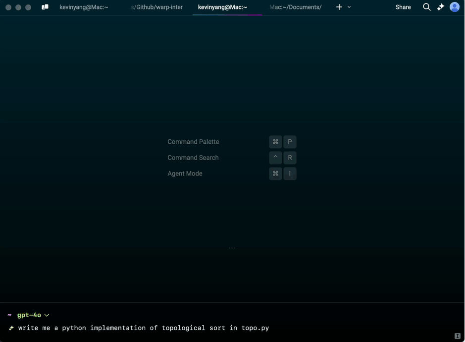
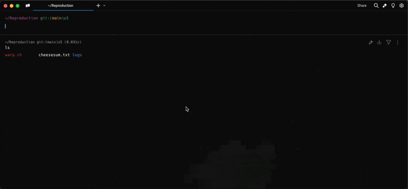

# Code Overview

## Coding capabilities

Warp includes advanced coding capabilities directly within your app window, which are triggered when the app detects an opportunity to generate a code diff. This powerful feature allows for seamless code generation, editing, and management tasks, all within the Warp environment.

<figure><figcaption>
Coding demo of a topological sort in Python.
</figcaption></figure>

### **Examples of coding capabilities**

Code responds to prompts related to code generation, editing, and analysis. Here are some examples:

* Code creation: “Write a function in JavaScript to debounce an input”
* Based on error outputs, suggest fixes: “Fix this TypeScript error.”
* Modify code within a file: “Update all instances of ‘var’ to ‘let’ in this file.”
* Apply changes across multiple files: “Add headers to all .py files in this directory”

When coding agent generates a code diff, you can review, refine, and decide whether to apply the changes.

### **Supported languages for code suggestions in Agent Mode**

Agent Mode’s built-in text editor supports a wide range of programming languages and syntax highlighting, including: Python, JavaScript, TypeScript, Rust, Golang, Java, C, C#, C++, HTML, CSS, Bash, JSON, YAML. We are also continuously working on adding support for more languages.


You can also open supported code files in Warp by clicking on the link, then selecting "Open in Warp". To save your changes, press `CMD-S` on macOS or `CTRL-S` on Linux and Windows.


<figure><figcaption>
Opening code files in Warp
</figcaption></figure>

## Included Code features:

* [Code](broken-reference) - Generate, edit, and apply code changes with AI-powered diffs
