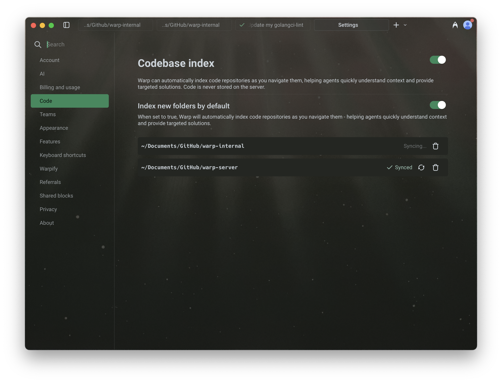
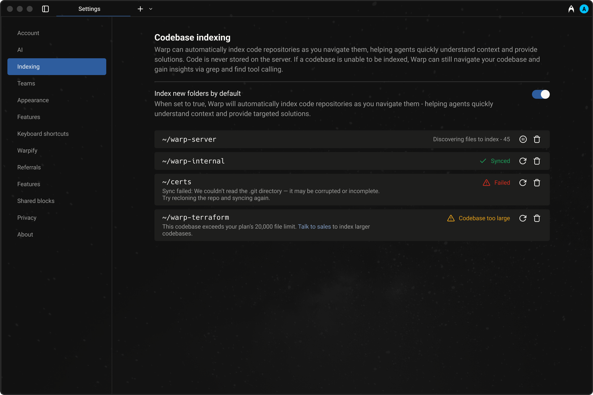

# Codebase Context

Codebase Context helps Warp Agents understand your project by indexing your local codebase. This allows Agents to generate more accurate completions, suggest context-aware edits, and answer questions using real knowledge of your code.


Code indexed with Codebase Context is never stored on our servers.



Codebase context doesn't work within SSH or WSL sessions. Feature requests for support are being tracked in the following Github issues: \
SSH - [https://github.com/warpdotdev/Warp/issues/6831](https://github.com/warpdotdev/Warp/issues/6831)\
WSL - [https://github.com/warpdotdev/Warp/issues/6744](https://github.com/warpdotdev/Warp/issues/6744)


<figure><figcaption>
Codebase indexing settings in Warp. Easily track sync status and manage which folders are indexed for AI-powered context and suggestions.
</figcaption></figure>

## Indexing your codebase

When you open a directory in Warp, we check if it is part of a Git repository. If it is, Warp begins indexing the source code to provide rich context for Warp Agents.

This embeddings index helps Agents:

* Understand your project structure and reference relevant code
* Generate completions that match your style and patterns
* Suggest edits in the correct locations based on real context

**Warp keeps the index up to date automatically as you make changes**, so Agents always have access to fresh context.

The first time you open a directory after launching Warp, indexing will begin from scratch. For large projects, this may take a few minutes. Warp Agents will not use codebase context until indexing is complete — but **agentic coding features remain fully available in the meantime**.


You can view and manage your indexed codebases under `Settings > Code > Codebase Index`. You can also choose whether to automatically index new folders as you navigate them.


### **Codebase indexing states**

When viewing indexed codebases in Warp under `Settings > Code`, you may see different status indicators:

* **Synced** — Indexing is complete and the codebase is ready to be used as context.
* **Discovering files** – Warp is currently scanning and indexing files in the codebase.
* **Failed** – Indexing failed. Common reasons include unreadable `.git` directories or corrupted repositories. Try recloning the repo and syncing again.
* **Codebase too large** – The number of files in the codebase exceeds your current plan’s limit. You can either reduce the number of files being indexed using `.warpindexingignore`, or [contact sales](https://warp.dev/contact-sales) for support with larger codebases.

<figure><figcaption>
View and manage the indexing status of your codebases in Warp. Easily see which projects are synced, in progress, or require attention.
</figcaption></figure>

### When does codebase syncing happen?

Warp automatically triggers a codebase sync periodically and whenever a new Agent conversation begins. However, if many files have changed or the network is slow, the sync may not complete before the Agent tries to access context.


In large projects (e.g. after a branch switch), there may be a short delay where the Agent rerefernces stale or outdated files.


### File and Codebase Limits

The number of codebases you can index and the maximum number of files per codebase vary by plan. All plans support indexing **at least 5,000 files per codebase**, with higher tiers including support for more files and additional codebases.

For full details, visit our [pricing page](https://www.warp.dev/pricing).

### Ignore files

For large codebases, Warp supports several ignore files to give you control over what gets indexed. This allows each developer to focus context on the parts of the codebase most relevant to their work.

Warp respects the following ignore files:

* `.gitignore`
* `.warpindexingignore`
* `.cursorignore`
* `.cursorindexingignore`
* `.codeiumignore`

Use these files to skip indexing of folders, generated files, or any content you don't want agents to reference. This can improve performance and result quality.


Files excluded by ignore rules **do not** count toward your codebase's file limit.


## Multi-repo context

Warp supports referencing context across multiple indexed repositories. Note that you don’t need to be inside a specific repo for agents to use its context.&#x20;

**This is especially useful when:**

* Implementing a feature across multiple repos, such as full-stack work across client and server
* Using one repo as a reference while building in another, for example: “copy the implementation from repo A into my repo B”

Agents will only reference other repositories if they are already indexed. During cross-repo tasks, Warp's Agents have access to the file paths of all indexed repos. It is more likely to use cross-repo context when you mention the exact name of the repo in your prompt.
