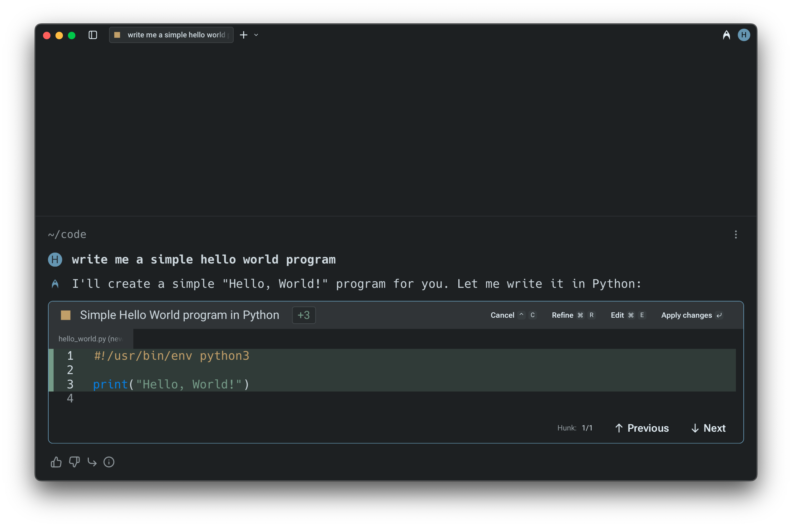
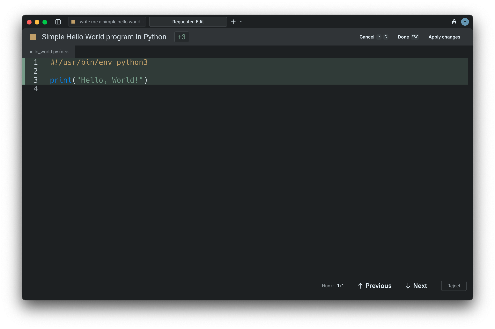

# Code Diffs in Agent Conversations

## Reviewing Code Diffs

During an Agent Conversation, Warp can generate code diffs that open directly in a built-in diff editor.

This lets you review proposed changes line by line, refine them with natural language, or make manual edits before choosing whether to apply them. It’s a fast, transparent way to stay in control of agent-generated code.

**Note**: If the `Apply Code Diffs` permission is set to `Agent decides` or `Always allow` in [agent-profiles-permissions.md](../agents/using-agents/agent-profiles-permissions.md "mention"), code diffs will not be surfaced for you to review. If it’s set to `Always ask`, you’ll always be prompted to review them.


Code diffs generated by Warp are never stored on our servers. Warp's coding agent only works on local repositories. The agent can make changes on remote or docker repositories, but fallback to using terminal commands (i.e. `sed`, `grep` ) to make the changes.


<figure><figcaption>
A code diff surfaced in an Agent Conversation.
</figcaption></figure>

You can also choose whether Warp automatically opens the [code-review](code-review/ "mention") panel the first time you accept a diff in a conversation. This behavior can be toggled in `Settings > Features > General > Auto-open Code Review Panel`.

## **Navigating and applying diffs**

When a Warp Agent generates a code diff, Warp opens it in a built-in text editor with a visual diff view. Changes are grouped into clear hunks for easy inspection.

* Use the `UP` and `DOWN` arrow keys (or mouse clicks) to move between hunks.
* For multi-file changes, use `LEFT` and `RIGHT` arrow keys to switch between files.
* Once satisfied with the changes, you can apply the diffs using `ENTER` or clicking "**Accept Changes**" to apply the modifications.


These modifications will not be applied to the files unless you explicitly accept them.


## **Refining or editing the diffs**

If the initial suggestion needs more work:

* Press `R` or select the "**Refine**" button to provide follow-up instructions in natural language. The agent will regenerate the diff based on your input.
* To manually adjust the code, press `E` or click "**Edit**" to switch into an editable view.
* To cancel a pending operation, use `CTRL-C` (on Mac, Windows, or Linux systems). Similarly, you can exit the editor at any time with `ESC` .


You can open up code files in Warp in various different ways, refer to: [#opening-files-in-warp](code-editor/#opening-files-in-warp "mention")


<figure><figcaption>
Editing the code diff directly in Warp's native code editor.
</figcaption></figure>

### Demo: Editing Agent Code in Warp

Here's an example from [Warp University](https://www.warp.dev/university), where Zach demonstrates a how to review and edit Agent code diffs natively in Warp:


