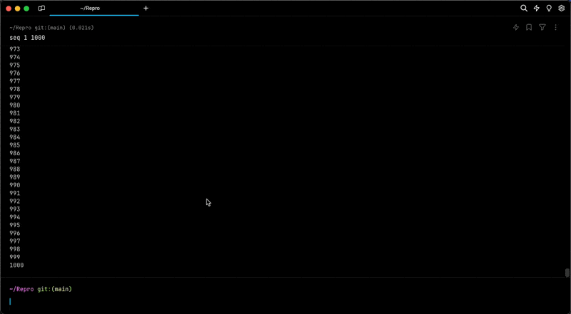

# Sticky Command Header


For long-running commands that take up the full screen, the sticky header only shows after you start scrolling up. This is to prevent the header from blocking the top part of the output for commands like `git log` that simulate full-screen apps.


## How to access Sticky Command Header



* Sticky Command Header is enabled by default.
* Toggle Sticky Command Header by going to `Settings > Features` > toggle “Show sticky command header”.
* Toggle by searching for “Sticky Command Header” within the [Command Palette](../../features/command-palette.md) or by pressing `CTRL-CMD-S`.
* You can also "Toggle the Sticky Command Header in the Active Pane" with `CTRL-S`. This won't disable the feature entirely, only minimize it on the active session.



* Sticky Command Header is enabled by default.
* Toggle the Sticky Command Header by going to `Settings > Features` > toggle “Show sticky command header”.
* Toggle by searching for “Sticky Command Header” within the [Command Palette](../../features/command-palette.md) or by setting up a key bind in `Settings > Keyboard Shortcuts`.
* You can also "Toggle the Sticky Command Header in the Active Pane" in the Command Palette or by setting up a key bind in `Settings > Keyboard Shortcuts`. This won't disable the feature entirely, only minimize it on the active session.



* Sticky Command Header is enabled by default.
* Toggle the Sticky Command Header by going to `Settings > Features` > toggle “Show sticky command header”.
* Toggle by searching for “Sticky Command Header” within the [Command Palette](../command-palette.md) or by setting up a key bind in `Settings > Keyboard Shortcuts`.
* You can also "Toggle the Sticky Command Header in the Active Pane" in the Command Palette or by setting up a key bind in `Settings > Keyboard Shortcuts`. This won't disable the feature entirely, only minimize it on the active session.



## How to use Sticky Command Header

* If a Block has a large output ( e.g. `seq 1 1000`), the header of the Block will show on the top of the active Window, Tab, or Pane.
* Click on the Sticky Command Header to quickly jump to the top of the Block.
* While active you can also minimize the Sticky Command Header on the active pane by clicking the UP/DOWN arrow in the middle of the header.

## How Sticky Command Header works


Sticky Command Header Demo


<figure><figcaption>
Toggle active header and Jump to bottom of block demo
</figcaption></figure>
