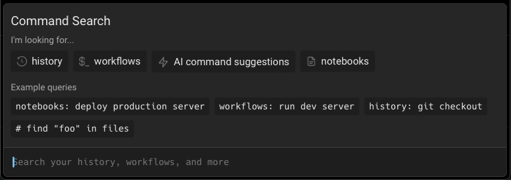

# Command Search


Tailor your Command Search experience by toggling off "Show Global Workflows" in `Settings > Features`. When disabled, your search will exclusively encompass YAML and Warp Drive Workflows.


## Quick Start

1. Press `CTRL-R` to open the Command Search Panel
2. Type your search query in the input box
3. Press `ENTER` to input the selected command into Warp's Input Editor

## Search Results

The Command Search panel searches across:

* Command History
* Workflows
* Notebooks
* AI Command Suggestions from Generate

### Result Icons

* $\_ Dollar Sign-Underscore: [Workflow](yaml-workflows.md)
*  Rewind Time Clock: [Command History](command-history.md)
*  Earmarked Page: [Notebook](../warp-drive/notebooks.md)
* ✨ Sparkle: Piping search query into [Generate](Generate.md)

## Search Filters

You can filter your search results by prepending your search term with any of the following:

| Filter                | Shortcuts                       |
| --------------------- | ------------------------------- |
| Workflows             | `workflows:`, `w:`, or `W-TAB`  |
| Notebooks             | `notebooks:`, `n:`, or `N-TAB`  |
| Command History       | `history:`, `h:`, or `H-TAB`    |
| Environment Variables | `env_vars:`, `e:`, or `E-TAB`   |
| Prompts               | `prompts:`, `p:`, or `P-TAB`    |
| Agent Mode History    | `ai_history:`, `a:`, or `A-TAB` |
| Generate              | `#:`                            |


When a filter is activated, it will be bolded and italicized in the search panel.


## Additional Features

* You can expand the menu horizontally by dragging the right edge
* The panel supports fuzzy search and ranks results by relevance

## How it works


Command Search Demo

