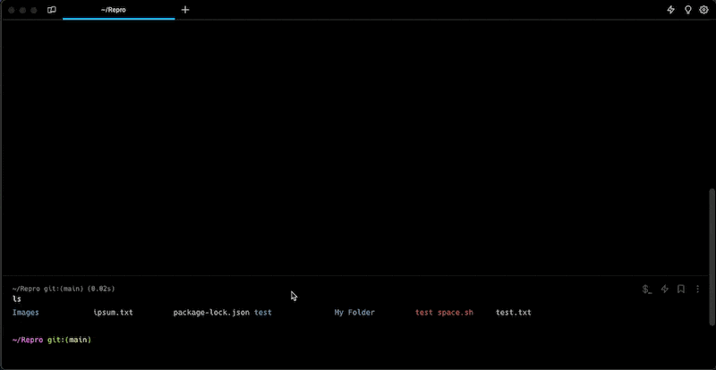
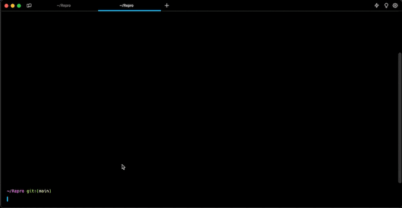

# Files, Links, & Scripts

## What is it

### Files & Links

Warp supports opening files, folders, and URL links that are within Blocks. Multiple URL protocols are supported e.g. `https`, `ftp`, `file`, etc. Warp opens web links directly in your default browser.

Warp can also open Markdown files directly. Learn more about [viewing Markdown files](markdown-viewer.md).

### Scripts

Warp can open `.command` and Unix Executable files from the finder directly.

## How to access it

### Files & Links



1. After hovering over a link, open it directly by holding down `CMD` while clicking it.
2. Clicking a link normally will open a clickable tooltip that says “Open File/Folder/Link”.
3. Right-clicking a link will open a context menu that supports copying the absolute file path or URL to the clipboard.



1. After hovering over a link, open it directly by holding down `CTRL` while clicking it.
2. Clicking a link normally will open a clickable tooltip that says “Open File/Folder/Link”.
3. Right-clicking a link will open a context menu that supports copying the absolute file path or URL to the clipboard.



1. After hovering over a link, open it directly by holding down `CTRL` while clicking it.
2. Clicking a link normally will open a clickable tooltip that says “Open File/Folder/Link”.
3. Right-clicking a link will open a context menu that supports copying the absolute file path or URL to the clipboard.




Configure the default editor to open files by navigating to `Settings > Features > Choose an editor to open file links`.


* You can also Drag and drop a folder or file onto the Warp dock icon to open a new tab in this directory.
* You can also right-click on a folder or file in Finder, then select Services, and "Open new Warp Tab | Window here".

### Scripts

1. Find a `.command` or Shell script you'd like to open in Finder.
2. Right-click and open the script with Warp.


Make sure the file has the appropriate executable permissions before you can run it in Warp. (e.g. `chmod +x script.command`)


## How it works

### Files & Links

Warp parses relative and absolute file paths. Warp also tries to capture line and column numbers attached to the file path, supported formats include:

* `file_name:line_num`
* `file_name:line_num:column_num`
* `file_name[line_num, column_num]`
* `file_name(line_num, column_num)`
* `file_name, line: line_num, column: column_num`
* `file_name, line: line_num, in`

<figure><figcaption>
Files &#x26; Links Demo
</figcaption></figure>

### Scripts

<figure><figcaption>
Scripts Demo
</figcaption></figure>
