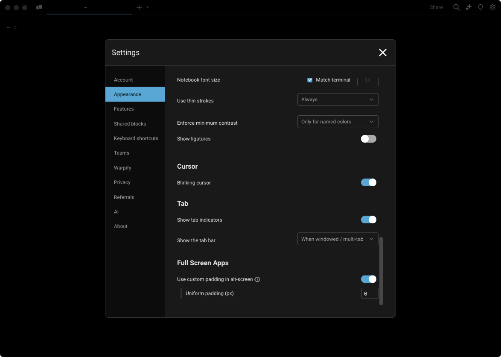

# Full-screen Apps

## Mouse and Scroll Reporting

Warp supports configuring how to handle mouse and scroll events. They can be sent to the currently running app, e.g. `vim`, or kept and handled by Warp.


Mouse reporting must be enabled to also toggle scroll reporting.


Once mouse reporting is enabled, Warp will use ANSI escape sequences to communicate mouse events to the running app.


If you want a mouse event to go to Warp instead (for example, for text selection) without disabling mouse reporting, you can hold the `SHIFT` key.


### How to access it

* From the Settings panel, `Settings > Features > Enable Mouse Reporting`
  * Scroll Reporting can be enabled after toggling `Enable Mouse Reporting`
* From the [Command Palette](command-palette.md), search for "Toggle Mouse Reporting"
* From the macOS Menu, `View > Toggle Mouse Reporting`
* With the keyboard shortcut: `CMD-R`

### How it works


Mouse and Scroll Reporting Demo


## Padding

Warp supports configuring how much padding surrounds full-screen apps. The default is 0 pixel padding, but this can be changed to a custom padding amount or to match the padding in the Blocklist.


Warp allows you to scale your terminal by fractions of a cell width | height. When your terminal size is not perfectly aligned to a cell width | height, the extra space appears as padding on the right | bottom.


### How to access it

* Go to `Settings > Appearance > Full Screen Apps` or from the [Command Palette](command-palette.md) search for "Appearance"
  * `Use custom padding in alt-screen` is enabled by default, you can disable it to match the Blocklist padding
    * Set the desired uniform padding (px) pixels, which is set to 0px by default


Some full-screen applications don't behave well when resizing. If you are experiencing rendering issues with full screen apps, try turning this setting off. This will ensure that full-screen apps don't need to resize when starting up.


<figure><figcaption>
Alt-screen padding setting
</figcaption></figure>
