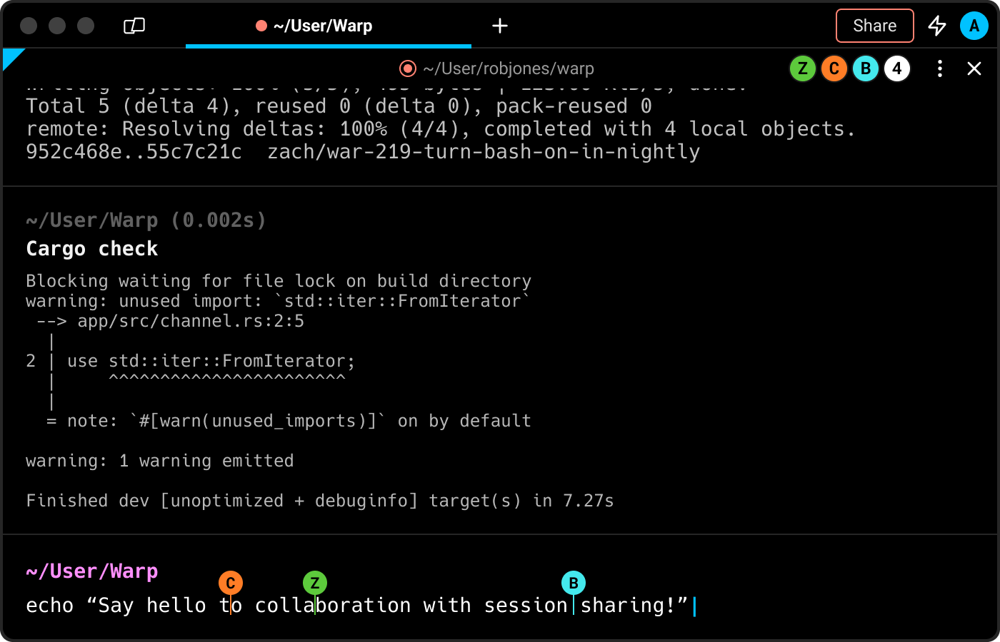
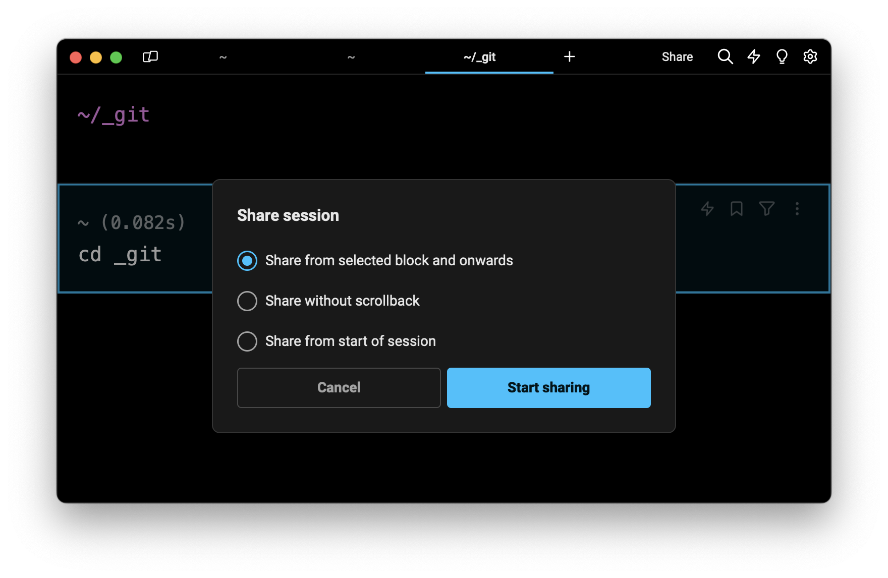
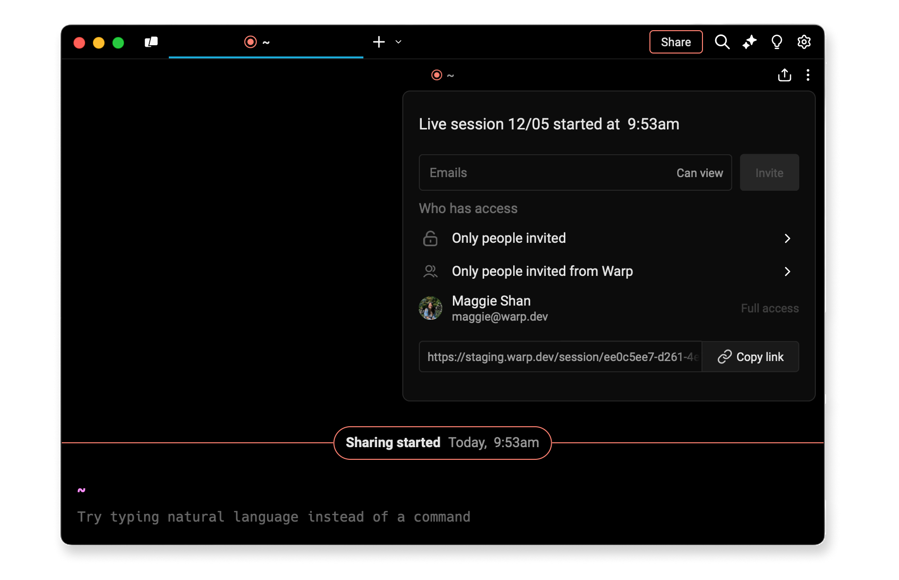
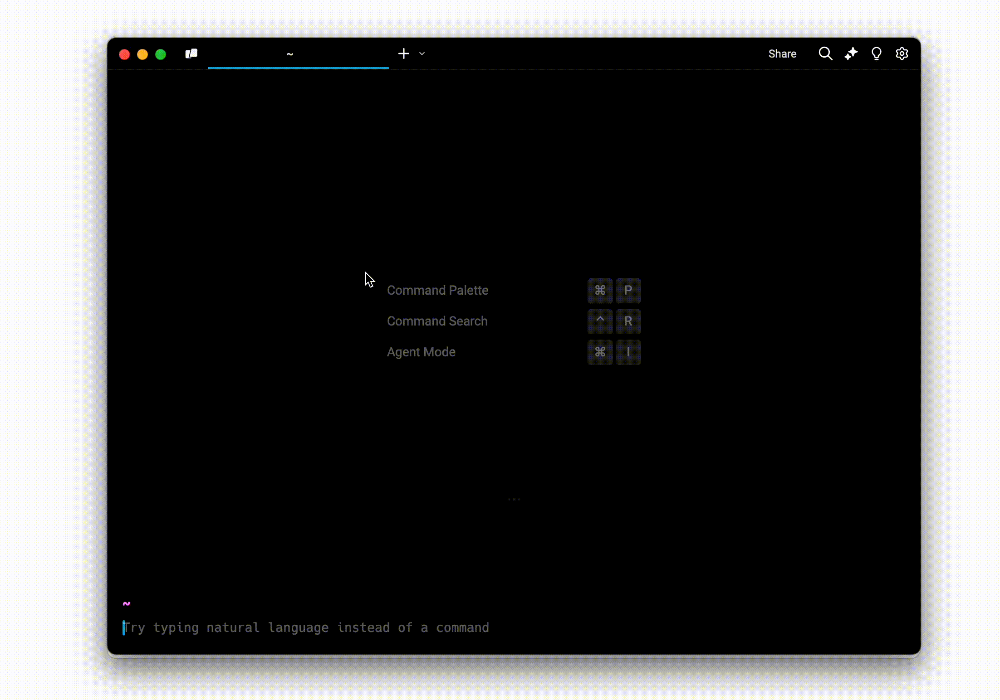
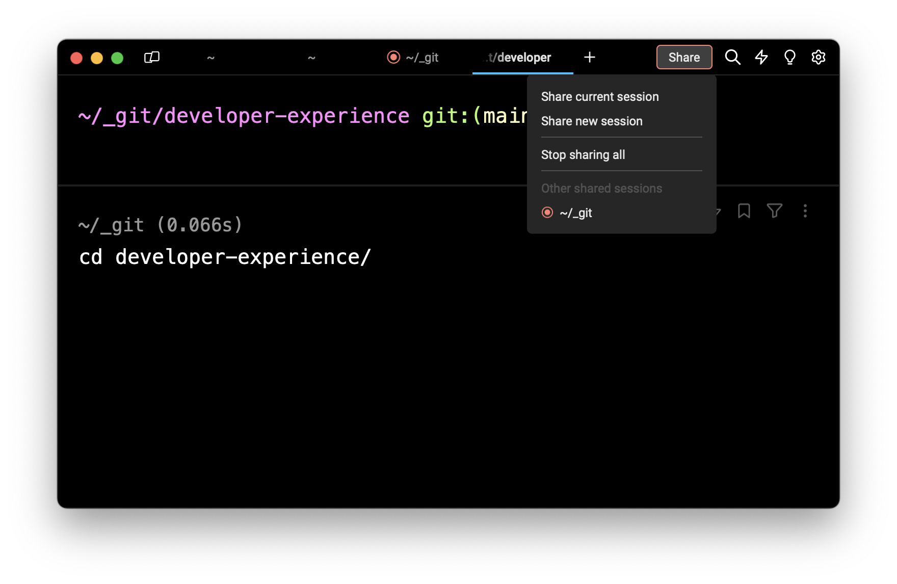

# Session Sharing


This action sends command information to Warp’s servers and is explicitly opt-in. Read more about privacy for cloud features in the [privacy overview](https://www.warp.dev/privacy/overview).


<figure><figcaption>
Session Sharing allows multiple teammates to edit the input at the same time
</figcaption></figure>

### Share a session

Users will find a Share button in the Warp top-bar navigation.

To start sharing:

1. Click Share
2. Select the option to share a current session or start a new session

#### How to control a starting point for sharing

If you select to share a current session, you will be given the option to share without scrollback or from the start of the session. When you share access from the start of a session (with scrollback), collaborators will be able to view and interact with your entire session history including command outputs from before sharing was initiated.

If you initiate a shared session using Block actions, you will be given the option to start sharing from the selected block onwards. This option gives you the precision to select a specific block of output in your session history as the starting point, excluding all previous scrollback before that block.

<figure><figcaption>
Start sharing from a selected block onward or an entire session with or without scrollback
</figcaption></figure>

#### How to allow access to collaborators in your session

After starting a shared session, Warp will copy a link to your clipboard that you can share. Share links open the Warp's native app or the Web.


By default the links are restricted to only emails that have access. It’s critical you only share your session links in private channels with known teammates and approved collaborators. Do not include your session-sharing links in any public forums.


You can adjust who has view or edit access to your session and specifically:

* Add emails to grant access
* Allow anyone with the link
* Allow anyone on your team
* Revoke edit access from collaborators
* Remove collaborators from the session

<figure><figcaption>
Update permissions through the share icon
</figcaption></figure>

When somebody accesses your shared session, they will be able to:

* View your session in Warp including your command line input and output
* Highlight blocks and text in your session
* Request control to edit and enter commands in the sharer’s session

If granted access, collaborators can edit the input together in real-time and execute commands.

You can also:

* Reference avatars and usernames for every collaborator who has access to your session
* Jump to a collaborator’s selection by clicking on their avatar

<figure><figcaption>
Session Sharing Native to Web Demo
</figcaption></figure>

#### How to end a shared session

When you’re ready to end a shared session, click `Share > Stop` sharing to wrap up and close access for all collaborators.

#### Multiple shared sessions

You may share multiple sessions simultaneously. If you have multiple shared sessions, you will find _Other shared sessions_ listed in the Share dropdown menu. You may also end multiple shared sessions at the same time with `Share > Stop` sharing all.

<figure><figcaption>
Switch between shared sessions or stop all shared sessions at once
</figcaption></figure>

### Known limitations

* [Agent Mode blocks](warp-ai/agent-mode.md) are not shareable during session sharing. Participants will be able to share regular shell commands that are run, but will not be able to share AI interactions (requested commands, AI blocks, etc.)
* [Secret redaction](secret-redaction.md) is not applied during session sharing.
* There is a session size limit of 100MB per session, 1GB per user per day, and a maximum of 10 participants per session (excluding the sharer). These limits are subject to change.
* Warp's Free and Pro plans are limited to 5 shared sessions and the session limits do not reset. Upgrade to a [Team plan](teams.md) to get unlimited sessions.


If you have any questions, please email [feedback+ss@warp.dev](mailto:feedback+ss@warp.dev).

