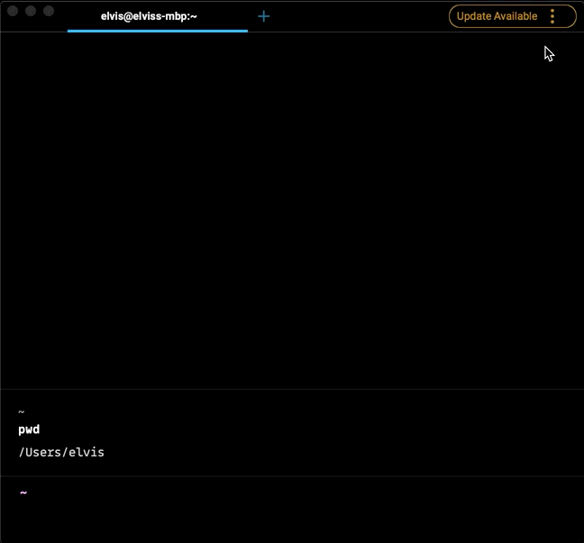

# Session Restoration

## What is it

Session restoration allows you to quickly pick up where you left off in your previous terminal session.

## How to access Session Restoration

* Session Restoration comes enabled by default in Warp.


On Linux, opening windows at a specific position is not supported in Wayland.


* You can disable Session Restoration by going to `Settings > Features`, then toggling off `Restore windows, tabs, and panes on startup`.


Toggling off Session Restoration will not clear the [SQLite database](session-restoration.md#session-restoration-database); however, Warp will stop recording new output.


## How Session Restoration works



#### Session Restoration database

Warp saves the data from your previous session's windows, tabs, and panes to a SQLite database on your computer, and every time you quit the app, this data is overwritten by your latest session. You can open the database directly and inspect its full contents like so:



```bash
sqlite3 "$HOME/Library/Application Support/dev.warp.Warp-Stable/warp.sqlite"
```



```powershell
sqlite3 $env:LOCALAPPDATA\warp\Warp\data\warp.sqlite
```



```bash
sqlite3 "${XDG_STATE_HOME:-$HOME/.local/state}/warp-terminal/warp.sqlite"
```



**How to clear the Session Restoration database**

Sometimes, you may want to prevent a sensitive Block from being saved on your computer, or you may want to clear blocks from a machine entirely.


This interferes with the running session's ability to save content and may require you close Warp before running the database removal commands.


There are two ways to do this:



* Clear the blocks from your running Warp session with `CMD-K`.
* Delete the SQLite file entirely with the following command:
```bash
rm -f "$HOME/Library/Application Support/dev.warp.Warp-Stable/warp.sqlite"
```



* Clear the blocks from your running Warp session with `CTRL-SHIFT-K`.
* Delete the SQLite file entirely with the following command:
```powershell
Remove-Item -Force $env:LOCALAPPDATA\warp\Warp\data\warp.sqlite
```



* Clear the blocks from your running Warp session with `CTRL-SHIFT-K`.
* Delete the SQLite file entirely with the following command:
```bash
rm -f "${XDG_STATE_HOME:-$HOME/.local/state}/warp-terminal/warp.sqlite"
```


