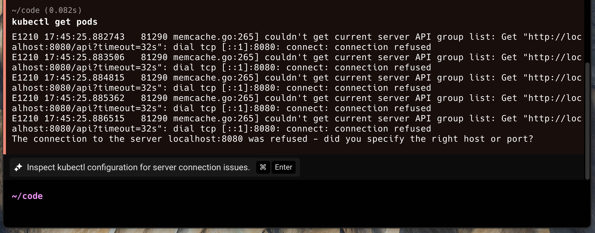
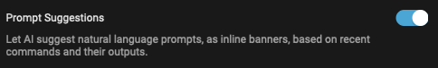

# Active AI

## Features

### Prompt Suggestions

Prompt Suggestions are contextual, AI-powered suggestions that activate Agent Mode. These banners will provide suggestions for what to ask Agent Mode in specific scenarios, similar to how Warp already suggests commands to run.

<figure><figcaption>
Example of inline banner popping up when relevant contextually.
</figcaption></figure>

If you press `CMD-ENTER` (on Mac), `CTRL-SHIFT-ENTER` (on Linux/Windows), or click on the chip, the suggestion will be auto-populated into your input and run against Agent Mode (with the most recent block attached).


Prompt Suggestions use an LLM to generate prompts based on your terminal session, specifically the most recent block. These AI requests do not contribute towards your AI limits, however, any accepted prompts run in Agent Mode contribute as normal. Visit Settings > AI > Agent Mode, if you'd like to turn it off.


<figure><figcaption>
Setting for Prompt Suggestions
</figcaption></figure>

### Next Command (coming soon)

Next Command uses AI to suggest the next command to run based on your active terminal session and command history. It uses your active terminal session contents and an LLM to generate commands.&#x20;

<figure><figcaption></figcaption></figure>
