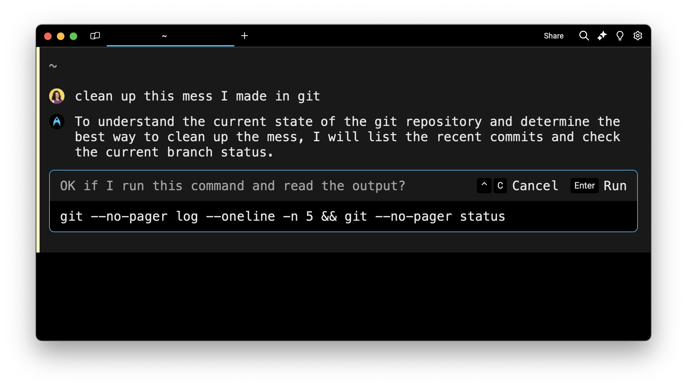
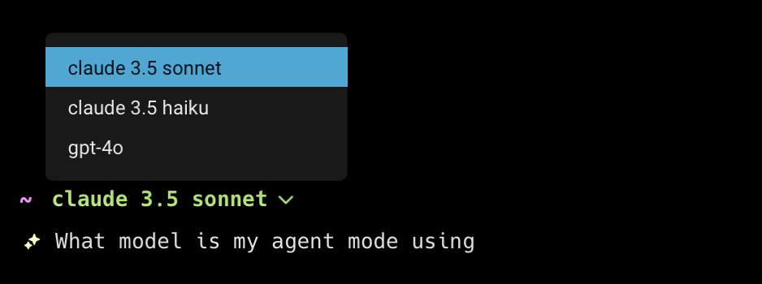
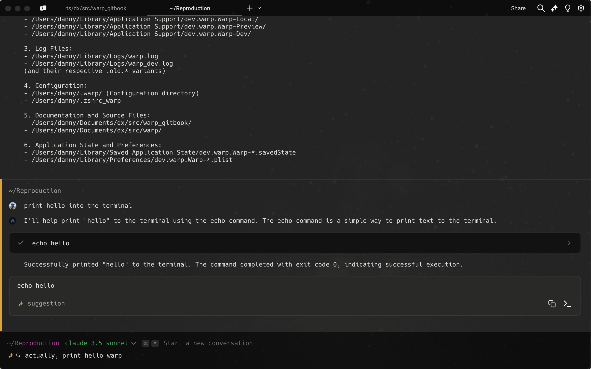
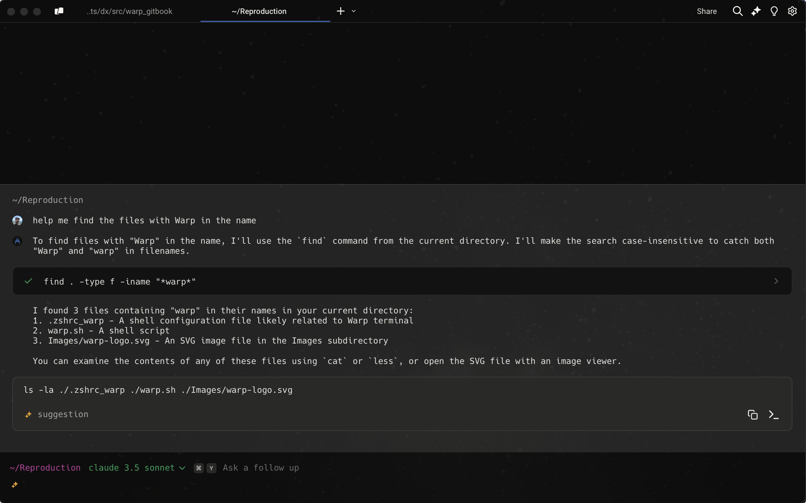
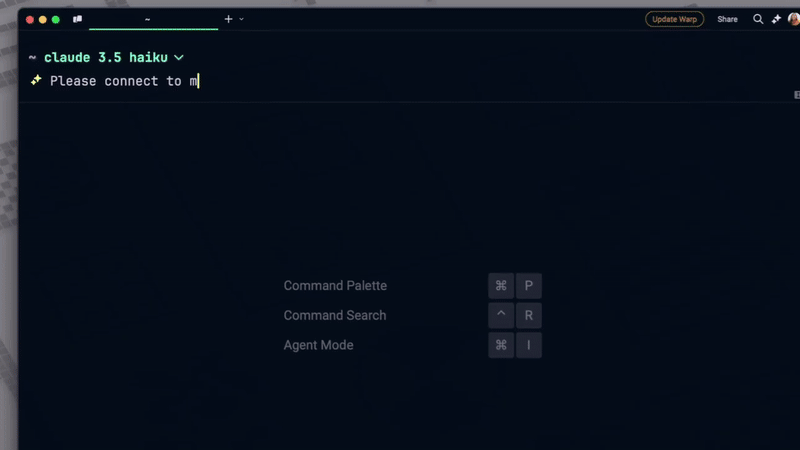

# Agent Mode

## What is Agent Mode?

Agent Mode is a mode in Warp that lets you perform any terminal task with natural language. Type the task into your terminal input, press `ENTER`, and Warp AI runs highly accurate commands tailored to your environment.\
\
Agent Mode can:

1. Understand plain English (not just commands)
2. Execute commands and use that output to guide you
3. Correct itself when it encounters mistakes
4. Learn and integrate with any service that has public docs or --help
5. Utilize your saved workflows to answer queries

[Visit the example gallery to watch videos of Agent Mode in action](https://www.warp.dev/ai).

### How to enter Agent Mode

You may enter Agent Mode in a few ways:



* Type any natural language, like a task or a question, in the terminal input. Warp will recognize natural language with a local auto-detection feature and prepare to send your query to Warp AI.
* Use keyboard shortcuts to toggle into Agent Mode `CMD-I` or type `ASTERISK+SPACE`.
* Click the “AI” sparkles icon in the menu bar, and this will open a new terminal pane that starts in Agent Mode.
* From a block, you want to ask Warp AI about. You can click the sparkles icon in the toolbelt, or click on its block context menu item “Attach block(s) to AI query”.



* Type any natural language, like a task or a question, in the terminal input. Warp will recognize natural language with a local auto-detection feature and prepare to send your query to Warp AI.
* Use keyboard shortcuts to toggle into Agent Mode `CTRL-I` or type `ASTERISK+SPACE`.
* Click the “AI” sparkles icon in the menu bar, and this will open a new terminal pane that starts in Agent Mode.
* From a block, you want to ask Warp AI about. You can click the sparkles icon in the toolbelt, or click on its block context menu item “Attach block(s) to AI query”.



When you are in Agent Mode, a ✨ sparkles icon will display in line with your terminal input.

<figure><figcaption>
The sparkles on the command line indicate Agent Mode is active.
</figcaption></figure>

### Auto-detection for natural language and configurable settings

The feature Warp uses to detect natural language automatically is completely local. None of your input is sent to AI unless you press `ENTER` in Agent Mode.

If you find that certain shell commands are falsely detected as natural language, you can fix the model by adding those commands to a denylist in `Settings > AI > Auto-detection denylist`.

You may also turn autodetection off from `Settings > AI > Input Auto-detection`.

The first time you enter Agent Mode, you will be served a banner with the option to disable auto-detection for natural language on your command line:

<figure><figcaption>
Warp displays an option to toggle natural language detection on / off
</figcaption></figure>

### Input Hints

Warp input occasionally shows hints within the input editor in a light grey text that helps users learn about features. It's enabled by default.

* Toggle this feature `Settings > AI > Show input hint text` or search for "Input hint text" in the [Command Palette](../command-palette.md) or Right-click on the input editor.

### How to exit Agent Mode



You can quit Agent Mode at any point with `ESC` or `CTRL-C`, or toggle out of Agent Mode with `CMD-I`.



You can quit Agent Mode at any point with `ESC` or `CTRL-C`, or toggle out of Agent Mode with `CTRL-I`.



### How to run commands in Agent Mode

Once you have typed your question or task in the input, press `ENTER` to execute your AI query. Agent Mode will send your request to Warp AI and begin streaming output in the form of an AI block.

Unlike a chat panel, Agent Mode can complete tasks for you by running commands directly in your session.

#### Agent Mode Command Suggestions

If Agent Mode finds a suitable command that will accomplish your task, it will describe the command in the AI block. It will also fill your terminal input with the suggested command so you can press `ENTER` to run the command.

When you run a command suggested by Agent Mode, that command will work like a standard command you've written in the terminal. No data will be sent back to the AI.

If the suggested command fails and you want to resolve the error, you may start a new AI query to address the problem.

<figure><figcaption>
Agent Mode makes a suggestion to run a command.
</figcaption></figure>

#### Agent Mode Requested Commands

If Agent Mode doesn't have enough context to assist with a task, it will ask permission to run a command and read the output of that command.

You must explicitly agree and press `ENTER` to run the requested command. When you hit enter, both the command input and the output will be sent to Warp AI.

If you do not wish to send the command or its output to AI, you can click Cancel or press `CTRL-C` to exit Agent Mode and return to the traditional command line. No input or output is ever sent to Warp AI without your explicit action.

<figure><figcaption>
Warp AI asks permission to run a command and read the output.
</figcaption></figure>

Once a requested command is executed, you may click to expand the output and view command details.

<figure><figcaption>
Viewing command details
</figcaption></figure>

In the case that a requested command fails, Warp AI will detect that. Agent Mode is self-correcting. It will request another command until it completes the task for you.

## How to choose your model in Agent Mode

Warp supports the ability to choose from a pre-defined list of LLMs to be used in your Agent Mode queries. Warp defaults to using Claude 3.5 Sonnet, but has support for OpenAI GPT-4o, OpenAI o3-mini, Claude 3.5 Haiku, Gemini 2.0 Flash, and DeepSeek R1 & V3 (hosted by [Fireworks AI](https://fireworks.ai/) in the US).

When you start an agent mode conversation, you will be able to see the model being used.

<figure><figcaption>
Agent mode prompt using Sonnet
</figcaption></figure>

To change the model being used, click the current model name, 'claude 3.5 sonnet' in the example image above, to open a dropdown menu with the supported models. Your model choice will persist in future prompts.

<figure><figcaption>
Dropdown menu of supported models
</figcaption></figure>

## Conversations with Agent Mode

Conceptually, a conversation refers to a sequence of AI queries and blocks. Conversations are tied to panes and you can have multiple Agent Mode conversations running at the same time in different panes.

You will get more accurate results from AI queries if the conversation is relevant to the query you ask. When you start an AI query unrelated to the previous conversation, start a new conversation. When you start an AI query related to the previous conversation, ask a follow-up and stay in the same conversation.


Long conversations can have high latency. We recommend creating a new conversation when possible for distinct tasks or questions where the previous context isn't relevant.


### How to attach context to an Agent Mode conversation

Agent Mode can gather context from your terminal sessions and tailor every command to your session and environment.

You can supply a block of context to your conversation with Agent Mode as part of your query. From the block in the terminal, click the AI sparkles icon to "Attach as Agent Mode context."

<figure><figcaption>
From a block of output, attach the block and ask Agent Mode to remove all untracked files.
</figcaption></figure>

The most common use case is to ask the AI to fix an error. You can attach the error in a query to Agent Mode and type "fix it."

If you're already in Agent Mode, use the following ways to attach or clear context from your query:



**Attach a previous block**

* To attach blocks to a query, you can use `CMD-UP` to attach the previous block as context to the query. While holding `CMD`, you can then use your `UP/DOWN` keys to pick another block to attach.
  * You may also use your mouse to attach blocks in your session. Hold `CMD` as you click on other blocks to extend your block selection.

**Clear a previous block**

* To clear blocks from a query, you can use `CMD-DOWN` until the blocks are removed from context.
  * You may also use your mouse to clear blocks in your session. Hold `CMD` as you click on an attached block to clear it.


When using "Pin to the top" [Input Position](../../appearance/input-position.md), the direction for attaching or detaching is reversed (i.e. `CMD-DOWN` attaches blocks to context, while `CMD-UP` clears blocks from context).




**Attach a previous block**

* To attach blocks to a query, you can use `CTRL-UP` to attach the previous block as context to the query. While holding `CMD`, you can then use your `UP/DOWN` keys to pick another block to attach.
  * You may also use your mouse to select blocks in your session. Hold `CTRL` as you click on other blocks to extend your block selection.

**Clear a previous block**

* To clear blocks from a query, you can use `CTRL-DOWN` until the blocks are removed from context.
  * You may also use your mouse to clear blocks in your session. Hold `CTRL` as you click on an attached block to clear it.


When using "Pin to the top" [Input Position](../../appearance/input-position.md), the direction for attaching or detaching is reversed (i.e. `CTRL-DOWN` attaches blocks to context, while `CTRL-UP` clears blocks from context).




### **How to ask a follow-up to stay in a conversation**

By default, if you ask an AI query right after any interaction in Agent Mode, your query will be sent as a follow-up. The follow-up ↳ icon is a bent arrow, to indicate your query is continuing the conversation.



To enter follow-up mode manually, press `CMD-Y`.



To enter follow-up mode manually, press `CTRL-Y`.



<figure><figcaption>
A continuing conversation in Agent Mode with a follow-up indicator
</figcaption></figure>

### **How to start a new conversation**

If there is no follow-up ↳ icon next to your input, this indicates a new conversation. If you ask an AI query after running a shell command you will be placed in a new conversation. Agent Mode will also kick you out to a new conversation after 3 hours.



To start a new conversation manually, use `CMD-Y` or `BACKSPACE`.



To start a new conversation manually, use `CTRL-Y` or `BACKSPACE`.



<figure><figcaption>
A new conversation in Agent Mode with no follow-up indicator
</figcaption></figure>


**Context truncation**

You might notice that in long conversations, the AI loses context from the very beginning of the conversation. This is because Warp's models are limited by context windows (\~128K tokens) and it will discard earlier tokens.


## Coding capabilities in Agent Mode

Agent Mode now includes advanced coding capabilities directly within your terminal, triggered when it detects an opportunity to generate a code diff. This powerful feature allows for seamless code generation, editing, and management tasks, all within your terminal environment.

<figure><figcaption>
Agent mode coding capabilities demo of a topological sort in Python.
</figcaption></figure>

For a more tailored editing experience, you can attach context blocks directly from the terminal, providing Agent Mode with specific input to guide its diff suggestions.

If you have questions or feedback about this recent feature, feel free to contact us at [feedback@warp.dev](mailto:feedback@warp.dev).

### **Examples of coding capabilities**

Agent Mode responds to prompts related to code generation, editing, and analysis. Here are some examples:

* Code creation: “Write a function in JavaScript to debounce an input”
* Based on error outputs, suggest fixes: “Fix this TypeScript error.”
* Modify code within a file: “Update all instances of ‘var’ to ‘let’ in this file.”
* Apply changes across multiple files: “Add headers to all .py files in this directory”

When Agent Mode generates a code diff, you can review, refine, and decide whether to apply the changes.

### **Navigating diffs within text-editor view**

When Agent Mode generates a code diff, it automatically triggers a built-in text editor diff view, which visually displays the changes as distinct hunks.

You can navigate through the highlighted hunks using the `UP` and `DOWN` arrow keys or mouse clicks. Agent Mode also supports multi-file changes, enabling you to view and manage hunks across several files. To switch between files, use the `LEFT` and `RIGHT` arrow keys.

Once satisfied with the changes, you can apply them by pressing `ENTER` or selecting the “Accept Changes” button. These modifications will not be applied to the files until you explicitly accept them.

### **Refining and editing diffs in text-editor view**

For refining or customizing the changes, Agent Mode allows for further interaction. You can refine the query (and diff) using natural language by pressing `R` or the “Refine” button, which will generate an updated diff based on your follow-up input.

If you wish to make direct edits within the text editor, press `E` or the “Edit” button to open the editor view. You can exit the editor by pressing `ESC`.

To cancel a pending action, use `CTRL-C` (on both Mac and Linux systems).


You can open up code files in Warp by clicking on the link and selecting "Open in Warp"\\


### **Supported languages for code suggestions in Agent Mode**

Agent Mode’s built-in text editor supports a wide range of programming languages and syntax highlighting, including: Python, JavaScript, TypeScript, Rust, Golang, Java, C, C#, C++, HTML, CSS, Bash, JSON, YAML. We are also continuously working on adding support for more languages.


You can also open supported code files in Warp by clicking on the link, then selecting "Open in Warp". To save your changes, press `CMD-S` on macOS or `CTRL-S` on Linux and Windows.


<figure><figcaption>
Opening code files in Warp
</figcaption></figure>

## Autonomy

Agent Mode supports configurable autonomous command execution under `Settings > AI > Autonomy`. You can customize this by:

1. Using a command allowlist to specify which commands can auto-execute
2. Using a command denylist to specify which commands require confirmation
3. Letting the Agent Mode model automatically determine if a command is safe to execute based on whether it's read-only

<figure><figcaption>
Agent Mode connects to a docker container and checks for error logs with autonomy enabled.
</figcaption></figure>

### Command allowlist

Agent Mode comes with default allowlist entries for common read-only commands that can be automatically executed without user confirmation.

* `which .*` - Find executable locations
* `ls(\s.*)?` - List directory contents
* `grep(\s.*)?` - Search file contents
* `find .*` - Search for files
* `echo(\s.*)?` - Print text output

You can add your own regular expressions to this list in `Settings > AI > Autonomy > Command allowlist`. Commands in the allowlist will always auto-execute, even if they are not read-only operations.


Mostly any commands are allowed to be auto-executed if they are on the allowlist, with the exception of any commands that contain redirection. e.g. `which warp 2>/dev/null`


### Command denylist

Agent Mode comes with default denylist entries for potentially risky commands that always require explicit user permission before execution. A couple of examples include:

* `wget(\s.*)?` - Network downloads
* `curl(\s.*)?` - Network requests
* `rm(\s.*)?` - File deletion
* `eval(\s.*)?` - Shell code execution

The denylist takes precedence over both the allowlist and model-based auto-execution. If a command matches the denylist, user permission will always be required, regardless of other settings. You can add your own regular expressions to this list in `Settings > AI > Autonomy > Command denylist`.

### Model based auto-execution

Agent Mode can dynamically analyze command safety for automatic execution of read-only commands. This provides intelligent command safety analysis but follows a strict precedence order.

1. Denylist (highest priority) - Commands always require confirmation
2. Allowlist - Commands always auto-execute
3. Model-based analysis (lowest priority) - Agent Mode determines if a command is read-only safe

This behavior can be toggled in `Settings > AI > Autonomy > Model-based auto-execution`.

### File read permissions for coding

When performing coding tasks, Agent Mode can automatically read files. This allows Agent Mode to analyze code without requiring explicit permission for each file access.

This behavior can be toggled in `Settings > AI > Autonomy > Coding read permissions`.

## Warp Drive as Agent Mode context

Agent Mode can leverage your [Warp Drive](../warp-drive/) contents to tailor responses to your personal and team developer workflows and environments. This includes any Workflows, Notebooks, Environmental Variables, etc..

## How billing works for Agent Mode

Every Warp plan includes a set number of Warp AI requests per user per month. Please refer to [pricing](https://www.warp.dev/pricing) to compare plans.

AI Request limits apply to Agent Mode, [Generate](generate.md), [Active AI](active-ai.md), and AI autofill in Warp Drive. When you have used up your allotted requests for the cycle, you will not be able to issue any more AI requests until the cycle renews.

#### What counts as a Warp AI request in Agent Mode?

Every time you submit an AI query from your input box, this counts as one Warp AI request. [Suggested commands](agent-mode.md#agent-mode-command-suggestions) and [requested commands](agent-mode.md#agent-mode-requested-commands) do not count as billable Warp AI requests. [Next Command](active-ai.md#next-command) suggestions are counted separately to Warp AI requests as noted in our [Active AI](active-ai.md#next-command-and-billing) docs.\
You can monitor your request usage under `Settings > AI > Usage`.

#### What counts as a Warp AI token in Agent Mode?

Tokens are chunks of text, such as words, parts of code, or characters, that large language models (LLMs) break down to analyze and generate responses. LLMs have a maximum number of tokens they can process at once. Warp AI Requests and Suggestions are not the same as Tokens, which are limited separately regardless of which plan you're on.\
Please learn more about Tokens [here](https://help.openai.com/en/articles/4936856-what-are-tokens-and-how-to-count-them) and refer to [pricing](https://www.warp.dev/pricing) for the current monthly token limits on each plan.

#### **When do my Warp AI requests, suggestions, and tokens refresh?**

Allotted AI requests refill every 30 days from your signup date. When you upgrade to a Pro or Team plan, you will be given more requests immediately. You can follow along with your refill period by referencing `Settings > AI > Request Usage`.

For more FAQs about pricing, visit [Plans, Subscriptions, and Pricing](../../help/plans-subscriptions-and-pricing.md).

## Privacy, Security, and Safety

We recognize that the terminal is a sensitive environment and we want to be explicit about what's leaving your machine and what’s being run when you use Agent Mode.

* You have to explicitly approve any command the AI wants to run.
* The natural language detection in the input is done completely locally. Warp first checks the string input with a completion engine, and then cross-checks the query string against popular engineering-related words. If you’re uncomfortable with the auto-detection, you may turn it off in Settings.
* You get to choose what blocks, if any, are sent to Warp AI.
* All actions are performed through terminal commands. All commands are inspectable. You may click on the requested commands to see their output. All suggested commands are run as regular Warp blocks you can read.
* [Suggested commands](agent-mode.md#agent-mode-command-suggestions) are not read by Warp AI.
* While [requested commands](agent-mode.md#agent-mode-requested-commands) and their output are sent to Warp AI, you get to cancel out a requested command at any time.
* You can inspect all data that’s leaving your machine using [Network Log](../network-log.md).
* Warp does not store or train on any data from Agent Mode.
* While Warp AI is built on OpenAI and OpenAI’s servers will receive all input, OpenAI does not train their models on this data.
* Advanced security features, such as Zero Data Retention and Custom LLM, are available on Warp's Enterprise plan.

## Known Issues and Limitations

* Note that Agent Mode blocks are not shareable during [session sharing](../session-sharing.md). Participants will be able to share regular shell commands that are run, but will not be able to share AI interactions (requested commands, AI blocks, etc.).
* Block actions such as [Block Sharing](../blocks/block-sharing.md) are not available on Agent Mode AI blocks.
* Warp AI does not have up-to-date information on several commands’ completion specs
* You cannot continue any conversation that’s before an existing conversation.
* Agent Mode works better with Warp's default prompt settings, where the prompt starts on a new line, than it does with a same-line prompt. If you are using the same-line prompt, the cursor will jump from the end of the single line to the start of the input box when you switch to Agent Mode.

### Exceeding Agent Mode token limits

#### **“Message token limit exceeded” error**

If you run into this error, it means that your query and attached context have collectively hit the context window limit on the models we are using. On GPT-4o, Warp AI cannot send more than 123,904 tokens in a single request, or you may not get output. To resolve this error, we recommend you start a new conversation or attach fewer lines of blocks to the query.

#### **“Monthly token limit exceeded” error**

Warp has set an extremely high token limit on users to prevent abuse. We do not anticipate any user hitting this limit. If you hit this limit and are interested in getting it lifted, please contact us with your use case at [feedback@warp.dev](mailto:feedback@warp.dev)

### Agent Mode FAQs

#### What happened to the old Warp AI chat panel?

Agent Mode has replaced the Warp AI chat panel. Agent Mode is more powerful in all of the chat panel's use cases. Not only can Agent Mode run commands for you, it can also gather context without you needing to copy and paste. To start a similar chat panel, click the AI button in the menu bar to start on a new AI pane.

#### Is my data used for model training?

No, Warp nor its providers OpenAI or Anthropic train on your data.

#### What model are you using?

The following LLMs are currently supported in Warp:

* **OpenAI**:
  * GPT-4o
  * o3-mini
* **Claude**:
  * 3.5 Sonnet
  * 3.5 Haiku
* **Google**:
  * Gemini 2.0 Flash
* **DeepSeek** (hosted by [Fireworks AI](https://fireworks.ai/) in the US):
  * R1
  * V3

#### Is DeepSeek enabled by default?

No, DeepSeek is never enabled by default. By default, Agent Mode uses Claude 3.5 Sonnet. To use DeepSeek, you would need to manually select it from the model selector inside Agent Mode.

#### How is my data handled for DeepSeek models?

We take privacy and security very seriously when it comes to models developed by foreign companies or hosted outside the US. DeepSeek models in Warp are hosted exclusively on US servers through our trusted provider, [Fireworks AI](https://fireworks.ai/). No requests are routed to servers outside the US.

#### Can I use my own LLM API key?

Warp AI is tailored for the terminal so you can get optimal results and performance. It's suitable for AI power users and professional use cases.

For organizations with strict security requirements, a “Bring Your Own LLM” option is available on the Enterprise plan. At the Enterprise plan level, we can work closely with your team to ensure quality and compliance for your LLM of choice.
