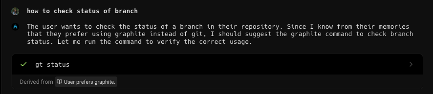
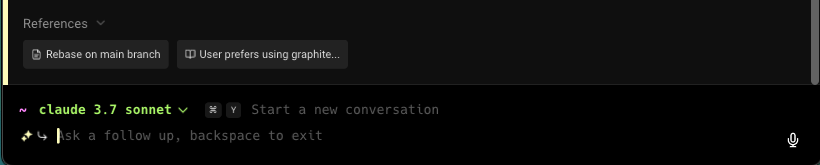

# Rules

Warp's Rules feature allows you to create and store rules that provide context to Agent Mode interations for smarter and more tailored assistance. Warp can also suggest rules to you based on your interactions with Agent Mode. These rules can include:

* Coding standards and best practices
* Project and workspace guidelines
* User-specific preferences

### How to access Rules

* From the [Warp Drive](../warp-drive/) > Personal > Rules
* From the [Command Palette](command-palette.md), search for "Open AI Rules"
* From the Settings panel, `Settings > AI > Knowledge > Manage Rules`
* From the macOS Menu, `AI > Open Rules`

### Managing Rules

In the Rules pane, users can add, edit, delete any number of rules. Each rule includes a name (optional) and description.


Rules Demo


### Rules as Agent Mode context

Agent Mode can leverage the rules you created to tailor its responses. Rules that are pulled as context will be displayed in the conversation as a citation under "References" or "derived from".

<figure><figcaption>
Derived from rules
</figcaption></figure>

<figure><figcaption>
Rules as references
</figcaption></figure>

### Rules Privacy

See our [Privacy Page](../../getting-started/privacy.md) for more information on how we handle data with Rules.
