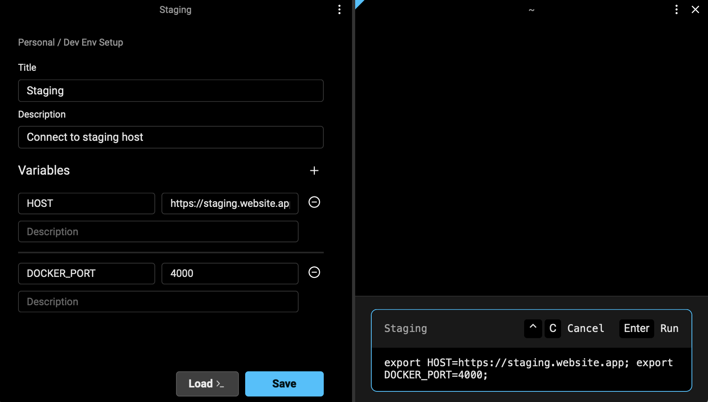
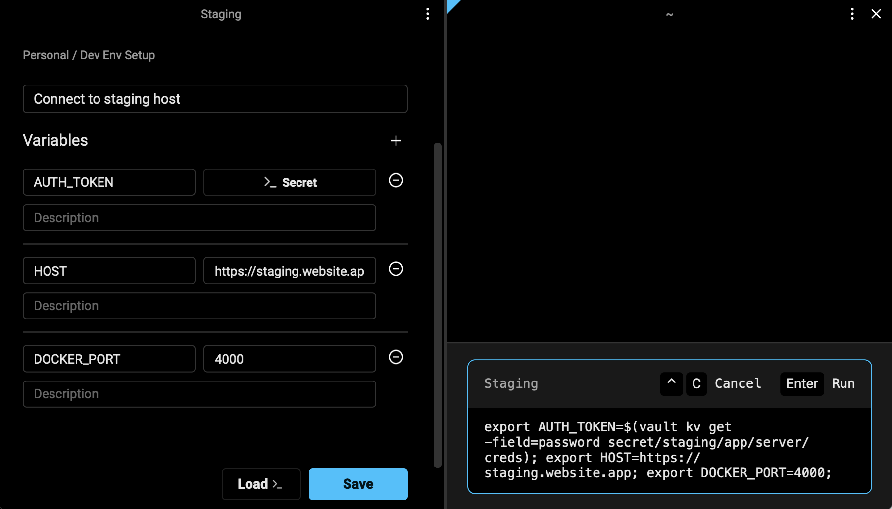
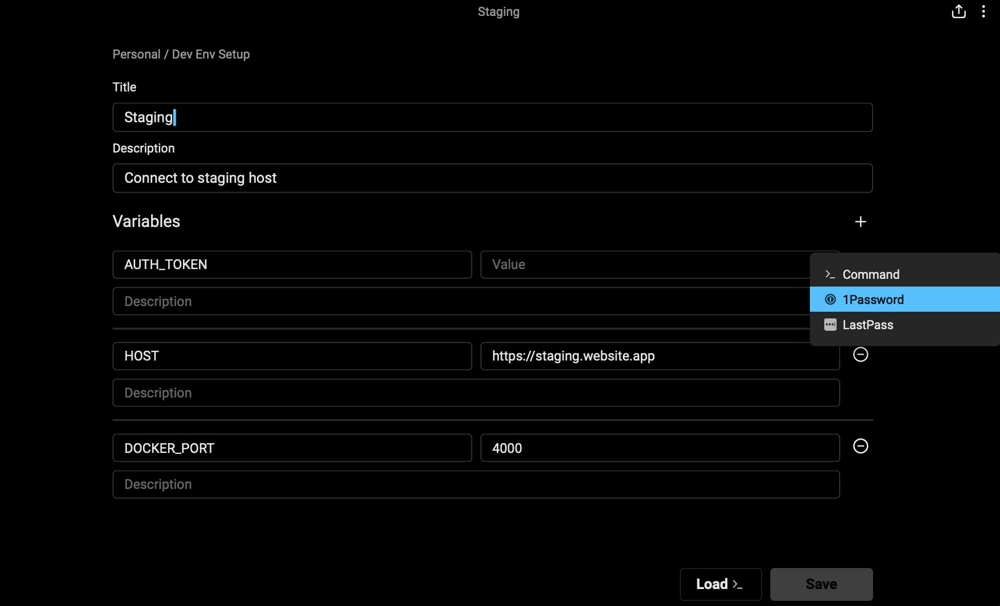
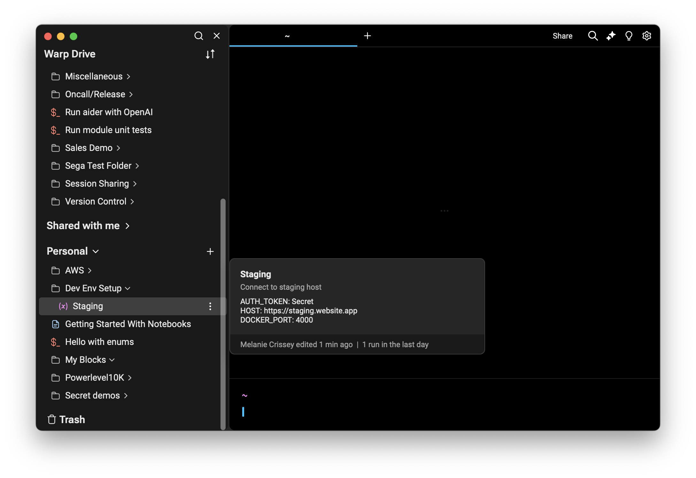

# Environment Variables


Environment Variables are currently available in Free Preview.


## What are Environment Variables in Warp?

Environment Variables in Warp are similar to .env files, except you can:

* Load them into your terminal session with a click.
* Use them in parameterized workflows.
* Dynamically reference secrets from external managers.

## How to create and edit environment variables

You can create new environment variables through:

* [Warp Drive](./), + → Environment variable
* [Command Palette](../command-palette.md), create new team or personal environment variables

Any of these entry points will open the environment variables editor where you can name and describe your environment variables.

<figure><figcaption></figcaption></figure>

## Managing individual environment variables

Warp supports two types of environment variables: static variables and dynamic variables.

### Static variables

Static variables are similar to .env files. You create the variables by entering raw strings of text. Each variable has a variable name and a corresponding value.

<figure><figcaption></figcaption></figure>

After you save the environment variable, you can click it to load it into your terminal session.

<figure><figcaption></figcaption></figure>

When you use static variables, Warp stores them securely in Warp Drive.\
\
Note: Static variables should not be used to replace a secret manager. Please use dynamic variables for any sensitive information.

### Dynamic variables


Warp never stores secrets used in dynamic variables. Warp only stores the command used to dynamically retrieve the secrets at runtime.


Dynamic variables let you reference secrets that are stored securely outside of Warp in external secret managers, such as 1Password or LastPass.

You can use custom commands to create dynamic variables for any system with a public API or CLI, such as AWS or Hashicorp Vault.

### **How to create and edit dynamic environment variables**

To create a new dynamic variable:

1. Open the environment variable editor.
2. Use the key icon to reveal the dynamic variable menu.
3. Select an integrated password manager or "Command" to write your own custom integration.

<figure><figcaption></figcaption></figure>

#### **Integrated password managers**

Before you get started, please ensure you have the CLI installed for your tool of choice and follow the instructions to enable the CLI:

* [1Password CLI](https://developer.1password.com/docs/cli/get-started/)
* [LastPass CLI](https://github.com/lastpass/lastpass-cli)

Then, you can click the key icon and select your manager from the dropdown menu.

<figure><figcaption></figcaption></figure>

The CLI will require you to authenticate and then provide you with a list of available secrets.


Selecting a secret name never stores the actual secret. Warp uses your selection to generate a command that dynamically pulls in your selected secret at runtime.


<figure><figcaption></figcaption></figure>

### **How to write a custom secret command**

Reference the documentation for your external secret manager. Then, write a custom command to retrieve secrets.


Your custom command should return the exact string you want loaded into your environment. Please make sure that you are selecting the exact field you want loaded as many secret manager CLIs provide additional formatting by default.


For example, you could write a command using the [Hashicorp Vault CLI](https://developer.hashicorp.com/vault/docs/commands) to retrieve and load the password field for the staging server. When using secret commands, Warp stores the command but never the actual secrets. The secrets will be referenced and loaded into a terminal session at runtime.

```
// vault kv get -field=password secret/staging/app/server/creds
```

<figure><figcaption></figcaption></figure>

### Using environment variables

There are three ways to invoke your environment variables and load them into a terminal session:

1. [Click to load into a current section](environment-variables.md#click-to-load-into-a-current-session)
2. [Click to load into a subshell](environment-variables.md#click-to-load-into-a-subshell)
3. [Select to load in with a workflow](environment-variables.md#select-to-load-with-a-workflow)

#### Click to load into a current session

First, click your environment variable from Warp Drive or the Command Palette.

Then, review the confirmation block. If your environment variables are correct, hit enter to load them into your session.

<figure><figcaption></figcaption></figure>

<figure><figcaption></figcaption></figure>

These environment variables will now be present for the remainder of your session.

#### Click to load into a subshell

To load environment variables into a subshell, you will need to open [Warp Drive](./) and locate your environment variable in the Warp Drive index. You can then use the overflow menu to select "Load in subshell."

Loading an environment into a subshell reduces the risk of your environment variables accidentally contaminating your workspace. The subshell is clearly defined and once you exit it, any environment variables set by Warp Environment Variables will be cleared, unless they are already present in the parent session.

<figure><figcaption></figcaption></figure>

<figure><figcaption></figcaption></figure>

#### Select to load with a workflow

Any time you run a workflow, you can select from existing environment variables. This allows you to dynamically inject environment variables into a parameterized workflow so you can use a single workflow command in multiple environments, such as production and staging.

For example, you might have a workflow to create a new team that uses the environment variable $SERVER\_URL. By using the environment variables dropdown in the workflow card, you can dynamically inject the necessary variables. This ensures the workflow references the appropriate values so the command runs with the relevant environment-specific information.

These environment variables will now be present for the remainder of your session until you clear them or overwrite them with a different environment.

<figure><figcaption></figcaption></figure>

<figure><figcaption></figcaption></figure>

\\
