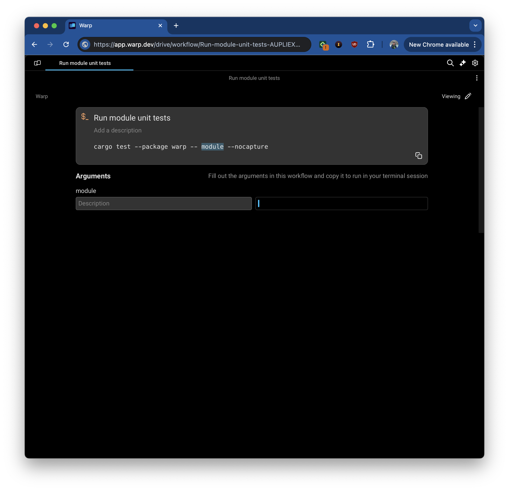
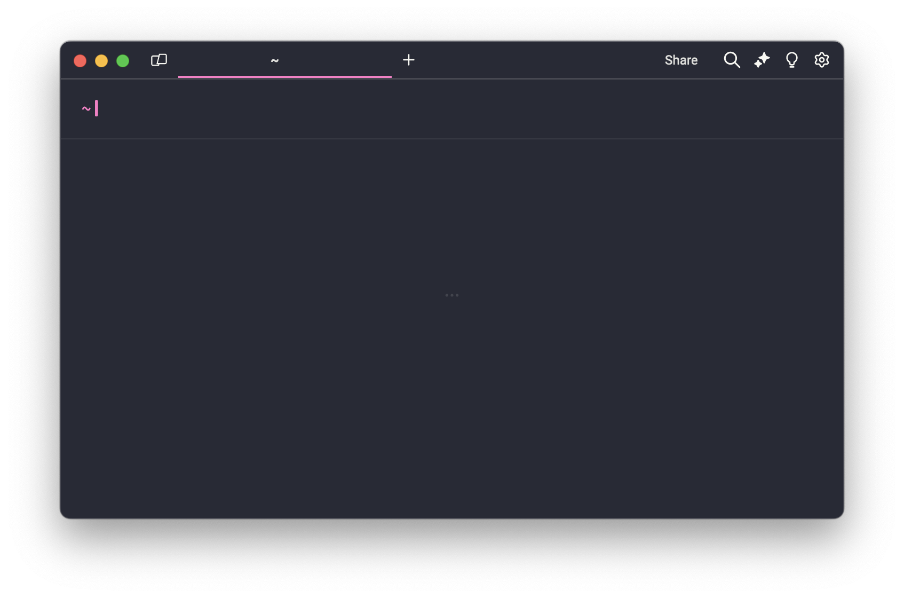
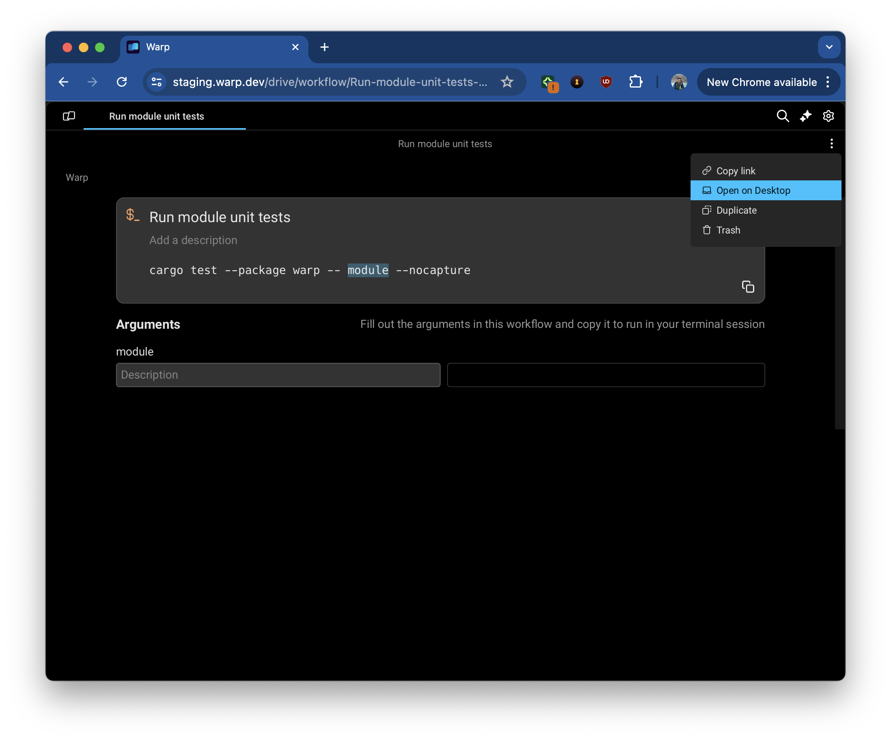

# Warp Drive on the Web \[Beta]

## What is Warp Drive on the Web?

Warp now gives developers the ability to view their drives and shared sessions on the browser.

<figure><figcaption>
A web-based rendering of a Team Workflow
</figcaption></figure>

## Accessing Warp Drive on the Web

Warp's web-based viewing experience can currently be accessed via:

* [Drive Object](../../../features/warp-drive/#sharing-your-drive-objects) Links
* [Session Sharing](../session-sharing.md#how-to-invite-collaborators-to-your-session) Links


You should be able to edit and view web-based objects and session as normal. The one exception is executing a command from a workflow or notebook since there is no shell session running on the web.


## Managing Your View Preferences - Web or Desktop

You can manage whether Warp links open in Warp's desktop app or the browser in multiple ways:


The desktop option is only presented if Warp's web service is able to detect the Warp app installed locally. If you would like to use Warp locally and do not have it installed, please visit our[ installation guide.](../../getting-started/getting-started-with-warp.md)


1. The first time you follow a link, you will be presented with the option to globally set your view preference to open links on desktop. Dismissing the pop-up will set you preference to web.

<figure><figcaption></figcaption></figure>

2.  This preference can be changed at any point in _Settings > Features > General > Open links in desktop app._ Note that this setting is only available while on the web-based version of Warp.

    <figure><figcaption>
Setting managing how to open links
</figcaption></figure>
3. You can always switch between web and desktop views on a case-by-case basis.&#x20;
   1.  To switch from a web-view to Desktop for a given object, open the _overflow menu > Open link on Desktop._

       <figure><figcaption></figcaption></figure>
   2.  To stay on the web for a given object despite a global Desktop preference, follow the _View on the web_ option that is part of the redirect screen to Desktop.

       <figure><figcaption></figcaption></figure>

## Supported Browsers

Modern browser support currently includes

* Chrome
* Firefox
* Safari
