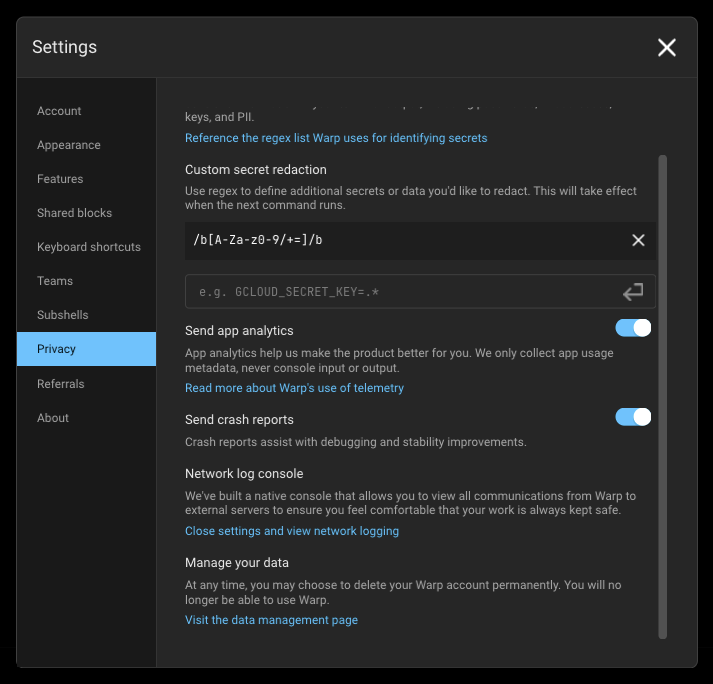

# Privacy


If you have any questions about any of this, please don’t hesitate to reach out at [privacy@warp.dev](mailto:privacy@warp.dev). For security-related issues or questions, please email [security@warp.dev](mailto:security@warp.dev).


## Transparency and control

Our philosophy is complete transparency and control over any data leaving your machine. This means you can:

* Read a complete list of [all the telemetry events](privacy.md#exhaustive-telemetry-table) that get sent for app analytics
* Monitor telemetry in real-time with Warp's native [Network Log](../features/network-log.md)
* [Opt out](privacy.md#how-to-disable-telemetry-and-crash-reporting) of telemetry at any time

## What telemetry data does Warp collect and why?

Warp collects high-level telemetry and usage data to discover product quality issues and guide feature prioritization.

If you haven't opted out of "Help improve Warp", we may collect:

1. High level product usage and analytics data to analyze feature uptake and usage patterns. See the [Exhaustive Telemetry Table](privacy.md#exhaustive-telemetry-table) for the full list of tracked events below. These are all high level metrics and do not include any user generated content.
2. AI interactions and console inputs that power our [AI features](../features/warp-ai/). Warp unconditionally applies [Secret Redaction](../features/secret-redaction.md) in all AI interactions to ensure that any sensitive data is _never_ collected or sent to third parties.

All users can opt-out of this any time and still continue using all of Warp (including AI features).


Enterprise plans are covered by our Zero Data Retention (ZDR) agreement. No AI interaction or console data is ever collected.


Selling usage data will never be part of Warp's business model. This data is used solely to improve the end-user experience. Warp uses Sentry for crash reporting and Rudderstack for app analytics.

You can read our [full privacy policy](https://www.warp.dev/privacy/policy) as well as [how Warp handles security](https://www.warp.dev/security).

### How to disable telemetry and crash reporting

1. Navigate to `Settings > Privacy`, or open the [Command Palette](../features/command-palette.md) and search for "privacy"
2. Toggle off "Help improve Warp", "Send crash reports", or both

<figure><figcaption>
Privacy Settings
</figcaption></figure>

With telemetry disabled, no console interactions are ever persisted on Warp's servers. Each request contains a `X-Warp-Telemetry-Enabled` header to specify whether telemetry is disabled, and even if this is missing from the request, our server assumes it's disabled.

### Delete your account and data

Warp provides a convenient way for you to delete your account and data. Any active Warp subscriptions associated with the account will also be cancelled when deleted. You can delete your Warp account and data in the following ways:

* From Warp, go to `Settings > Privacy > "Visit the data management page"`
  * Click the "Delete" button on the Data Management page to go through the data deletion flow.
* From the [Data Management](https://app.warp.dev/data_management) page, log into your Warp account, and click the "Delete" button to go through the data and account deletion flow.


Deletion jobs run every 24 hours, so if you deleted your account and want to sign up again with the same email, you won't be able to do so until that deletion job completes.



If you're a [Team](../features/teams.md) admin, the deletion flow will require that you assign a team member as the new admin.


### Exhaustive Telemetry Table

| Event Name                                                 | Description                                                                                                                                                       |
| ---------------------------------------------------------- | ----------------------------------------------------------------------------------------------------------------------------------------------------------------- |
| `AI Command Search opened`                                 | Opened the modal for AI Command Search, where you can use natural language to search for commands                                                                 |
| `AI Suggested Rule Added`                                  | Clicked the Add Suggested Rule button in the AI blocklist                                                                                                         |
| `AI Suggested Rule Content Changed`                        | Content changed by the user in the suggested rule dialog                                                                                                          |
| `AI Suggested Rule Edited`                                 | Clicked the Edit Suggested Rule button in the AI blocklist                                                                                                        |
| `AIAutonomy.AutoexecutedRequestedCommand`                  | Autoexecuted an Agent Mode requested command                                                                                                                      |
| `AIAutonomy.ChangedAgentModeCodingPermissions`             | Changed Agent Mode permissions for coding tasks                                                                                                                   |
| `AIAutonomy.ToggledAutoexecuteReadonlyCommandsSetting`     | Toggled setting to autoexecute readonly Agent Mode requested commands                                                                                             |
| `AIDispatch.AcceptedPlan`                                  | Accepted a Disaptch plan                                                                                                                                          |
| `AIDispatch.EnteredDispatch`                               | Switched to Agent Mode's Dispatch mode                                                                                                                            |
| `AIDispatch.RefinedPlan`                                   | Refined a suggested Dispatch plan                                                                                                                                 |
| `AIDispatch.SuggestCreatePlanResult`                       | User accepted or rejected the suggestion to create a Dispatch plan                                                                                                |
| `Add Added Subshell Command`                               | Added a command to be automatically Warpified via Warp's subshell wrapper                                                                                         |
| `Add Denylisted SSH Tmux Wrapper Host`                     | Added a SSH host to the denylist for prompting for Tmux Wrapper                                                                                                   |
| `Add Denylisted Subshell Command`                          | Explicitly prevent a command from being Warpified via Warp's subshell wrapper                                                                                     |
| `Add Tab With Shell`                                       | Added a tab with specific shell                                                                                                                                   |
| `Added Workflow Alias`                                     | Added an alias to a Warp Drive workflow                                                                                                                           |
| `Agent Mode Query Suggestion Accepted`                     | Prompt Suggestion accepted                                                                                                                                        |
| `Agent Mode Query Suggestions Banner Shown`                | Prompt Suggestions banner shown                                                                                                                                   |
| `Agent Predict`                                            | Completed an Agent Predict prediction                                                                                                                             |
| `AgentMode.AttachedContext`                                | Attached block as context to an Agent Mode query                                                                                                                  |
| `AgentMode.ChangedInputType`                               | The input type was changed from shell -> AI or AI -> shell                                                                                                        |
| `AgentMode.ClickedEntrypoint`                              | Clicked on an Agent Mode entrypoint                                                                                                                               |
| `AgentMode.Code.DiffHunksNavigated`                        | Agent Mode Code diff hunks navigated                                                                                                                              |
| `AgentMode.Code.DiffMatchFailed`                           | Failed to match code diff                                                                                                                                         |
| `AgentMode.Code.FileExceededContextLimit`                  | File from AI exceeded context limit                                                                                                                               |
| `AgentMode.Code.FilesNavigated`                            | Agent Mode Code files navigated                                                                                                                                   |
| `AgentMode.Code.InvalidFile`                               | File(s) in code diff could not be found                                                                                                                           |
| `AgentMode.Code.SuggestedCodeEditedByUser`                 | Agent Mode Code suggestion edited by user                                                                                                                         |
| `AgentMode.Code.SuggestedEditResolved`                     | Agent Mode pending code edit suggestion resolved                                                                                                                  |
| `AgentMode.CreatedAIBlock`                                 | Created an AI block in agent mode                                                                                                                                 |
| `AgentMode.Error`                                          | Received an error when getting Agent Mode response                                                                                                                |
| `AgentMode.ExecutedWarpDrivePrompt`                        | Executed a saved prompt.                                                                                                                                          |
| `AgentMode.FailedToDeserializeResponse`                    | Failed to deserialize GenerateAIAgentOutput response                                                                                                              |
| `AgentMode.FileGlob.Failed`                                | The file glob tool failed to complete                                                                                                                             |
| `AgentMode.FileGlob.Succeeded`                             | The file glob tool completed successfully                                                                                                                         |
| `AgentMode.Grep.Failed`                                    | The grep tool failed to complete                                                                                                                                  |
| `AgentMode.Grep.Succeeded`                                 | The grep tool completed successfully                                                                                                                              |
| `AgentMode.OpenedCitation`                                 | Opened a citation that was surfaced in agent mode                                                                                                                 |
| `AgentMode.PotentialAutoDetectionFalsePositive`            | Manually toggled input to shell mode after input was auto-detected as natural language.                                                                           |
| `AgentMode.QueryAttemptAtLImit`                            | Tried to send an Agent Mode query but they already reached the query limit                                                                                        |
| `AgentMode.RatedResponse`                                  | User rated an Agent Mode response                                                                                                                                 |
| `AgentMode.ResponseWarning`                                | Encountered one or more non-blocking errors when parsing GenerateAIAgentOutput                                                                                    |
| `AgentMode.SurfacedCitations`                              | Agent mode used and cited external sources that were used in its response                                                                                         |
| `AgentMode.ToggleAutoDetectionSetting`                     | Toggled the setting that enables or disables natural language auto-detection in the input.                                                                        |
| `AgentMode.ToggledAskFollowUp`                             | Toggled 'ask followup' on Agent Mode query                                                                                                                        |
| `AgenticOnboarding.BlockSelected`                          | Selected an agentic onboarding block to execute                                                                                                                   |
| `Anonymous User Attempted Login-Gated Feature`             | Anonymous user attempted to access a login-gated feature                                                                                                          |
| `Anonymous User Expiration Lockout`                        | An anonymous user opened Warp after their conversion deadline and was locked out                                                                                  |
| `Anonymous User Hit Cloud Object Limit`                    | Anonymous user attempted to create a cloud object past their personal object limit                                                                                |
| `Anonymous User Initiated Signup`                          | An anonymous user initiated the sign up flow                                                                                                                      |
| `Anonymous User Linked from Browser`                       | Received an auth payload from anonymous user after linking in browser                                                                                             |
| `App Download Source`                                      | Whether the Warp was installed from the home page or through homebrew                                                                                             |
| `App Startup`                                              | App is launched                                                                                                                                                   |
| `Attached Workflow Alias Environment Variables`            | Added or removed environment variables for a Warp Drive workflow alias                                                                                            |
| `Attempting to Relaunch for Update`                        | Attempted to relaunch the app after installing an update                                                                                                          |
| `Auth Common Question Clicked in App`                      | Clicked on "Common Question" when logging in                                                                                                                      |
| `Auth: Open Privacy Settings Overlay`                      | Privacy settings are open during sign-in                                                                                                                          |
| `Auth: Toggle Common Questions`                            | Toggled FAQ Page when logging in                                                                                                                                  |
| `Autosuggestion Inserted`                                  | Accepted autosuggestion                                                                                                                                           |
| `Background Block Started`                                 | Warp created a background-output Block (whenever a processes has been backgrounded and yields some output)                                                        |
| `BaselineCommand Latency`                                  | Command execution time                                                                                                                                            |
| `Block Creation`                                           | Created Block                                                                                                                                                     |
| `Block Filter Toolbelt Button Clicked`                     | Clicked the block filter icon in the top-right of a block                                                                                                         |
| `Block Selection`                                          | Selected Block                                                                                                                                                    |
| `Bootstrapping Slow`                                       | Slow bootstrap on session startup                                                                                                                                 |
| `Bootstrapping Succeeded`                                  | Successful bootstrap for session                                                                                                                                  |
| `Changed invite view option`                               | Toggled between link and invite for invite                                                                                                                        |
| `Clicked Reset to Defaults Button in Settings Import`      | Reset the imported settings in the settings import onboarding block                                                                                               |
| `Command Correction Event`                                 | Accepted command correction                                                                                                                                       |
| `Command File Run`                                         | Opened a .cmd or unix executable file and ran it directly in Warp                                                                                                 |
| `Command Palette Search Accepted`                          | Accepted a command palette search result                                                                                                                          |
| `Command Palette Search Exited`                            | Exited command palette search without accepting a result                                                                                                          |
| `Command Search Async Query Completed`                     | Finished searching for a command in the background                                                                                                                |
| `Command Search Exited`                                    | Exited command search (universal search panel to search) without accepting a result                                                                               |
| `Command Search Filter Changed`                            | Changed command search filter                                                                                                                                     |
| `Command Search Opened`                                    | Opened command search (universal search panel to search)                                                                                                          |
| `Command Search Result Accepted`                           | Accepted command search result                                                                                                                                    |
| `Complete Welcome Tip`                                     | Completed all welcome tips items                                                                                                                                  |
| `Completed Settings Import`                                | Imported a terminal's settings via the settings import onboarding block                                                                                           |
| `Confirm Suggestion`                                       | Accepted tab completion suggestion                                                                                                                                |
| `Context Menu Copy`                                        | Clicked "Copy" in context menu                                                                                                                                    |
| `Context Menu Copy Prompt`                                 | Clicked "Copy Prompt" in context menu                                                                                                                             |
| `Context Menu Copy Selected Text`                          | Clicked "Copy selected text" in context menu                                                                                                                      |
| `Context Menu Insert Selected Text into Input`             | Clicked "insert into input" in context menu                                                                                                                       |
| `Context Menu Toggle Git Prompt Dirty Indicator`           | Toggled indicator of dirty git prompt                                                                                                                             |
| `Context Menu Toggle PS1`                                  | Clicked "user default prompt" in context menu                                                                                                                     |
| `Context Menu: Find Within Blocks`                         | Clicked "find within blocks" in context menu                                                                                                                      |
| `Context Menu: Initiate Block Sharing`                     | Opened "Share" modal via context menu                                                                                                                             |
| `Context Menu: Reinput Commands`                           | Clicked "reinput commands" in context menu                                                                                                                        |
| `Copied Shared Session Link`                               | Copied a shared session link                                                                                                                                      |
| `Copy Block Sharing Link`                                  | Clicked "Share block..." in context menu                                                                                                                          |
| `Copy Invite Link`                                         | Clicked "Copy Link" on Referral Modal                                                                                                                             |
| `Copy Obfuscated Secret`                                   | Copied a secret's obfuscated contents to clipboard                                                                                                                |
| `Copy Object To Clipboard`                                 | Copied an object to the user's keyboard                                                                                                                           |
| `Create Custom Theme`                                      | Created a custom theme using the built-in theme creator                                                                                                           |
| `Custom Secret Regex Added`                                | Custom Secret Regex Added                                                                                                                                         |
| `Database Read Error`                                      | Database read error when trying to get app state for session restoration                                                                                          |
| `Database Startup Error`                                   | Failed to initialize sqlite upon startup                                                                                                                          |
| `Database Write Error`                                     | Database write error when trying to write app state for session restoration                                                                                       |
| `Decline Subshell Bootstrap`                               | Developer declined the Warp banner to Warpify the current session                                                                                                 |
| `Delete Custom Theme`                                      | Deleted a custom theme using the built-in theme creator                                                                                                           |
| `Deleted Notebook`                                         | Deleted notebook from Warp Drive team                                                                                                                             |
| `Deleted Workflow`                                         | Deleted workflow from Warp Drive team                                                                                                                             |
| `Disable Input Sync Inputs`                                | Disabled / turn off the Input Synchronization (across editors)                                                                                                    |
| `Dismiss Alias Expansion Banner`                           | Dismissed the banner to enable automatic alias expansion within the Input Editor                                                                                  |
| `Dismiss Welcome Tips`                                     | Dismissed Welcome tips                                                                                                                                            |
| `Don't Show Sharer Grant Modal Again`                      | When you check don't show again on the confirmation modal for granting a role                                                                                     |
| `Drag and Drop Tab`                                        | Tab dragged and dropped                                                                                                                                           |
| `Draw Frame Latency`                                       | Recorded time to draw a frame in app (in ms)                                                                                                                      |
| `Draw Frame Latency Histogram Overflow`                    | Could not summarize histogram of draw frame latency                                                                                                               |
| `Duplicate Object`                                         | Cloned a Warp Drive object                                                                                                                                        |
| `Edited Input Before Precmd`                               | Input edited before precmd hook completes                                                                                                                         |
| `Edited Workflow Alias Argument`                           | Edited an argument in a Warp Drive workflow alias                                                                                                                 |
| `Enable Alias Expansion From Banner`                       | Enabled automatic alias expansion within the Input Editor from the banner                                                                                         |
| `Expensive Frame`                                          | Frame took long time to draw (past a certain threshold)                                                                                                           |
| `Experiment Triggered`                                     | User assigned to A/B test                                                                                                                                         |
| `Export Object`                                            | Exported a Warp Drive object                                                                                                                                      |
| `Features Page Action`                                     | Changed settings in Features Page                                                                                                                                 |
| `Find Option Toggled`                                      | Changed settings in Find Toggle                                                                                                                                   |
| `Focused Config in Settings Import`                        | Selected a terminal in the settings import onboarding block                                                                                                       |
| `Generate Block Sharing Link`                              | Generated Block sharing link                                                                                                                                      |
| `Generate Metadata For Workflow Error`                     | Failed to generate metadata for a workflow using Warp AI                                                                                                          |
| `Generate Metadata For Workflow Success`                   | Successfully generated metadata for a workflow using Warp AI                                                                                                      |
| `ITerm Profile has Multiple Hotkeys`                       | Attempted to import an iTerm profile that contained multiple hotkey window bindings                                                                               |
| `Image Received`                                           | Received an image through an image protocol over the pty                                                                                                          |
| `InitialWorkingDirectoryConfigurationChanged`              | Replaced the default working directory with a different path                                                                                                      |
| `Initiate Reauth`                                          | Started the flow to re-authenticate the client                                                                                                                    |
| `InlineAI.AcceptedOutput`                                  | Accepted Inline AI output                                                                                                                                         |
| `InlineAI.ClickedRefine`                                   | Refined an Inline AI output with a follow-up query                                                                                                                |
| `InlineAI.Open`                                            | Opened Inline AI                                                                                                                                                  |
| `InlineAI.RevertedFollowUp`                                | Reverted to a previous Inline AI output                                                                                                                           |
| `InlineAI.ShowedHintText`                                  | Showed hint text for Inline AI.                                                                                                                                   |
| `Input Mode Changed`                                       | Changed the Input Editor Mode (Pinned to Bottom, Pinned to Top, Classic / Waterfall Mode)                                                                         |
| `InputBoxAICommandSearch`                                  | Opened AI Command Search via the Input Editor's context menu (right clicking the buffer)                                                                          |
| `InputBoxAskWarpAI`                                        | Clicked "Ask Warp AI" from the Input Editor's context menu                                                                                                        |
| `InputBoxCommandSearch`                                    | Opened Command Search via the Input Editor's context menu (right clicking the buffer)                                                                             |
| `InputBoxCutSelectedText`                                  | Copied selected text from Input Editor                                                                                                                            |
| `InputBoxPaste`                                            | Pasted text into the Input Editor's via its context menu (right clicking the buffer)                                                                              |
| `InputBoxSelectAll`                                        | Selected all the text in the Input Editor via its context menu (right clicking the buffer)                                                                        |
| `Invited Teammates`                                        | Sent emails to invite teammates to join Warp Drive team                                                                                                           |
| `Invoked Environment Variables`                            | Invoked an environment variables object                                                                                                                           |
| `Joined Shared Session`                                    | When you join another instance of Warp using shared sessions                                                                                                      |
| `Jumped to Bookmark Block`                                 | Jumped to bookmarked Block                                                                                                                                        |
| `Jumped to Bottom of Block Button Clicked`                 | Used the button to jump to the bottom of a Block                                                                                                                  |
| `Jumped to Previous Command`                               | Jumped to a previous command                                                                                                                                      |
| `Jumped to Shared Session Participant`                     | Clicked on a shared session participant avatar to jump to their location in the session                                                                           |
| `Keybinding Changed`                                       | Edited a custom keybinding                                                                                                                                        |
| `Keybinding Removed`                                       | Removed / cleared a keybinding                                                                                                                                    |
| `Keybinding Reset to Default`                              | Reset a custom keybinding to its default                                                                                                                          |
| `Knowledge Pane Opened`                                    | Knowledge Pane Opened                                                                                                                                             |
| `Log In Button Clicked in App`                             | Clicked on "Log in" button                                                                                                                                        |
| `Log Out`                                                  | Logged out of the Warp client                                                                                                                                     |
| `Log Out Modal Cancel Pressed`                             | Escaped the log out flow by canceling the log out modal                                                                                                           |
| `Log Out Modal Shown`                                      | When the log out modal is displayed                                                                                                                               |
| `Logged in to native app`                                  | Login is successful                                                                                                                                               |
| `Logged-out App Startup`                                   | Started Warp in the logged-out / signed-out state                                                                                                                 |
| `Login Later Button Clicked`                               | Clicked "Login later" button                                                                                                                                      |
| `Login Later Confirmation Button Clicked`                  | Clicked "Yes, skip login" confirmation button                                                                                                                     |
| `Move Active Tab`                                          | Move active tab left or right                                                                                                                                     |
| `Move Tab`                                                 | Move tab left or right                                                                                                                                            |
| `Needs Reauth`                                             | User needs to re-authenticate                                                                                                                                     |
| `New Session From Directory`                               | Dragged a file, folder, etc. into Warp to start a session                                                                                                         |
| `Notebook Action`                                          | Took an action on a notebook: edit, delete, modified font size, etc.                                                                                              |
| `Notebook Edited`                                          | Edited a notebook                                                                                                                                                 |
| `Notebook Opened`                                          | Opened a notebook                                                                                                                                                 |
| `Notification Clicked`                                     | Clicked desktop notification sent from Warp                                                                                                                       |
| `Notification Failed to Send`                              | Failed to send desktop notification                                                                                                                               |
| `Notification Permissions Requested`                       | Requested permission for desktop notification permissions                                                                                                         |
| `Notification Request Permissions Outcome`                 | Recorded outcome of attempting to request desktop notification permissions                                                                                        |
| `Notification Sent`                                        | Sent desktop notification                                                                                                                                         |
| `Notifications Discovery Banner Action`                    | Showed banner introducing the notifications feature                                                                                                               |
| `Notifications Error Banner Action`                        | Showed error banner for notifications feature                                                                                                                     |
| `Object Link Copied`                                       | The web link to an object has been copied.                                                                                                                        |
| `Open Context Menu`                                        | Opened context menu (such as right clicking, clicking on ellipses in the top right of a Block, etc.)                                                              |
| `Open Launch Config`                                       | Opened launch config for a session                                                                                                                                |
| `Open Launch Config File`                                  | Opened the launch config YAML file from modal once saved successfully                                                                                             |
| `Open Palette`                                             | Opened the palette                                                                                                                                                |
| `Open Quake Mode Window`                                   | Toggled quake mode window when previously hidden or closed                                                                                                        |
| `Open Save Config Modal`                                   | Opened save launch configuration modal                                                                                                                            |
| `Open Suggestions Menu`                                    | Opened a suggestion menus, such as with up arrow or tab                                                                                                           |
| `Open Team from URI`                                       | Showed settings view of their newly joined team within the app                                                                                                    |
| `Open Theme Chooser`                                       | Opened theme chooser (list of different themes and visualizations of those themes)                                                                                |
| `Open Theme Creator Modal`                                 | Opened theme creator modal (modal to create a new theme)                                                                                                          |
| `Open Welcome Tips`                                        | Opened welcome tips in app                                                                                                                                        |
| `Open Workflows Search`                                    | Opened workflows search in command search pane                                                                                                                    |
| `OpenAndWarpifyDockerSubshell`                             | Warpifying a docker subshell from using the docker extension                                                                                                      |
| `OpenInputBoxContextMenu`                                  | Opened the Input Editor's context menu                                                                                                                            |
| `Opened Changelog Link`                                    | Opened the changelog link within the App                                                                                                                          |
| `Opened Link`                                              | Opened a highlighted link within input or output                                                                                                                  |
| `Opened Save As Workflow Modal`                            | Opened the modal to create a new workflow using a Block's context--command, etc.                                                                                  |
| `Opened Sharing Dialog`                                    | Opened the sharing settings dialog for a session or Warp Drive object                                                                                             |
| `Opened Warp AI`                                           | Activated Warp AI                                                                                                                                                 |
| `Opened alt screen find bar`                               | Opened the Find bar in the Alt Screen                                                                                                                             |
| `Page Up/Down In Editor Pressed`                           | Pressed `PAGE-UP` or `PAGE-DOWN` within the Input Editor                                                                                                          |
| `Pane Drag Ended`                                          | Ended dragging a pane via the pane header                                                                                                                         |
| `Pane Drag Inititiated`                                    | Initiated dragging a pane via the header                                                                                                                          |
| `Parameterized Workflow With Environment Variables`        | Selected from environment variables dropdown to parameterize workflow                                                                                             |
| `Parsed Config in Settings Import`                         | Parsed a terminal's settings as part of settings import                                                                                                           |
| `Prompt Edited`                                            | Edited the prompt using the built-in prompt editor                                                                                                                |
| `Prompt Editor Opened`                                     | Opened the prompt editor                                                                                                                                          |
| `Pty Spawned`                                              | Tracks the manner by which we create a new shell process (new codepath vs. old codepath). Used to ensure nothing breaks as we change parts of our infrastructure. |
| `Quit Modal Cancel Pressed`                                | `Cancel` button on the alert modal was pressed                                                                                                                    |
| `Quit Modal Disabled`                                      | The quit modal dialog has been disabled and will not popup when a user closes Warp while a session is running                                                     |
| `Quit Modal Shown`                                         | Showed an alert modal to warn the user about closing the app/window with a running process                                                                        |
| `Received Subshell RC File DCS`                            | Spawned a subshell to be automatically Warpified                                                                                                                  |
| `Remove Added Subshell Command`                            | Removed a command from the list of commands to automatically Warpify via Warp's subshell wrapper                                                                  |
| `Remove Denylisted SSH Tmux Wrapper Host`                  | Removed an SSH host from the denylist from prompting for Tmux Wrapper                                                                                             |
| `Remove Denylisted Subshell Command`                       | Removed a command from the list of commands to IGNORE when trying to Warpify via Warp's subshell wrapper                                                          |
| `Removed Workflow Alias`                                   | Removed an alias from a Warp Drive workflow                                                                                                                       |
| `Removed user from team`                                   | Remove user from Warp Drive team                                                                                                                                  |
| `Resource Center Keybindings Page Opened`                  | Opened the keybinding page within the resource center                                                                                                             |
| `Resource Center Opened`                                   | Opened Resource Center pane                                                                                                                                       |
| `Resource Center Tips Completed`                           | Completed resource center tips                                                                                                                                    |
| `Resource Center Tips Skipped`                             | Skipped welcome tips for new users                                                                                                                                |
| `Reverse Pro Trial Ended Reminder Dismissed`               | Reverse pro trial ended expiry reminder banner was dismissed by user                                                                                              |
| `Reverse Pro Trial Ending Reminder Dismissed`              | Reverse pro trial ending expiry reminder banner was dismissed by user                                                                                             |
| `SSH Bootstrap Attempt`                                    | Attempted bootstrapping for an SSH session                                                                                                                        |
| `SSH ControlMaster Error`                                  | Encountered a ControlMaster error during an SSH session                                                                                                           |
| `SSH Install Tmux Block Accepted`                          | User accepted an ssh install tmux block                                                                                                                           |
| `SSH Install Tmux Block Dismissed`                         | User dismissed an ssh install tmux block                                                                                                                          |
| `SSH Install Tmux Block Displayed`                         | Displayed an ssh install tmux block                                                                                                                               |
| `SSH Interactive Session Detected`                         | An interactive SSH session was detected                                                                                                                           |
| `SSH Tmux Warpification Error Block`                       | Ssh tmux warpification errored out                                                                                                                                |
| `SSH Tmux Warpification Succeeded`                         | Ssh tmux warpification succeeded                                                                                                                                  |
| `SSH Tmux Warpify Block Accepted`                          | User accepted an ssh tmux warpify block                                                                                                                           |
| `SSH Tmux Warpify Block Dismissed`                         | User dismissed an ssh tmux warpify block                                                                                                                          |
| `Save Launch Config`                                       | Saved current launch configuration of windows, tabs, and panes                                                                                                    |
| `Select App Icon`                                          | Selected app icon                                                                                                                                                 |
| `Select Command Palette Option`                            | Selected option from command palette (i.e. CMD-P)                                                                                                                 |
| `Select Cursor Type`                                       | Selected cursor type                                                                                                                                              |
| `Select Navigation Palette Item`                           | Selected session from the Session Navigation Palette (search across panes, tabs, and windows)                                                                     |
| `Select Theme`                                             | Selected theme                                                                                                                                                    |
| `Sent email invites`                                       | Sent email invites for Warp Drive team                                                                                                                            |
| `Session Abandoned Before Bootstrap`                       | Abandoned session before the bootstrapping completes                                                                                                              |
| `Set Line Height`                                          | Set line height through Settings -> Appearance                                                                                                                    |
| `Set New Windows at Custom Size`                           | Set new windows at custom size through Settings -> Appearance                                                                                                     |
| `Set Window Blur Radius`                                   | Changed the blur radius from the `Settings -> Appearance` dialog                                                                                                  |
| `Set Window Opacity`                                       | Changed the opacity (window transparency) from the `Settings -> Appearance` dialog                                                                                |
| `Settings Import Initiated`                                | Started the import settings flow for new users                                                                                                                    |
| `Shared Object Limit Hit Banner View Plans Button Clicked` | Clicked the 'View Plans' button on the persistent drive banner                                                                                                    |
| `Sharer Cancelled Grant Role`                              | When you cancel granting a role to a shared session participant                                                                                                   |
| `Shell Terminated Prematurely`                             | The shell process terminated prematurely                                                                                                                          |
| `Show Alias Expansion Banner`                              | Displayed the banner asking whether Warp should automatically expand aliases within the Input Editor                                                              |
| `Show Subshell Banner`                                     | Displayed the banner asking whether Warp should Warpify the current session via Warp's subshell wrapper                                                           |
| `Show Warpify SSH Banner`                                  | Displayed the banner asking whether Warp should Warpify the current SSH session via Warp's SSH Wrapper                                                            |
| `ShowNotificationsDiscoveryBanner`                         | Showed notifications discovery banner in the block list                                                                                                           |
| `ShowNotificationsErrorBanner`                             | Showed error banner for notifications feature                                                                                                                     |
| `Showed File in File Explorer`                             | Opened a file in Finder by using "Show in Finder"                                                                                                                 |
| `Sign Up Button Clicked in App`                            | Clicked "Sign Up" button                                                                                                                                          |
| `Skip Onboarding Survey`                                   | Skipped onboarding survey as a whole                                                                                                                              |
| `Split Pane`                                               | Split tab into multiple panes                                                                                                                                     |
| `Static Prompt Suggestion Accepted`                        | Static Prompt Suggestion accepted                                                                                                                                 |
| `Static Prompt Suggestions Banner Shown`                   | Static Prompt Suggestions banner shown                                                                                                                            |
| `Tab Creation`                                             | Created a tab                                                                                                                                                     |
| `Tab Operations`                                           | Took operation on a tab: change color, close tab, close adjacent tabs, etc.                                                                                       |
| `Tab Renamed`                                              | Changed tab title                                                                                                                                                 |
| `Tab Single Result Autocompletion`                         | Accepted tab completion and inserted into Input Editor                                                                                                            |
| `Team Created`                                             | Created a Warp Drive team                                                                                                                                         |
| `Team Joined`                                              | Joined a Warp Drive team                                                                                                                                          |
| `Team Left`                                                | Left a Warp Drive team                                                                                                                                            |
| `Team Link Copied`                                         | Copied a Warp Drive team link                                                                                                                                     |
| `Thin Strokes Setting Changed`                             | Changed thin strokes setting in settings -> Appearance                                                                                                            |
| `Tier Limit Hit`                                           | User hit the tier limit for a feature                                                                                                                             |
| `Toggle Active AI Enablement`                              | Toggled active AI enablement.                                                                                                                                     |
| `Toggle Agent Mode Codebase Context`                       | User toggled the enablement of codebase context usage for Agent Mode.                                                                                             |
| `Toggle Agent Mode Query Suggestions Setting`              | Toggled on/off the prompt suggestions setting                                                                                                                     |
| `Toggle Approvals Modal`                                   | Opened or closed teams modal                                                                                                                                      |
| `Toggle Block Filter Case Sensitivity`                     | Toggled on/off case sensitivity within the block filter editor                                                                                                    |
| `Toggle Block Filter Invert`                               | Toggled on/off invert within the block filter editor                                                                                                              |
| `Toggle Block Filter Query`                                | Toggled on/off a block filter query                                                                                                                               |
| `Toggle Block Filter Regex`                                | Toggled on/off regex within the block filter editor                                                                                                               |
| `Toggle Dim Inactive Panes`                                | Whether the dim inactive panes feature has been toggled                                                                                                           |
| `Toggle Focus Pane On Hover`                               | User toggled focus pane on hover feature, which causes panes to automatically focus when hovering over them                                                       |
| `Toggle Global AI Enablement`                              | Toggled global AI enablement.                                                                                                                                     |
| `Toggle Intelligent Autosuggestions Setting`               | Toggled on/off the intelligent autosuggestions setting                                                                                                            |
| `Toggle Jump to Bottom of Block Button`                    | Enabled or disabled the Jump to Bottom of Block Button                                                                                                            |
| `Toggle Ligature Rendering`                                | Toggled ligature rendering                                                                                                                                        |
| `Toggle New Windows at Custom Size`                        | Whether the new windows at custom size feature has been toggled                                                                                                   |
| `Toggle Obfuscate Secret`                                  | Revealed or hid a secret                                                                                                                                          |
| `Toggle Restore Session`                                   | Toggled session restoration ("Restore windows, tabs, panes, on startup")                                                                                          |
| `Toggle SSH Tmux Wrapper`                                  | Changed the setting for SSH sessions to prompt for Tmux Wrapper                                                                                                   |
| `Toggle SSH Warpification`                                 | Changed the setting for SSH sessions to be warified                                                                                                               |
| `Toggle Same Line Prompt`                                  | Toggled same line prompt                                                                                                                                          |
| `Toggle Secret Redaction`                                  | Toggled the setting for Secret Redaction - attempts to redact secrets and sensitive information                                                                   |
| `Toggle Settings Sync`                                     | User toggled Settings Sync                                                                                                                                        |
| `Toggle Show Block Dividers`                               | Enabled or disabled the Show Block Dividers Button                                                                                                                |
| `Toggle Sticky Command Header in Active Pane`              | Expanded or collapsed the sticky command header in the active pane                                                                                                |
| `Toggle Sync Inputs Across All Panes in All Tabs`          | Enable the synchronization of the Input Editor's buffer to all the panes in all the tabs                                                                          |
| `Toggle Sync Inputs Across All Panes in Current Tab`       | Enable the synchronization of the Input Editor's buffer to all the panes in the current tab                                                                       |
| `Toggle Tab Indicators`                                    | Enabled or disabled the tab indicators (failed command, etc.)                                                                                                     |
| `Toggle Voice Input Setting`                               | Toggled on/off the voice input setting                                                                                                                            |
| `Toggle Warp AI`                                           | Toggled Warp AI--an AI assistant to help you debug errors, look up forgotten commands and more                                                                    |
| `Toggled Bookmark Block`                                   | Bookmarked or unbookmarked Block                                                                                                                                  |
| `Toggled Tab Bar Visibility`                               | Toggled when to display the tab bar                                                                                                                               |
| `Tried to Execute Before Precmd`                           | Attempted to execute command before precmd, a shell stage that has metadata on a command such as ssh, prompt info, etc.                                           |
| `Trigger Subshell Bootstrap`                               | Attempted to Warpify the current session via Warp's subshell wrapper                                                                                              |
| `Triggered Command XRay`                                   | Triggered Command X-Ray (hovering over a command for explanation)                                                                                                 |
| `Try Agent Mode Banner Shown`                              | Try Agent Mode banner shown                                                                                                                                       |
| `Unable to Update To New Version`                          | Update available but not authorized to install                                                                                                                    |
| `Undo Close`                                               | Re-opened a closed tab or window (undo closing a tab or window)                                                                                                   |
| `Unhandled Editor Modifier Key`                            | Used modifier keybinding keystroke which is not currently supported                                                                                               |
| `Unsupported Shell`                                        | Booted Warp with a shell that isn't supported                                                                                                                     |
| `Update Block Filter Query`                                | When a new filter is applied to a block                                                                                                                           |
| `Update Block Filter Query With Context Lines`             | When the number of context lines for a block filter query is updated                                                                                              |
| `Updated Alt Screen Padding Mode`                          | Updated the custom padding setting for the alt-screen                                                                                                             |
| `Updated Sorting Choice`                                   | Modified the sorting scheme for Warp Drive objects                                                                                                                |
| `Used Warp AI Prepared Prompt`                             | Used one of the Warp-provided prompts, like "Show examples"                                                                                                       |
| `User Initiated Closing Something`                         | Attempted to either quit the app or close a window                                                                                                                |
| `User Initiated Log Out`                                   | Confirms a user has explicitly logged out of the application                                                                                                      |
| `Vim Keybindings Banner Dismissed`                         | Dismissed the banner to enable Vim keybindings in the Input Editor                                                                                                |
| `Vim Keybindings Banner Displayed`                         | Displayed the banner asking whether Warp should enable Vim keybindings in the Input Editor                                                                        |
| `Vim Keybindings Enabled from Banner`                      | Enabled Vim keybindings in the Input Editor from the banner                                                                                                       |
| `Warp AI Action`                                           | Executed a Warp AI action: Restart, Copy, Insert into terminal                                                                                                    |
| `Warp AI Character Limit Exceeded`                         | Attempted to ask a question longer than 1k chars to Warp AI                                                                                                       |
| `Warp AI Request Issued`                                   | Issued a question to Warp AI                                                                                                                                      |
| `Warp Drive Opened`                                        | Opened Warp Drive panel                                                                                                                                           |
| `Warp Drive Sharing onboarding block shown`                | Showed onboarding block for Warp Drive sharing                                                                                                                    |
| `Warp Drive object opened on desktop`                      | Warp Drive object on the web was opened on the desktop                                                                                                            |
| `Web session opened on desktop`                            | Shared session viewed on the web was opened on the desktop                                                                                                        |
| `Workflow Executed`                                        | Executed workflow                                                                                                                                                 |
| `Workflow Selected`                                        | Selected workflow and populated into the Input Editor                                                                                                             |
| `Zero State Prompt Suggestion Used`                        | Used a zero state prompt suggestion                                                                                                                               |
| `perf_metrics.memory_usage_high`                           | Total application memory usage exceeded a significant threshold                                                                                                   |
| `perf_metrics.resource_usage`                              | Periodic report on application resource usage statistics                                                                                                          |
