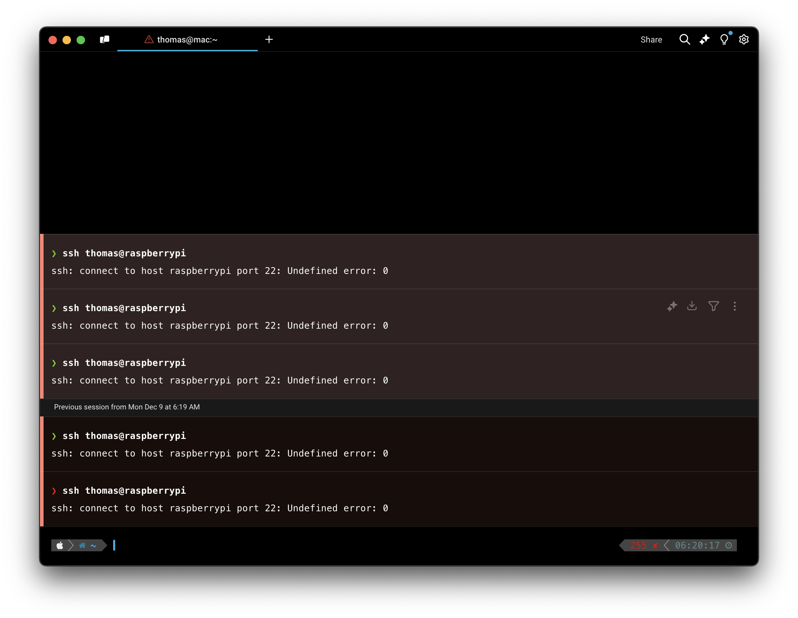
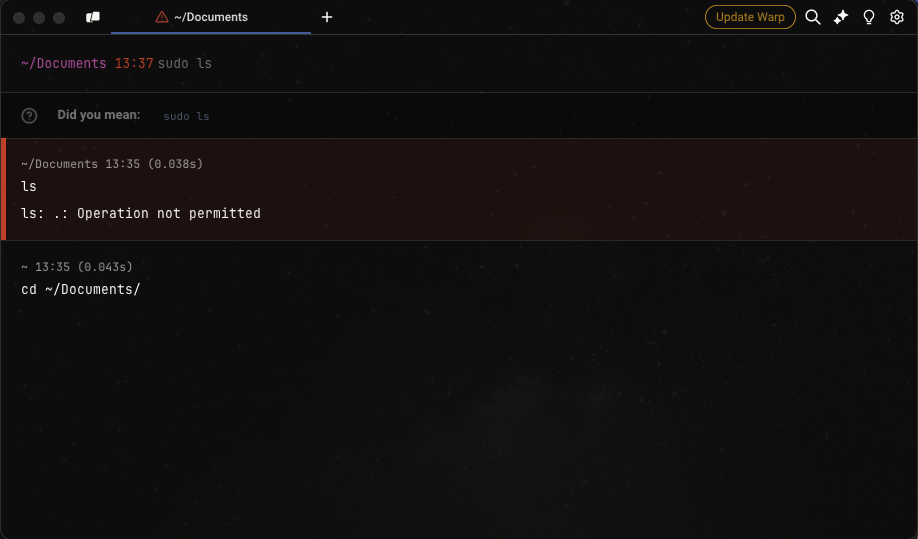
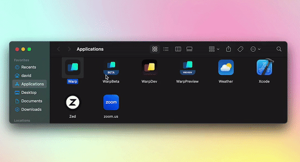

# Known Issues

* When you [SSH](known-issues.md#ssh), we start a bash shell on the remote host. We built a wrapper around SSH to make Warp features possible.
* If your default shell is zsh, your aliases typically do not transfer over. Other shells are unsupported for now.
* When you open a [non-shell-based subshell (REPL)](https://github.com/warpdotdev/Warp/issues/4082), we do not set it up for Warp - instead, it works like a normal terminal session.
* Warp may become unresponsive if it doesn't have permission to access the folders.


Please note many tools are incompatible with Warp, as listed [here](known-issues.md#list-of-incompatible-tools). We have debugging information in this [section](known-issues.md#debugging).


Links to popular GitHub issues:

* [Vi / Vim / NeoVim](https://github.com/warpdotdev/warp/discussions/451)
* [tmux](https://github.com/warpdotdev/warp/discussions/501)
* [oh-my-zsh Prompts](https://github.com/warpdotdev/Warp/issues/936)

## SSH

To enable Blocks over SSH, Warp uses an SSH Wrapper function; navigate to settings > features if you need to disable it. Please see [Troubleshooting Legacy SSH](../features/warpify/ssh-legacy.md#troubleshooting-ssh) for more info on workarounds to SSH issues, or see the [new SSH Page](../features/warpify/ssh.md) for more on the upcoming features.

## Online features don't work

There is a known issue that can occur that causes online features to break ([Warp AI](../features/warp-ai/), [AI Command Suggestions](../features/warp-ai/ai-command-suggestions.md), [Block Sharing](../features/blocks/block-sharing.md), [Refe](../getting-started/refer-a-friend.md)[r a Friend](../getting-started/refer-a-friend.md), etc. ). This is due to the login token going stale, typically due to a password change, and can be resolved by the following steps:



1. Remove Warp user login with `sudo security delete-generic-password -l "dev.warp.Warp-Stable" $HOME/Library/Keychains/login.keychain`
2. [Login to Warp](../getting-started/getting-started-with-warp.md#logging-into-warp)



1. Remove Warp user login with your keychain manager (gnome-keyring, kwallet, etc.). Search for `dev.warp.Warp` and delete the `User` password/secret.
2.  Remove any user files with the following command:

    ```sh
    rm -f ${XDG_STATE_HOME:-$HOME/.local/state}/warp-terminal/*-User
    ```
3. [Login to Warp](../getting-started/getting-started-with-warp.md#logging-into-warp)



## English-only UI

Nov 2021: We have added character support for Chinese, Korean, and Japanese, but our UI currently only supports English.

### Abnormal rendering of Chinese characters

If you notice issues with the terminal rendering Chinese characters (i.e. [#3366](https://github.com/warpdotdev/Warp/issues/3366)). Please try adding the following lines to your rc file.

```
export LC_ALL=zh_CN.UTF-8
export LANG=zh_CN.UTF-8
```

## fish shell `read` command

There is an issue in fish shell version 3.6 and below that causes the `read` built-in command to break Warp's integration with fish. This means that using `read` directly or any fish scripts that call `read` will not work as expected in Warp. That issue is resolved in the fish repository and so should be fixed in the next release of fish itself. We recommend upgrading fish to the most recent version to resolve this issue.

## Configuring and debugging your RC files

To support Blocks ([custom hooks](https://blog.warp.dev/how-warp-works/#implementing-blocks)), a native Input Editor experience, etc. we have to build custom support for a subset of shell functionality (decouple functionality from the shell and move to the terminal). This leads to Warp being incompatible with various tools and plugins.

You can **disable the conflicting settings for Warp** using this flag: `$TERM_PROGRAM != "WarpTerminal"`, see below for a full example.

We currently don't have support for multi-line custom prompts in bash, only zsh and fish. Unlike typical terminals which are essentially continuous character grids, each section of Warp is its own (separate) UI element. Warps default prompt does not support multi-line or right-sided prompts at this time. Improving the native Prompt is on the roadmap, however. Please see our [Prompt](../appearance/prompt.md) page for more information on custom prompts.

### Debugging

If Warp is not working with your dotfile configuration,

You can quickly set up clean configs by putting `ZDOTDIR=/` in a `~/.zshenv` file. This forces zsh to run with zero configs.

Zsh loads your configuration settings in this [order](https://zsh.sourceforge.io/Intro/intro_3.html):

```
$ZDOTDIR/.zshenv
$ZDOTDIR/.zprofile
$ZDOTDIR/.zshrc
$ZDOTDIR/.zlogin
$ZDOTDIR/.zlogout
```

If Warp starts working correctly then Warp is incompatible with something in the current dotfiles. We can isolate what is incompatible by iteratively disabling sections of our dotfiles with the `WarpTerminal` flag until we find the culprit. If you find an incompatible tool please email us at [feedback@warp.dev](mailto:feedback@warp.dev)

```
# bash and zsh
if [[ $TERM_PROGRAM != "WarpTerminal" ]]; then
##### WHAT YOU WANT TO DISABLE FOR WARP - BELOW
    # Unsupported plugin/prompt code here, i.e.
    test -e "${HOME}/.iterm2_shell_integration.zsh" && source "${HOME}/.iterm2_shell_integration.zsh" || true
##### WHAT YOU WANT TO DISABLE FOR WARP - ABOVE
fi
```

<pre><code># fish
if test "$TERM_PROGRAM" != "WarpTerminal"
##### WHAT YOU WANT TO DISABLE FOR WARP - BELOW
    # Unsupported plugin/prompt code here i.e. 
    test -e {$HOME}/.iterm2_shell_integration.fish ; and source {$HOME}/.iterm2_shell_integration.fish
##### WHAT YOU WANT TO DISABLE FOR WARP - ABOVE
<strong>end
</strong></code></pre>

### List of incompatible tools

Since Warp has an [Input Editor](../features/editor/) that wraps around the shell, the following inexhaustive list of plugins or tools can cause potential conflict given extra bytes coming into the PTY:

* oh-my-fish, oh-my-bash, or other unsupported shell prompts. See our [Custom Prompt Compatibility Table](../appearance/prompt.md#custom-prompt-compatibility-table).
* [iterm shell integration](https://iterm2.com/documentation-shell-integration.html)
  * `test -e "${HOME}/.iterm2_shell_integration.zsh" && source "${HOME}/.iterm2_shell_integration.zsh" || true`
* [Termium](https://codeium.com/blog/termium-codeium-in-terminal-launch)
  * `eval "$(termium shell-hook show pre)"`
  * `eval "$(termium shell-hook show post)"`
* [thefuck experimental instant mode](https://github.com/nvbn/thefuck?tab=readme-ov-file#experimental-instant-mode)
  * `eval $(thefuck --alias --enable-experimental-instant-mode)`
* [fubectl](https://github.com/kubermatic/fubectl)
  * `[ -f ${HOME}/bin/fubectl.source ] && source ${HOME}/bin/fubectl.source`
* [BIND keys](https://github.com/warpdotdev/Warp/issues/537)
  * `bindkey '^j' down-line-or-beginning-search`, which causes users to have to hit ENTER twice to run a command.
  * `bindkey 'tab' autosuggest-accept`, which causes incorrect behavior with autocompletion.
* `z`, `compdef`, `compinit`, [prezto utility module](https://github.com/sorin-ionescu/prezto/blob/master/modules/utility/README.md), CodeWhisperer or other [shell-based completion](https://github.com/warpdotdev/Warp/discussions/434) plugins.
* OH-MY-ZSH Themes
  * e.g. avit, spaceship, maybe more ...
* OH-MY-ZSH Plugins
  * e.g. zsh-autosuggestions, zsh-autocomplete, maybe more ...
* Oh-My-Tmux
* zsh4h (ZSH for Humans)
* znap
* FZF
* `[[ -r "/usr/local/etc/profile.d/bash_completion.sh" ]] && "/usr/local/etc/profile.d/bash_completion.sh"`
* `eval "$(rbenv init -)"`
* `grml-zsh-config`
* Python virtual environment PS1 [settings](https://github.com/warpdotdev/Warp/issues/2713#issuecomment-1447129449)
* [Starship settings](../appearance/prompt.md#starship-settings)
* Potentially more, this is an inexhaustive list ...

## macOS

### SSH to local network device is denied

On macOS, you may be [denied permission to SSH](https://github.com/warpdotdev/Warp/issues/5550) from Warp into other devices in your local network and see an error like: `ssh: connect to host <host_name> port 22: Undefined error: 0`.\
To resolve this issue, go to Mac > System Settings > Privacy & Security > Local Network, and add Warp.

<figure><figcaption><p>Mac SSH permission error</p></figcaption></figure>

### Unexpected loss of permission

On macOS, you may see a `Operation not permitted` error when trying to run commands in directories that have already been granted macOS permissions (Documents, Downloads, Desktop, etc). The best workaround at this time, is to [apply any pending Updates](updating-warp.md) so that the new Warp binary has the correct permissions. We are and tracking this issue [here](https://github.com/warpdotdev/Warp/issues/3009).

<figure><figcaption><p>Permission error on macOS</p></figcaption></figure>

### Auto-Update on macOS Ventura

Warp may have an error opening after auto-update on macOS Ventura. This issue has been resolved for current and future releases of Warp. To avoid the issue, [update Warp](updating-warp.md) _before_ you upgrade to macOS Ventura.\
\
If you experience an error opening Warp, please try the following:

* Go to the macOS Applications folder, right-click on Warp, choose Open, then the '"Warp" is damaged' dialog will have the option to click the Open button.

<figure><figcaption></figcaption></figure>

* If the above doesn't work, [uninstall Warp](uninstalling-warp.md), then [re-install Warp](../getting-started/getting-started-with-warp.md).

### Running x86 commands with macOS Rosetta

In some cases, [CLI applications only work on x86](https://discord.com/channels/851854972600451112/1204829324847358002) so you can run Warp with Rosetta on macOS to be able to use them by doing the following.

* Go to `Finder > Applications` and search for Warp.
* Right-click and select Get Info.
* Then check the box on Open with Rosetta.

## Linux

### Warp won't run or render on Linux

We're tracking some issues for Linux where a [Warp window doesn't show/render](https://github.com/warpdotdev/Warp/issues/4215) and won't run in [Virtual Machines](https://github.com/warpdotdev/Warp/issues/4476), over [remote desktops](https://github.com/warpdotdev/Warp/issues/4435), or on [WSL](https://github.com/warpdotdev/Warp/issues/4240).

If none of the workarounds help, please open a [new GitHub issue](https://github.com/warpdotdev/warp/issues/new/choose) and include [logs](sending-us-feedback.md#gathering-warp-logs) with your Linux distro, installation (WSL, Baremetal or VM, x86 or ARM), and the issue you had.


* Many package install examples are for Ubuntu using `apt`, your distro may use different commands (`dnf`, `pacman`, `zypper`) or package names.
* GPU Drivers and Default GPU / Graphics API environmental variables are system-dependent. e.g. AMD vs NVIDIA and OpenGL vs Vulkan


* System
  * Installing or Updating [Xorg](https://www.x.org/wiki/) / [Wayland](https://wayland.freedesktop.org/): `sudo apt install xserver-xorg` / `sudo apt install wayland`
  * Installing [Hack font](https://sourcefoundry.org/hack/) on WSL and VMs: `sudo apt install fonts-hack`
  * Install [WSL utilities](https://wslutiliti.es/wslu/install.html): `sudo apt install wslu`
  * Install Mesa utilities: `sudo apt install mesa-utils`
  * Install Mesa Vulkan drivers: `sudo apt install mesa-vulkan-drivers`
  * If unable to use the file picker: `sudo apt install xdg-desktop-portal xdg-desktop-portal-gtk zenity`
  * If unable to copy-paste: `sudo apt install wl-clipboard`
* Graphics
  * Install or Update your GPU driver: e.g. [NVIDIA](https://github.com/warpdotdev/Warp/issues/4215#issuecomment-1969750786) 535.x or below drivers
    * For Ubuntu: `sudo ubuntu-drivers install`
    * For Fedora: `sudo dnf install akmod-nvidia`
    * For Arch Linux: `sudo pacman -S nvidia`
    * For openSUSE: `sudo zypper install x11-video-nvidiaG05`
  * Use [Low Power (integrated) GPU](https://github.com/warpdotdev/Warp/issues/4215#issuecomment-1967500574) in `~/.config/warp-terminal/user_preferences.json` file: `{"prefs":{"PreferLowPowerGPU": "true",}}`. The low-power workaround is particularly helpful if you see [`Unrecognized device error ERROR_INITIALIZATION_FAILED` in warp.log](https://github.com/warpdotdev/Warp/issues/4390#issuecomment-1989493913).
* Environmental Variables
  * Prefix `warp-terminal` with the variables (multiple can be used), and once you confirm they work, `export` them in your `.profile`/`.zprofile` to [load on startup](https://github.com/warpdotdev/Warp/issues/4240#issuecomment-1968228029):
    * [Default to Wayland](https://github.com/warpdotdev/Warp/issues/4240#issuecomment-1961993281): `WARP_ENABLE_WAYLAND=1`
    * Set [Default GPU](https://docs.mesa3d.org/drivers/d3d12.html#utilities) for WSL: e.g. `MESA_D3D12_DEFAULT_ADAPTER_NAME=NVIDIA`
    * Set [Graphics APIs](https://github.com/gfx-rs/wgpu?tab=readme-ov-file#environment-variables): e.g. `WGPU_BACKEND=gl`

### Warp update fails after upgrading Linux

Some Linux distros may modify Warp's package repository during the the OS upgrades. We're aware of this on Ubuntu, but this may affect other Linux distros. We're tracking this issue on GitHub [here](https://github.com/warpdotdev/Warp/issues/5201).\
\
To workaround this issue, manually add the repository to update Warp. The Ubuntu example is below:

```
sudo apt-get install wget gpg
wget -qO- https://releases.warp.dev/linux/keys/warp.asc | gpg --dearmor > warpdotdev.gpg
sudo install -D -o root -g root -m 644 warpdotdev.gpg /etc/apt/keyrings/warpdotdev.gpg
sudo sh -c 'echo "deb [arch=amd64 signed-by=/etc/apt/keyrings/warpdotdev.gpg] https://releases.warp.dev/linux/deb stable main" > /etc/apt/sources.list.d/warpdotdev.list'
rm warpdotdev.gpg
sudo apt update && sudo apt install warp-terminal
```

See the instructions for other Linux distros on our [Quick Start Guide](../getting-started/getting-started-with-warp.md#linux).
