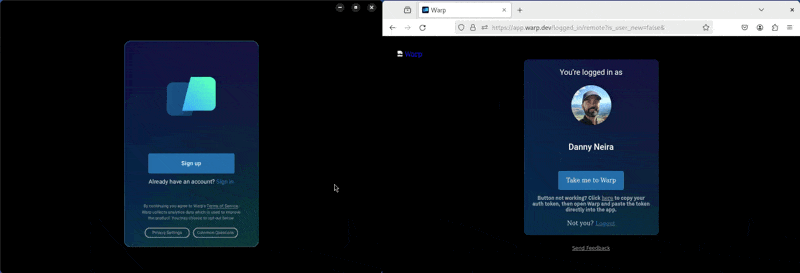

# Troubleshooting Login Issues

### Can't "Sign Up" for Warp

Clicking it should open a login pop-up. If clicking the signup button opens a blank pop-up window, try using a proxy. Your ISP or Firewall may be blocking the app's call to `*.googleapis.com` or `*.segment.io`. In some older Ruby development environments, `.dev` domains do not resolve properly and you may need to delete the `/etc/resolver/dev`, see more [here](https://superuser.com/questions/1374892/dev-domains-dont-resolve).

### All browsers

This error could occur if you installed an ad blocker or have stale browser cookies, including our Firebase auth pop-up. **To fix it:**

1. Disable your ad blocker for `app.warp.dev`
2. Clear any cookies and cache, or open a incognito / private browser window
3. Try [http://app.warp.dev/login](http://app.warp.dev/login) again

## Safari

You are on Safari and you might notice in your console that you get the following messages:

1. `Unable to access localStorage`
2. And every time you click the "Sign Up" button, you get `Unhandled Promise Rejection: Error: This operation is not supported in the environment the application is running on. "location.protocol" must be http, https, or chrome-extension and web storage must be enabled.`

This error occurs likely because you are blocking all cookies in Safari's security settings, but Firebase Auth requires the cookie to record whether the user is logged in. **To fix it:**

1. Go to Safari Preferences > Privacy
2. Uncheck the "Block all cookies" checkbox

### Proxies

When behind a proxy, a possible workaround is to disable QUIC in the browser. It will then fall back to TCP and likely allow login.

* In Chrome, or Chromium-based browsers like Edge, Opera, and Arc, type `chrome://flags` into the address bar.
  1. In the search bar on the flags page, type `Experimental QUIC protocol`.
  2. Locate the "Experimental QUIC protocol" flag and click on the drop-down menu next to it.
  3. Select "Disabled" from the options.
  4. Relaunch Chrome for the changes to take effect.
* In Firefox, type `about:config` into the address bar.
  1. You will see a warning message. Click on the "Accept the Risk and Continue" button.
  2. In the search bar, type `network.http.http3.enable`.
  3. Double-click on the `network.http.http3.enable` preference to set its value to `false`. This will disable QUIC in Firefox.
  4. Restart Firefox for the changes to take effect.
* In Safari, Unfortunately, there is no built-in option to disable QUIC in Safari. Safari uses QUIC as its default transport protocol and does not provide a user-accessible setting to disable it.

### Can't open Warp from SSO

Directly launching Warp from Okta or other SSO providers' pages isn’t supported. This is due to a limitation with Warp authentication APIs. Instead, do the following:

1. [Install and run Warp](../#installing-and-running-warp)
2. Go to [app.warp.dev/login](http://app.warp.dev/login)
3. Choose “Continue with SSO”
4. Login with your normal SSO credentials

### How to get an Auth token to login

If the browser does not open from Warp directly when you click "Sign up" or "Sign in". Please go to the [Signup ](https://app.warp.dev/signup)page to create an account or [Login](https://app.warp.dev/login) page if you already have one, then copy the auth token from the "here" link on the logged\_in page and paste it into Warp.

If nothing happens when you click "Take me to Warp" on the logged-in page. If this happens to you, copy the "here" link on the web logged-in page (https://app.warp.dev/logged\_in) to copy the authentication token, then paste it into the app as shown below.


the On Linux, the default copy-and-paste [Keyboard shortcuts](../features/keyboard-shortcuts.md) are `CTRL-SHIFT-C` and `CTRL-SHIFT-V` respectively.\
\
On Linux and WSL you should install and set your default `$BROWSER` to `brave-browser` to workaround any copy-paste issues. Please see the workaround guide below.



Warp for Linux on WSL Install and Login


<figure><figcaption>
Authentication Token Linux
</figcaption></figure>

If "Take me to Warp" is still not working it may be due to a [proxy issue](troubleshooting-login-issues.md#proxies), please see this article for more information on a workaround [here](https://embiid.blog/post/WARP-does-not-work-after-submitting-an-invite-code/).

### Get help with login issues

If Sign Up or Login does not work after trying the steps above, fill out [this Typeform](https://warpdotdev.typeform.com/to/UnZu0akR?question=sign_up?utm_source=docs) and our team will reach out to you.
