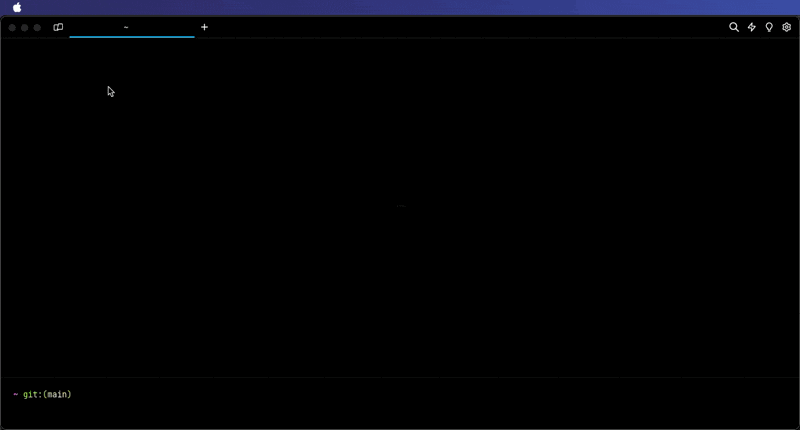

# Logging out & Uninstalling

## Logging out

You can log out of Warp through:

* `Settings > Account`, with the "Log out" button
* [Command Palette](../features/command-palette.md), with the "Log Out" item.

<figure><figcaption><p>Logout Demo</p></figcaption></figure>

### Known issues:

1. When you log out, you will lose all running processes and all unsaved objects.
2. When you log out and log in to Warp with another account, the following preferences will be preserved from the original account:
   1. Theme
   2. Keybindings
   3. Settings (e.g. autosuggestion, notifications, font size, welcome tips status)
3. Whenever you log in to Warp, you will receive the onboarding survey.

## Uninstalling Warp

Removing Warp from your computer involves uninstalling Warp and then removing any files or data.



**Uninstalling Warp by dmg**

* Remove Warp with `sudo rm -r /Applications/Warp.app`
* Go to Mac `Finder > Applications` and right-click on Warp, and "Move to Trash"

**Uninstalling Warp by Homebrew**

* Remove Warp with `brew uninstall warp`

**Removing Warp settings, files, logs, and database**

```bash
# Remove Warp settings defaults
defaults delete dev.warp.Warp-Stable
# Remove Warp logs
sudo rm -r $HOME/Library/Logs/warp.log
# Remove Warp database
sudo rm -r "$HOME/Library/Application Support/dev.warp.Warp-Stable"
# Remove Warp user files, themes, and launch configurations
sudo rm -r $HOME/.warp
```



**Uninstalling Warp installed by Installer**

* Search for "Installed apps” section of the Control Panel.
* Search for and Uninstall the Warp application

**Removing Warp settings, files, logs, and database**

```powershell
# Remove Warp settings in the Windows Registry
Remove-Item -Path "HKCU:\Software\Warp.dev\Warp" -Recurse -Force
# Remove Warp user files, logs, cache, and database from LOCALAPPDATA
Remove-Item -Path "$env:LOCALAPPDATA\warp\Warp" -Recurse -Force
# Remove themes and launch configurations
Remove-Item -Path "$env:APPDATA\warp\Warp" -Recurse -Force
```



**Uninstalling Warp by package manager**

```bash
# apt uninstall
sudo apt remove warp-terminal
# dnf uninstall
sudo dnf remove warp-terminal
# zypper uninstall
sudo zypper remove warp-terminal
# pacman uninstall
sudo pacman -R warp-terminal
```

* Uninstall Warp using the same package manager that you used to [install](../) it.

**Removing Warp settings, files, logs, and database**

```bash
# Remove Warp settings files
rm -r ${XDG_CONFIG_HOME:-$HOME/.config}/warp-terminal
# Remove Warp user files, logs, and database
rm -r ${XDG_STATE_HOME:-$HOME/.local/state}/warp-terminal
# Remove Warp themes and launch configurations
rm -r ${XDG_STATE_HOME:-$HOME/.local/share}/warp-terminal
```


