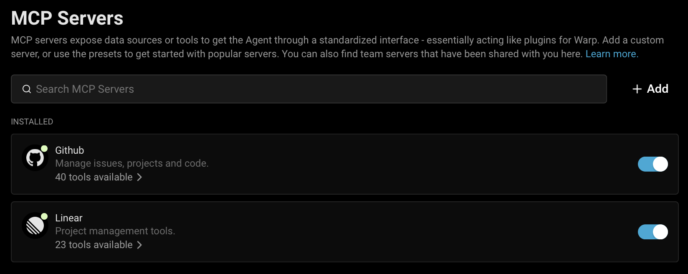
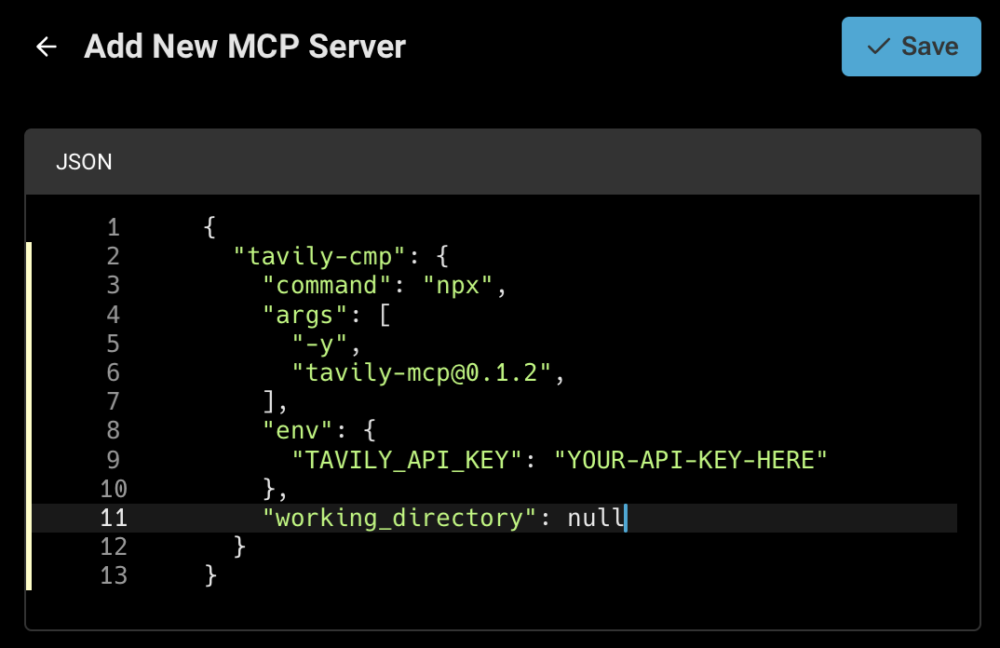
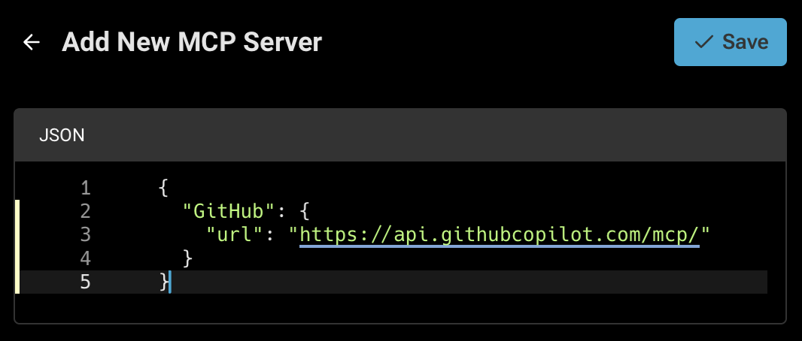
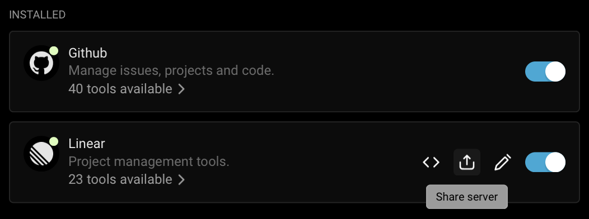

# Model Context Protocol (MCP)

## Model Context Protocol (MCP)

MCP servers extend Warp’s [agents](../agents/using-agents/) in a modular, flexible way by exposing custom tools or data sources through a standardized interface — essentially acting as plugins for Warp.

MCP is an open source protocol. Check out the official [MCP documentation](https://modelcontextprotocol.io/introduction) for more detailed information on how this protocol is engineered.

### How to access MCP Server settings

You can navigate to the MCP servers page in any of the following ways:

* From the [Settings Page](warp://settings/mcp): `Settings > MCP Servers`
* From [Warp Drive](warp-drive/): under `Personal > MCP Servers`
* From the [Command Palette](../terminal/command-palette.md): search for `Open MCP Servers`
* From the AI settings tab: `Settings > AI > Manage MCP servers`

This will show a list of all configured MCP servers, including which are currently running. If you close Warp with an MCP server running, it will run again on next start of Warp. MCP servers that are stopped will remain so on next launch of Warp.

<figure><figcaption><p>MCP servers page</p></figcaption></figure>

### Adding an MCP Server

To add a new MCP server, you can click the `+ Add` button. Configurations from most MCP Clients can be directly copied and pasted.

MCP server types you can add:



Provide a startup command. Warp will launch this command when starting up and shut it down on exit.

<figure><figcaption><p>Adding a CLI MCP Server (Command)</p></figcaption></figure>


Always set `working_directory` explicitly when your MCP server command or args include relative paths. This ensures consistent and predictable behavior across machines and sessions.


**CLI Server (Command) MCP Configuration Properties**

| Property            | Type      | Required | Description                                                                         |
| ------------------- | --------- | -------- | ----------------------------------------------------------------------------------- |
| `command`           | string    | Yes      | The executable to launch (e.g., `npx`).                                             |
| `args`              | string\[] | Yes      | Array of command-line arguments passed to `command` (e.g., module name, paths).     |
| `env`               | object    | No       | Key-value object of environment variables (e.g., tokens).                           |
| `working_directory` | string    | No       | Working directory path where the command is run, used for resolving relative paths. |



Provide a URL where Warp can reach an already-running MCP server that supports Server-Sent Events.

<figure><figcaption><p>Adding an SSE MCP Server (URL)</p></figcaption></figure>

**SSE Server (URL) MCP Configuration Properties**

| Property | Type   | Required | Description                                                                    |
| -------- | ------ | -------- | ------------------------------------------------------------------------------ |
| `url`    | string | Yes      | The HTTP endpoint URL to connect to via Server-Sent Events (SSE).              |



### Adding multiple MCP Servers

Warp supports configuring **multiple MCP servers** using a JSON snippet. Each entry under `mcpServers` is keyed by a unique name (`filesystem`, `github`, `notes`, etc). All servers defined in the example are added automatically — no manual setup required.

To add a multiple MCP servers, you can click the `+ Add` button then paste in a JSON snippet like the example below:

```json
{
  "mcpServers": {
    "filesystem": {
      "command": "npx",
      "args": ["-y", "@modelcontextprotocol/server-filesystem", "/path/to/allowed/files"]
    },
    "notes": {
      "command": "npx",
      "args": ["-y", "@modelcontextprotocol/server-notes", "--notes-dir", "/Users/you/Documents/notes"]
    },
    "externalDocs": {
      "url": "http://localhost:4000/mcp/stream"
    }
  }
}
```

### Managing MCP servers

After MCP servers are registered in Warp, you can **Start** or **Stop** them from the MCP servers page. Each running server will have a list of available tools and resources.

You can rename and edit a server's name, as well as delete the server. If you are a part of a Team, you can also share a MCP with your teammates.

### Sharing MCP servers

MCP servers can be shared with your teammates by clicking the share icon. When sharing, sensitive values in the `env` configuration will be automatically scrubbed and replaced with variables. 

<figure><figcaption><p>Sharing a MCP Server</p></figcaption></figure>

Your teammates can find shared MCP servers under the `Shared` section of their MCP settings. When your teammates install your server configuration, they will be prompted to enter any scrubbed `env` values. 

Warp also provides out-of-the-box MCP servers that can be installed by anyone. These can be found under the `Shared` section of your MCP settings.

### Authentication in MCP servers

Most MCP servers require authentication to connect to external services. Warp supports two main methods:

* **Environment variable tokens**: pass an API key or access token via the server's environment variables.
* **OAuth login (one-click installation)**: simplifies configuration by handling authentication through your browser. Warp stores credentials securely on your device and reuses them for future sessions.
  * Starting a server without existing credentials automatically opens a browser-based authentication flow.
  * Credentials can be revoked at any time from the MCP Servers pane in Warp.

Re-authentication is required when opening Warp on a new machine.

### Debugging MCP

If you're having trouble with an MCP server, you can check the logs for any errors or messages to help you diagnose the problem by clicking the `View Logs` button on a server from the MCP servers page.


If you choose to share your MCP server logs with anybody, **make sure to remove any sensitive information before sharing**, as they may contain API keys.

Many SSE based MCP servers will state that your URL should be treated like a password, and can be used with no additional authentication.



Tip: We've noticed that some models often work better with MCP servers than others. If you're having trouble calling or using an MCP server, try using a different model.


#### Debugging MCP Authentication issues

In some cases you may need to reset the auth token for some MCP servers. To do this delete the local MCP auth files by running the following: `rm -rf ~/.mcp-auth`


Note this will delete all your MCP auth tokens stored locally so you will need to login and re-authenticate.


If the above doesn't help and you need to reset or change authentication, you may need to switch to a CLI-based MCP server configuration and provide the token via environment variables. See [Sentry CLI MCP Example](mcp.md#sentry).

### Where MCP Logs Are Stored

Warp saves the MCP logs locally on your computer. You can open the files directly and inspect the full contents in the following location:



```bash
cd "$HOME/Library/Group Containers/2BBY89MBSN.dev.warp/Library/Application Support/dev.warp.Warp-Stable/mcp"
```



```powershell
Set-Location $env:LOCALAPPDATA\warp\Warp\data\logs\mcp
```



```bash
cd "${XDG_STATE_HOME:-$HOME/.local/state}/warp-terminal/mcp"
```



## MCP Server Configuration Examples

Below are examples for popular Model Context Protocol (MCP) servers.

* **CLI Server (Command)** — local `npx`  or `docker` command based MCP servers.
* **SSE Server (URL)** — remote or locally hosted MCP endpoints.

### **Engineering & Ops**



[GitHub MCP Docs](https://github.com/github/github-mcp-server)

#### **GitHub CLI Server (Command)**

```json
{
  "GitHub": {
    "command": "docker",
    "args": ["run","-i","--rm","-e","GITHUB_PERSONAL_ACCESS_TOKEN","ghcr.io/github/github-mcp-server"],
    "env": {
      "GITHUB_PERSONAL_ACCESS_TOKEN": "<your_github_token>"
    }
  }
}
```

#### **GitHub SSE Server (URL)**

```json
{
  "GitHub": {
    "url": "https://api.githubcopilot.com/mcp/"
  }
}
```



[Sentry MCP Docs](https://docs.sentry.io/product/sentry-mcp/)

#### **Sentry CLI Server (Command)**

```json
{
  "Sentry": {
    "command": "npx",
    "args": ["-y","mcp-remote@latest","https://mcp.sentry.dev/mcp"]
  }
}
```

#### **Sentry SSE Server (URL)**

```json
{
  "Sentry": {
    "url": "https://mcp.sentry.dev/sse"
  }
}
```



[Grafana MCP Docs](https://github.com/grafana/mcp-grafana)

#### **Grafana CLI Server (Command)**

```json
{
  "Grafana": {
    "command": "docker",
    "args": ["run","--rm","-i","-e","GRAFANA_URL","-e","GRAFANA_API_KEY","mcp/grafana","-t","stdio","-debug"],
    "env": {
      "GRAFANA_URL": "http://localhost:3000",
      "GRAFANA_API_KEY": "<your_grafana_key>"
    }
  }
}
```

#### **Grafana SSE Server (URL)**

```json
{
  "Grafana": {
    "url": "https://your-mcp-host.com/api/mcp/grafana/sse"
  }
}
```



[Linear MCP Docs](https://linear.app/docs/mcp)

#### **Linear CLI Server (Command)**

```json
{
  "Linear": {
    "command": "npx",
    "args": ["-y","mcp-remote","https://mcp.linear.app/sse"]
  }
}
```

#### **Linear SSE Server (URL)**

```json
{
  "Linear": {
    "url": "https://mcp.linear.app/sse"
  }
}
```



#### **Chroma Package Search CLI Server (Command)**

1. Visit Chroma's [Package Search](http://trychroma.com/package-search) page.
2. Click "Get API Key" to create or log into your Chroma account and issue an API key for Package Search.
3. After issuing your API key, click the "Other" tab and copy your API key.
4. Add the following to your Warp MCP config. Make sure to click "Start" on the server after adding.

More info in [Chroma's Package Search MCP Docs](https://docs.trychroma.com/cloud/package-search/mcp)

```json
{
    "package-search": {
      "command": "npx",
      "args": ["mcp-remote", "https://mcp.trychroma.com/package-search/v1", "--header", "x-chroma-token: ${X_CHROMA_TOKEN}"],
      "env": {
        "X_CHROMA_TOKEN": "<YOUR_CHROMA_API_KEY>"
      }
    }
}
```



### **Design & Collaboration**



#### **Figma Remote MCP Server (Recommended)**

The official Figma remote MCP server supports OAuth for simple, one-click setup.

1. In Warp, go to `Warp Drive` > `MCP Servers` > `+ Add` and paste the configuration below.
2. Warp will open a browser window to authenticate with Figma.
3. After approving access, credentials are stored securely on your device.


Note: A Figma account with [Dev Mode](https://www.figma.com/dev-mode/) enabled is required.


```json
{
  "Figma": {
    "url": "https://mcp.figma.com/mcp"
  }
}
```

#### **Figma Local MCP Server**

1. Enable the Official Figma MCP Server. [Figma MCP Docs](https://help.figma.com/hc/en-us/articles/32132100833559-Guide-to-the-Dev-Mode-MCP-Server)
2. Open the [Figma desktop app](https://www.figma.com/downloads/) and make sure you’ve [updated to the latest version](https://help.figma.com/hc/en-us/articles/5601429983767-Guide-to-the-Figma-desktop-app#h_01HE5QD60DG6FEEDTZVJYM82QW).
3. Create or open a Figma Design file.
4. In the upper-left corner, open the Figma menu.
5. Under **Preferences**, select **Enable local MCP Server**.
6. Enter the following configuration into Warp > `Warp Drive` > `MCP Servers` > `+ Add`.

```json
{
  "Figma (Local)": {
    "url": "http://127.0.0.1:3845/mcp"
  }
}
```



[Slack MCP Docs](https://github.com/korotovsky/slack-mcp-server/)

#### **Slack CLI Server (Command)**

Enter the following configuration into Warp > `Warp Drive` > `MCP Servers` > `+ Add`.

```json
{
  "Slack": {
    "command": "npx",
    "args": ["-y", "@modelcontextprotocol/server-slack"],
    "env": {
      "SLACK_BOT_TOKEN": "xoxb-<your-bot-token>",
      "SLACK_APP_TOKEN": "xapp-<your-app-token>",
      "SLACK_TEAM_ID": "T<your_workspace_id>",
      "SLACK_CHANNEL_IDS": "<your_channel_id-1>, <your_channel_id-2>",
      "MCP_MODE": "stdio"
    }
  }
}
```

#### **Slack SSE Server (URL)**

Enter the following configuration into Warp > `Warp Drive` > `MCP Servers` > `+ Add`.

```json
{
  "Slack": {
    "url": "https://your-mcp-host.com/api/mcp/slack/sse"
  }
}
```



[Atlassian MCP Docs](https://support.atlassian.com/rovo/docs/setting-up-ides/)

#### **Atlassian CLI Server (Command)**

Enter the following configuration into Warp > `Warp Drive` > `MCP Servers` > `+ Add`.

```json
{
  "Atlassian": {
    "command": "npx",
    "args": ["-y", "mcp-remote", "https://mcp.atlassian.com/v1/sse"]
  }
}
```



[Notion MCP Docs](https://notion.notion.site/Beta-Overview-Notion-MCP-206efdeead058060a59bf2c14202bd0a)

#### **Notion CLI Server (Command)**

Enter the following configuration into Warp > `Warp Drive` > `MCP Servers` > `+ Add`.

```json
{
  "Notion": {
    "command": "npx",
    "args": ["-y", "mcp-remote", "https://mcp.notion.com/mcp"]
  }
}
```

#### **Notion SSE Server (URL)**

Enter the following configuration into Warp > `Warp Drive` > `MCP Servers` > `+ Add`.

```json
{
  "Notion": {
    "url": "https://mcp.notion.com/sse"
  }
}
```



### MCP Server Demos

[Warp University](https://www.warp.dev/university) hosts a collection of demos and walkthroughs showing how MCP servers can extend your workflows. Each example highlights practical use cases you can try today:

* [**GitHub**](https://www.warp.dev/university/mcp/using-github-mcp-server) — access repositories, issues, and pull requests through MCP.
* [**Sentry**](https://www.warp.dev/university/mcp/using-sentry-mcp-server) — surface error monitoring and alerts as agent-usable data.
* [**Linear**](https://www.warp.dev/university/mcp/connecting-warp-to-linear-via-mcp) — integrate project management tasks and tickets.
* [**Puppeteer**](https://www.warp.dev/university/mcp/using-puppeteer-mcp-server) — run automated browser workflows via MCP.
* [**Context7**](https://www.warp.dev/university/mcp/using-context7-mcp-server) — experiment with external data integrations.

