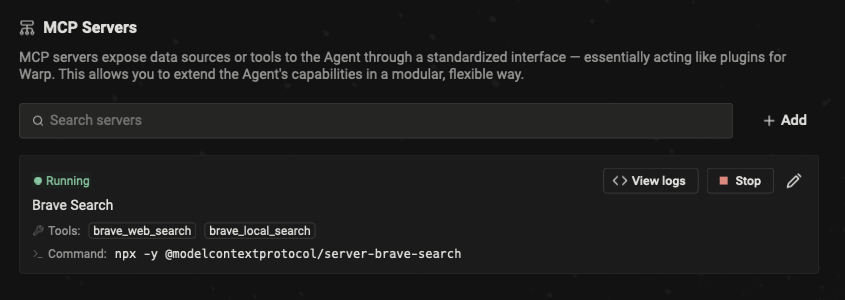
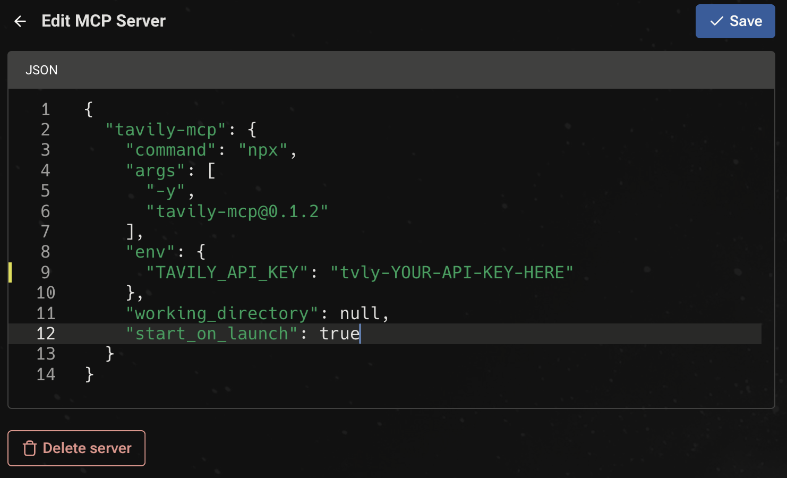
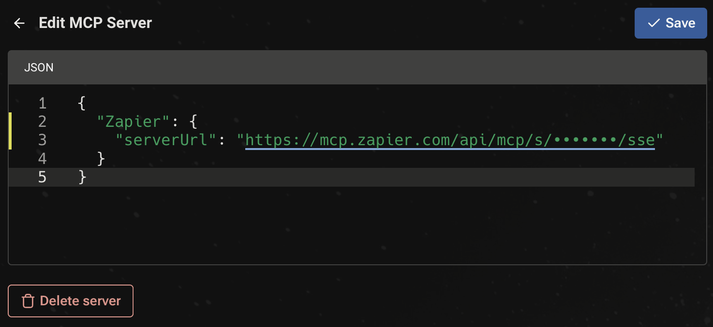

# Model Context Protocol

## Model Context Protocol (MCP)

MCP servers extend Warp’s [agents](../agents/using-agents/) in a modular, flexible way by exposing custom tools or data sources through a standardized interface — essentially acting as plugins for Warp.

MCP is an open source protocol. Check out the official [MCP documentation](https://modelcontextprotocol.io/introduction) for more detailed information on how this protocol is engineered.

In these docs, we'll focus on how to use MCP servers in Warp.

### How to access MCP Server settings

You can navigate to the MCP servers page in any of the following ways:

* From [Warp Drive](warp-drive/): under `Personal > MCP Servers`
* From the [Command Palette](../terminal/command-palette.md): search for `Open MCP Servers`
* From the settings tab: `Settings > AI > Manage MCP servers`

This will show a list of all configured MCP servers, including which are currently running

<figure><figcaption><p>MCP servers page</p></figcaption></figure>

### Adding an MCP Server

To add a new MCP server, you can click the `+ Add` button. There are two types of MCP servers you can add:

1. **CLI Server (Command)**
   1. Provide a startup command. Warp will launch this command when starting up and shut it down on exit.
2. **SSE Server (URL)**
   1. Provide a URL where Warp can reach an already-running MCP server that supports Server-Sent Events.

<figure><figcaption><p>Adding a CLI MCP Server (Command)</p></figcaption></figure>

<figure><figcaption><p>Adding an SSE MCP Server (URL)</p></figcaption></figure>

### Adding multiple MCP Servers

Warp supports configuring **multiple MCP servers** using a JSON snippet. To add a multiple MCP servers, you can click the `+ Add` button then paste in a JSON snippet like the example below.

#### Multiple MCP server configuration

* Each entry under `mcpServers` is keyed by a unique name (`filesystem`, `github`, `notes`, etc).
* `command` and `args` define how each server is started.
* Use `env` to inject sensitive credentials securely.
* `start_on_launch: true` means Warp will auto-start the server when Warp launches.
* All servers defined in this block are added automatically — no manual setup required.

```json
{
  "mcpServers": {
    "filesystem": {
      "command": "npx",
      "args": ["-y", "@modelcontextprotocol/server-filesystem", "/path/to/allowed/files"],
      "start_on_launch": true
    },
    "github": {
      "command": "npx",
      "args": ["-y", "@modelcontextprotocol/server-github"],
      "env": {
        "GITHUB_PERSONAL_ACCESS_TOKEN": "your-github-token"
      },
      "start_on_launch": true
    },
    "notes": {
      "command": "npx",
      "args": ["-y", "@modelcontextprotocol/server-notes", "--notes-dir", "/Users/you/Documents/notes"],
      "start_on_launch": true
    }
  }
}
```

### Managing MCP servers

After MCP servers are registered in Warp, you can **Start** or **Stop** them from the MCP servers page. Each running server will have a list of available tools and resources.

You can rename and edit a server's name, as well as delete the server. To prevent Warp from automatically starting a server when you open Warp, set the `"start_on_launch"` value to `false` in the server's JSON configuration.

### Debugging

If you're having trouble with an MCP server, you can check the logs for any errors or messages to help you diagnose the problem by clicking the `View Logs` button on a server from the MCP servers page.


If you choose to share your MCP server logs with anybody, **make sure to remove any sensitive information before sharing**, as they may contain API keys.&#x20;

Many SSE based MCP servers will state that your URL should be treated like a password, and can be used with no additional authentication.



Tip: We've noticed that some models often work better with MCP servers than others. If you're having trouble calling or using an MCP server, try using a different model.


### Where MCP Logs Are Stored

Warp saves the MCP logs locally on your computer. You can open the files directly and inspect the full contents in the following location:



```bash
cd "$HOME/Library/Application Support/dev.warp.Warp-Stable/mcp"
```



```powershell
Set-Location $env:LOCALAPPDATA\warp\Warp\data\logs\mcp
```



```bash
cd "${XDG_STATE_HOME:-$HOME/.local/state}/warp-terminal/mcp"
```


