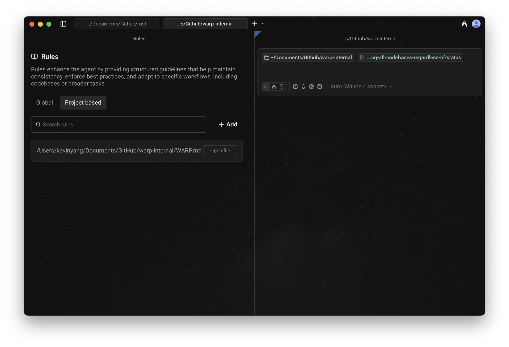

# Rules

Warp’s **Rules** feature lets you create reusable guidelines that inform how agents respond to your prompts. Rules help tailor responses to match your coding standards, project conventions, and personal preferences, making agent interactions smarter and more consistent.

Warp supports two types of rules: **Global Rules** and **Project-Scoped Rules**.

## Global Rules

Global Rules apply across all projects and contexts. They're ideal for:

* Coding standards and best practices
* Workspace-wide guidelines
* Tool configurations or preferences you want applied everywhere

Warp may also suggest Global Rules based on your usage patterns to make future interactions smarter and more consistent.

## Project-Scoped Rules

Project-Scoped Rules live in your codebase and apply automatically when working within that project. They’re stored in a `WARP.md` file and can be:

* Placed in the root of your repository
* Added in subdirectories for more targeted guidance


If manually creating a `WARP.md`, make sure to always follow that naming convention (all caps).


**When you're in a directory:**

* Warp automatically applies the `WARP.md` in the root and in the current directory.
* If you edit files in another subdirectory, Warp makes a best-effort attempt to include that subdirectory’s `WARP.md` as well.

Example project structure:

```
project/
  api/
    WARP.md      # API-specific rules
  ui/
    WARP.md      # UI-specific rules
  WARP.md        # Project-wide rules
```

How Warp applies these project-based rules:

* **If the current directory is `ui/`**\
  Automatically applied: `project/WARP.md` and `project/ui/WARP.md`\
  Best effort: `project/api/WARP.md` if editing files there
* **If the current directory is `api/`**\
  Automatically applied: `project/WARP.md` and `project/api/WARP.md`\
  Best effort: `project/ui/WARP.md` if editing files there

### **Rules precedence**

When multiple rules apply, Warp follows this order of precedence:

1. Rules in the current subdirectory's `WARP.md` file
2. Rules in the root directory's `WARP.md` file
3. Global Rules

This ensures the most specific, project-relevant rules take priority over broader ones.

***

## How to access Rules

* From [Warp Drive](warp-drive/): Personal > Rules
* From the [Command Palette](../terminal/command-palette.md): search for "Open AI Rules"
* From the Settings panel: `Settings > AI > Knowledge > Manage Rules`
  * Here, you can manage both Global as well as Project-Scoped Rules.
* From the macOS Menu: `AI > Open Rules` &#x20;
* From the Slash Commands menu: `/open-project-rules`  to open Project-Scoped Rules directly in Warp's code editor

<figure><figcaption><p>Project-based Rules UI open in a Rules pane</p></figcaption></figure>

## How to create, edit, or delete Rules

#### Global Rules

* **From Warp Drive Rules pane:** `Personal > Rules > Global`\
  Add, edit, or delete any number of rules. Each rule can include:
  * Name (optional)
  * Description (what the rule does and when to apply it)
* **From the Slash Commands menu:** `/add-rule` in Auto or Agent input modes to create a new Global Rule (automatically opens the Warp Drive Rules pane).


Rules Demo (legacy) with just Global Rules. Project-based rules can also be found there.


#### Project-Scoped Rules

* **From Warp Drive Rules pane:** `Personal > Rules > Project-based`\
  View all Project-based Rules and open them in Warp.
* **From the Slash Commands menu:** Use `/init` in Auto or Agent mode to:
  * Begin indexing your codebase or display indexing status
  * Generate a `WARP.md` file with initial context, or
  * Link an existing Rules file to `WARP.md`
    * Warp currently supports the following Rules files: `CLAUDE.md`, `.cursorrules`, `AGENT.md`, `AGENTS.md`, `GEMINI.md`, `.clinerules`, `.windsurfrules`, `.github/copilot-instructions.md`

### Rules as Agent context

When relevant, Warp agents automatically pull in applicable rules to guide their responses. Rules used in an interaction will appear in the conversation under **References** or marked as derived from a specific rule.

<figure><figcaption><p>Derived from rules</p></figcaption></figure>

<figure><figcaption><p>Rules as references</p></figcaption></figure>

### Rules Privacy

See our [Privacy Page](../privacy/privacy.md) for more information on how we handle data with Rules.
