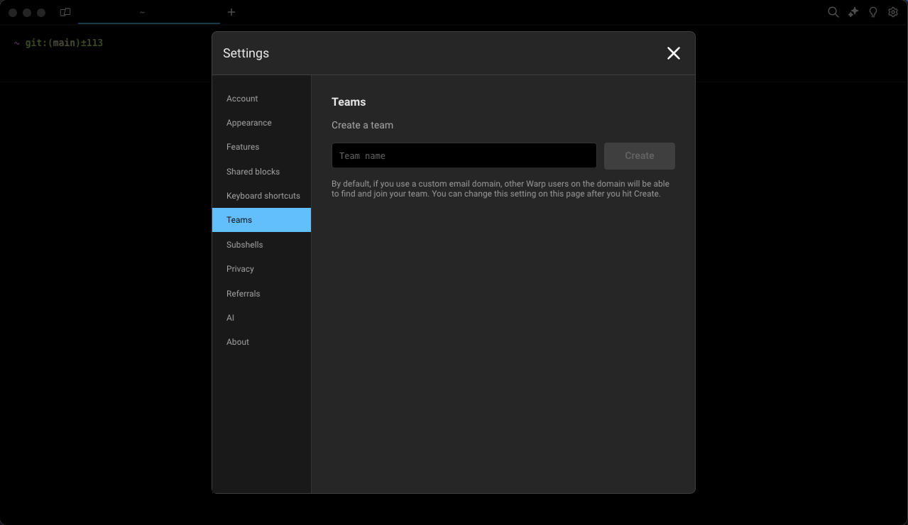
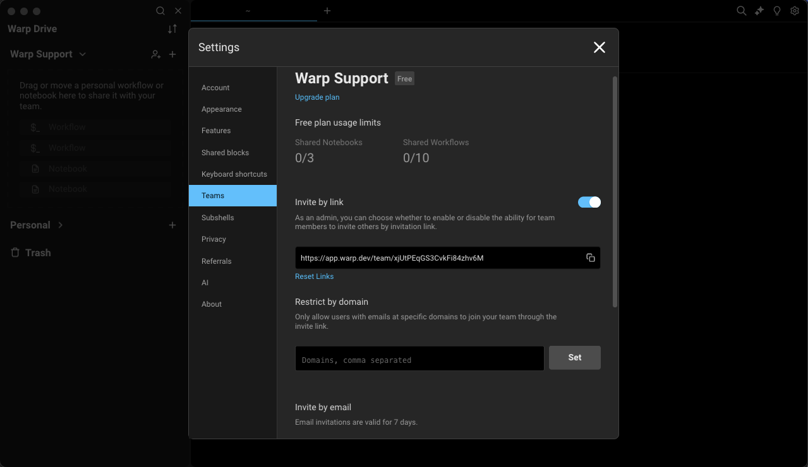

# Teams

## What is a team?

A team is a group of Warp users who can collaborate on the command line together. Warp teams can share a dedicated workspace in Warp Drive. [Learn about pricing](https://www.warp.dev/pricing) and see our [Pricing FAQ](../support-and-billing/plans-and-pricing.md).


Currently, each Warp user can only be an admin or member of one team at a time.



Teams Demo


## Creating a team

You can create a new team from:

* Warp Drive, + Create a team, or
* `Settings > Teams`

Before you can invite team members, you will need to give your team a meaningful name. We suggest using a name to represent your organization, company, or project.


It’s not currently possible to edit and rename a team, so please choose carefully! You can delete your team and create a new one to assign a new name if needed.


<figure><figcaption></figcaption></figure>

If you create a team, you become the team’s admin and will be the only person who can delete the team. Reference [Team roles and permissions](teams.md#team-roles-and-permissions) for more info.

### Inviting new team members

Under `Settings > Teams` you can copy the invite link for your Warp team and paste it to your clipboard.

<figure><figcaption>
Teams settings panel
</figcaption></figure>

When you share this link with your teammates directly (we suggest using a secure channel like Slack or email), they will be able to join your team in Warp.

## Restricting team invites by domain

Sometimes you may want to control your team so that people can only join if they also authenticate with a specific email domain, such as your company’s email domain.

Toggle on Restrict by domain to set an explicit allowlist.

If you share an invite link with somebody who’s using Warp with a domain that does not match your allowlist, they will be prompted to authenticate from an emailed link sent to a matching domain to join your team.

## Joining a team

If you have received an invite link, you can use that link to sign up or log in and join your team in Warp. If your team is using domain restriction, you will need to authenticate you have access to a specific domain before you can join your team.

## Leaving and deleting teams

If you’re a member of a team, you can visit `Settings > Teams` to leave a team at any time. Team admins (who created teams) may delete a team only after removing all team members.

## Team discoverability

Team admins can make their teams discoverable to colleagues from the same email domain. This feature is available under `Settings > Teams > Make team discoverable`.


While discoverability is enabled, any new user who joins the team will add a prorated charge to the team's next month's bill. See more in our [pricing docs](../support-and-billing/plans-and-pricing.md#what-counts-as-a-team-member-and-how-does-billing-work-for-members).


## Transferring team admin

Team admins can transfer their role to another team member by going to `Settings > Teams > Transfer admin` and selecting the member to whom you'd like to transfer the admin role.

## Team roles and permissions


If you're a Team admin, and you choose to [delete your Warp](../privacy/privacy.md#manage-your-data) account, the deletion flow will require that you assign a team member as the new admin.


|                                                               | Admin                                                            | Member                                 |
| ------------------------------------------------------------- | ---------------------------------------------------------------- | -------------------------------------- |
|                                                               | This is the Warp user who created a team. There can only be one. | All team members who belong to a team. |
| Create a team                                                 | ✓                                                                |                                        |
| Restrict by domain                                            | ✓                                                                |                                        |
| Invite members                                                | ✓                                                                | ✓                                      |
| Remove team members                                           | ✓                                                                |                                        |
| Leave a team                                                  |                                                                  | ✓                                      |
| Delete a team                                                 | ✓                                                                |                                        |
| Transfer admin                                                | ✓                                                                |                                        |
| [Manage billing](../support-and-billing/plans-and-pricing.md) | ✓                                                                |                                        |
