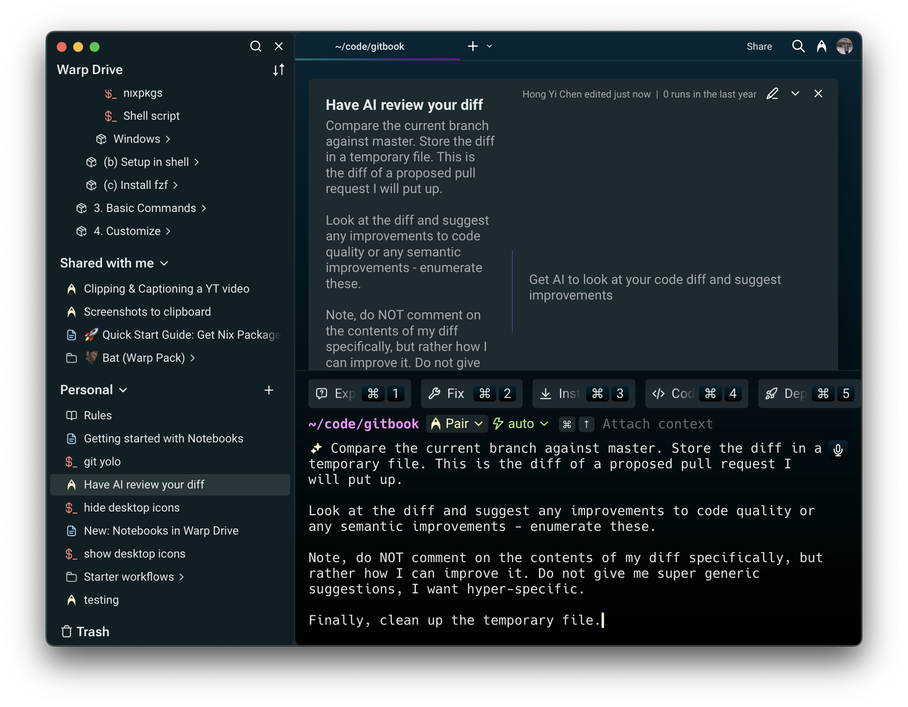
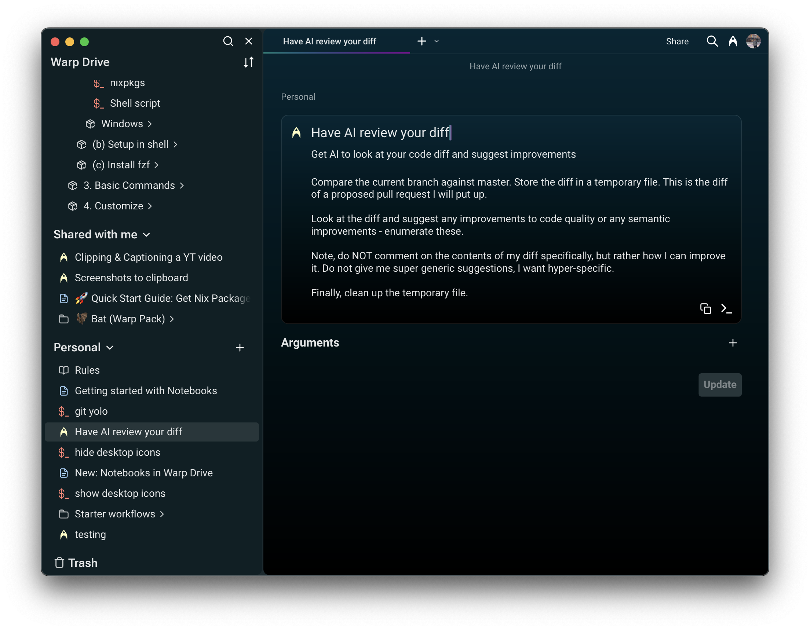
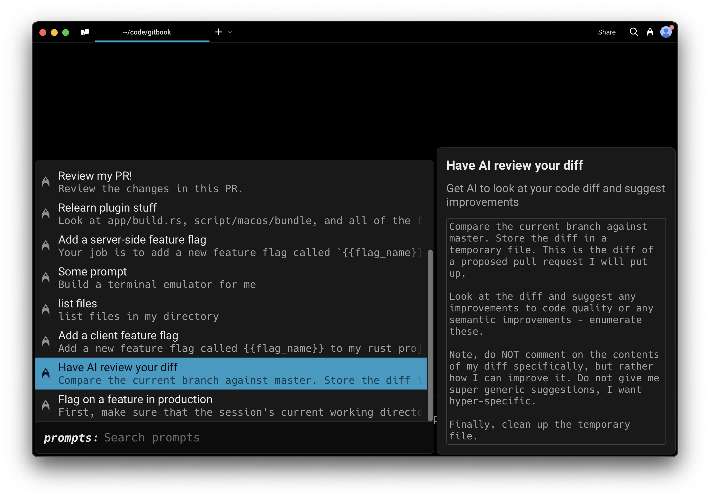

# Prompts

## What is a Prompt?

A Prompt is a parameterized natural language query you can name and save in Warp to use with [Agent Mode](../../agents/agents/).

Prompts are searchable and easily accessed from the [Command Palette](../../terminal/command-palette.md) so you can find and execute them without switching context. They allow you to save and reuse specific and complex AI workflows, making it easier to repeat multi-step tasks with Agent Mode.

<figure><figcaption>
Command view of a Prompt in Warp Drive
</figcaption></figure>

## How to save and edit Prompts

You can create a new Prompt from Warp Drive by clicking the + button and selecting "Prompt".

* Name your Prompt
* Edit the natural language query along with any arguments (also known as parameters)
* Add a meaningful description that will be indexed for search (optional)
* Add arguments, descriptions for arguments, and default values (optional)

<figure><figcaption>
Edit view of a Prompt in Warp Drive
</figcaption></figure>

Once a Prompt has been created, you can edit it at any time, as long as you have access to an internet connection.

### Working with arguments

In the Prompt editor, you can add arguments manually with "New argument" or by typing in double curly braces (`{{argument}}`) within the command field. If you select "New argument" while you have text selected, Warp will wrap that text in curly braces to create an argument.

There are some rules for creating valid arguments:

* Argument names can only include characters `A-Za-z0-9`, hyphens `-` and underscores `_`
* The first character of an argument cannot be a number

Arguments can be one of two types: text or enum. By default, all new arguments are text type.

#### Enum type arguments

Enums allow you to specify expected inputs to a Prompt argument. When you insert a Prompt with enums into the input editor, you will be prompted with suggestions for filling in the argument. You can open the suggestions menu by pressing `SHIFT-TAB` while selecting an argument.

For detailed information about creating and using enum type arguments, please see the [Enum type arguments section in Workflows documentation](workflows.md#enum-type-arguments).

### Editing Prompts with a team

If the Prompt is shared with a team, all team members will have access to edit it and updates will sync immediately for all members of the team.

If a Prompt in the Warp Drive has been edited by another team member or a user on another device while you are attempting to edit the same Prompt, you will not be able to save changes; you will need to check out the latest version and try again.

## How to execute Prompts

You can execute a Prompt in several ways:

* From Warp Drive, click the Prompt
* From the [Command Palette](../../terminal/command-palette.md) or [Command Search](../../terminal/entry/command-search.md), search for a Prompt by name or type "prompts:" to see all available prompts and your prompt history
* When a Prompt is selected, you can use `SHIFT-TAB` to cycle through the arguments.

<figure><figcaption>
Search for Prompts in the Command Palette with <code>CMD + P</code>
</figcaption></figure>

<figure><figcaption>
Search for Prompts in Command Search with <code>CTRL + R</code>
</figcaption></figure>

These options will paste the Prompt into your active terminal input. Prompt names and any relevant descriptions and arguments will be displayed in a dialog, so you can understand how to use the Prompt.

You can make any adjustments you need to the arguments before running the Prompt in your input editor.

### Import and Export Prompts in Warp Drive

Please see our [Warp Drive Import and Export](./#import-and-export) instructions.
