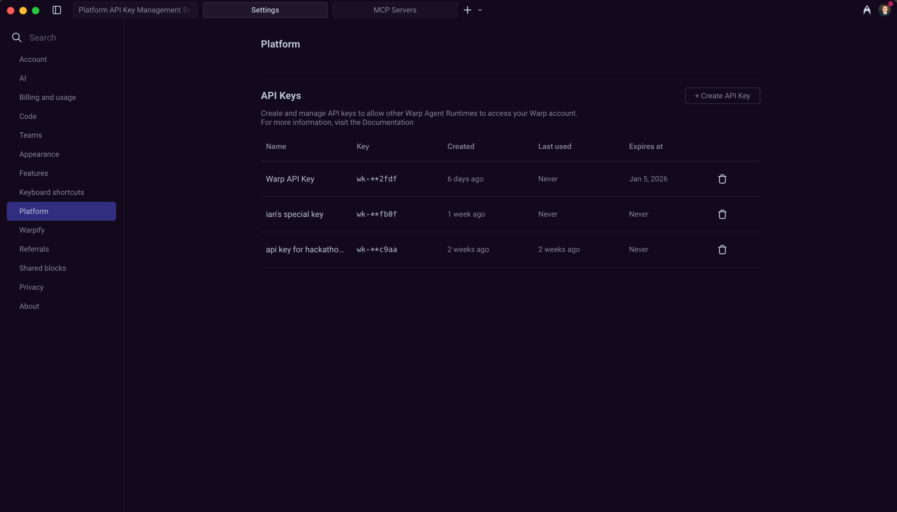

# Warp CLI


The Warp CLI is under development and only supports some operations. \
\
We welcome [feedback](../../support-and-billing/sending-us-feedback.md#sending-warp-feedback) on how you're building with the CLI and on any missing functionality!


## What is the Warp CLI?

The Warp CLI is the command-line tool that lets you run [Ambient Agents](../../ambient-agents/ambient-agents-overview.md) from anywhere, including terminals, scripts, automated systems, or services.&#x20;

It’s the standard runtime entry point that turns a **prompt** plus **configuration** into an **executable agent task** that runs on either a **Warp-hosted or self-hosted runner**.&#x20;

With the Warp CLI, you can:

* Run agents locally for development and debugging
* Run agents on remote machines
* Connect agents to MCP servers like GitHub and Linear
* Configure integrations that connect agents to Slack, Linear, and other trigger surfaces

## Quickstart Guide

Set up and run your first ambient agent in less than 5 minutes.

### 1. Installing the CLI

If you already have the [Warp desktop app installed](../../getting-started/quickstart-guide/installation-and-setup.md), the **CLI is included** and available in the Warp terminal.&#x20;

If not, see [Installing the CLI](./#id-1.-installing-the-cli) for installation options for all platforms.

### 2. Authenticate

For local development and first-time setup, authenticate interactively using the `warp login` command. Replace `warp` with the appropriate command name based on your installation method. For command names, refer to the table in [Running the CLI](./#running-the-cli).

**For example, on macOS:**

```sh
warp login
```

This command prints a sign-in URL in your terminal. Open the URL in your browser to login to Warp. Your credentials will be stored securely for future CLI use.

Interactive login works on both **local** and **remote** machines, and does not require API keys.

### 3. Run an agent

From any directory, run:

```sh
warp agent run --prompt "summarize this directory"
```

This uses the default agent profile, loads any available MCP servers, and executes the run locally. The output appears directly in your terminal.

What happens:

* Warp starts a new Ambient Agent session.
* The agent is given access to your current working directory.
* The agent autonomously executes commands and streams output to your terminal.

### 4. Add GitHub context (optional)

If the directory is a Git repository, the Warp CLI can use GitHub as an MCP server:

```sh
warp mcp add github
warp agent run --prompt "Open a pull request that fixes TODOs in this repo"
```

You'll be prompted to authorize the Warp GitHub App if you haven't already.

### 5. Next steps

Once you've successfully set up and ran your agent, explore other configurations and workflows with the Warp CLI:

* Customize behavior with [agent profiles.](./#using-agent-profiles)
* [Reuse prompts](./#using-saved-prompts) with `--saved-prompt`.
* Connect agents to external systems [using MCP servers](./#using-mcp-servers).
* Authenticate with [API keys](./#api-key-authentication) for automated environments or workflows.
* Get up-to-date information about the Warp CLI using the [`help` command.](./#getting-help)

Continue reading to learn how to install the CLI on different platforms, authenticate in different environments, and configure agents for real-world workflows.

***

## Installing the CLI

You can install the Warp CLI as part of the Warp desktop app, or as a standalone package.&#x20;

### Bundled with Warp

The Warp CLI is automatically distributed with the Warp desktop app and can be used right away with the Warp terminal. To make the CLI globally available, add it your `PATH`.



To add the Warp CLI to your `PATH`,:

1. Open the [Command Palette](../../terminal/command-palette.md) (`CMD+P` )&#x20;
2. In the search field, find and select the `Install Warp CLI Command` action.&#x20;


**Note:** Administrator permissions are required to install the CLI into `/usr/local/bin` .




In the Warp installer, select `Add Warp to PATH`. If you are installing for all users, this will put the CLI on the system path. Otherwise, the CLI is only added to the path for your account.



To run the Warp CLI on Linux, use the same command that you'd use to start Warp normally. If you installed Warp via a package manager, it should already be on the system `PATH`.



### Standalone package

Warp provides standalone packages for the CLI on macOS and Linux, without the Warp app.



On macOS, we recommend that you install and update the standalone CLI with [Homebrew](https://brew.sh/), using the [`warpdotdev/warp` tap](https://github.com/warpdotdev/homebrew-warp):

```sh
$ brew tap warpdotdev/warp
$ brew update
$ brew install --cask warp-cli
```

If you're using Warp Preview, install the preview version of the CLI instead:

```sh
brew install --cask warp-cli@preview
```

To install Warp Preview, use `brew install --cask warp-cli@preview`.

***

You can also download the CLI directly from these URLs:

* [Apple Silicon](https://app.warp.dev/download/cli?os=macos\&package=tar\&arch=aarch64)
* [Intel](https://app.warp.dev/download/cli?os=macos\&package=tar\&arch=x86_64)
* [Apple Silicon, Warp Preview](https://app.warp.dev/download/cli?os=macos\&channel=preview\&package=tar\&arch=aarch64)
* [Intel, Warp Preview](https://app.warp.dev/download/cli?os=macos\&channel=preview\&package=tar\&arch=x86_64)


**Note:** These builds do not auto-update.




On Linux, we recommend that you install and update the standalone CLI through your distribution's package manager. We support `apt`, `yum`, and `pacman`.

1. Add the Warp package repository for your distribution (see the [installation instructions](../../getting-started/quickstart-guide/installation-and-setup.md)).&#x20;
2. Install either the stable or Preview package (replace `apt` with `yum` or `pacman` as needed):

```sh
# Stable
sudo apt install warp-cli

# Preview (beta/early-access)
sudo apt install warp-cli-preview

```

***

You can also install the CLI by downloading a package directly. These installers automatically add the Warp repository, so future updates come through your package manager:

* x86-64: [`.deb`](https://app.warp.dev/download/cli?os=linux\&package=deb\&arch=x86_64), [`.rpm`](https://app.warp.dev/download/cli?os=linux\&package=rpm\&arch=x86_64), [pacman](https://app.warp.dev/download/cli?os=linux\&package=pacman\&arch=x86_64)
* aarch64: [`.deb`](https://app.warp.dev/download/cli?os=linux\&package=deb\&arch=aarch64), [`.rpm`](https://app.warp.dev/download/cli?os=linux\&package=rpm\&arch=aarch64), [pacman](https://app.warp.dev/download/cli?os=linux\&package=pacman\&arch=aarch64)



## Running the CLI

The command to run the Warp CLI depends on your OS, whether you installed the CLI as part of Warp or as a standalone package, and whether you're using the stable build or [Warp Preview](../../community/warp-preview-and-alpha-program.md).

| OS      | Installation Method | CLI Command     | CLI Command (Preview)   |
| ------- | ------------------- | --------------- | ----------------------- |
| macOS   | Standalone          | `warp`          | `warp-preview`          |
| macOS   | Bundled             | `warp`          | `warp-preview`          |
| Linux   | Standalone          | `warp-cli`      | `warp-cli-preview`      |
| Linux   | Bundled             | `warp-terminal` | `warp-terminal-preview` |
| Windows | Bundled             | `warp`          | `warp-preview`          |

## Logging in

The Warp CLI supports two authentication methods, depending on where and how you’re running agents.

* **Interactive login —** best for local machines where you have Warp installed and can authenticate through a browser.
* **API keys** — best for automated or remote environments that need to authenticate without human interaction.

### Interactive login (local machines)

Use interactive login when you’re working on a machine where you already use the Warp app, or when you can open a browser to complete authentication.

If you use the CLI on a host where you're already signed in to Warp, it automatically reuses your existing credentials.

To authenticate interactively:

```bash
warp login
```

Replace `warp` with the appropriate command name for your installation method according ot the table in [Running the CLI](./#running-the-cli).

The CLI prints out a URL that you can open in any browser to login to Warp.

### API key authentication

Use an API key when the environment must authenticate on its own, such as CI pipelines, headless servers, VMs, Codespaces, or containers. API keys let the CLI authenticate non-interactively.

#### Generating API keys

You can create an API key from your settings in Warp:

1. Click your profile photo in the top-right corner, then click **Settings.**&#x20;
2. In the sidebar, click **Platform**.
3. In the API Keys section, click **+ Create API Key.**
4. Name the key and choose an expiration.
5. Click **Create key**.

<figure><figcaption><p>API key management interface in Warp settings</p></figcaption></figure>

#### Authenticating with API keys

You can authenticate with an API key in the CLI using either an environment variable or command flag. We recommend environment variables for security and easier reuse across multiple commands.

**Via environment variable (recommended):**

```sh
$ export WARP_API_KEY="wk-xxx..."
$ warp agent run --prompt "analyze this codebase"
```

**Via command flag:**

```sh
$ warp agent run --api-key "wk-xxx..." --prompt "analyze this codebase"
```

***

## Running agents

The Warp CLI offers two ways to run agents, depending on where you want the work to happen:

**Use `warp agent run` when:**

* You're developing locally and want immediate feedback
* You need the agent to work with files in your current directory
* You want to inspect and modify the agent's work in real time
* You're debugging or iterating on prompts

**Use `warp agent run-ambient` when:**

* You want the agent to run on a remote machine or standardized environment
* You're triggering agent work from CI/CD or automated systems
* You need the agent to run independently of your local session
* You're delegating work that doesn't require your immediate attention

### Running locally: \`warp agent run\`

To start a Warp agent, use the `warp agent run` subcommand. You'll need to specify a prompt and, optionally, the [MCP servers](../../knowledge-and-collaboration/mcp.md) and [agent profile](../../agents/using-agents/agent-profiles-permissions.md) to use.

```sh
warp agent run --prompt "set up a new Rust crate named warp-cli"
I'll run a few terminal commands to:
- Check if this is a Git repo and Cargo workspace
- Create a new binary crate named warp-cli
```

**Key flags:**

* `--cwd <PATH>` — run from a different directory.
* `--share` — share the session with teammates (see [#collaboration](./#collaboration "mention")).
* `--profile <ID>` — use a specific agent profile (see [#using-agent-profiles](./#using-agent-profiles "mention")).

The agent will automatically carry out the task you gave it, printing out tool calls and responses as it works.&#x20;

By default, the agent runs in your current working directory. To run from a different directory, use the `-C/--cwd` flag.&#x20;

### Running agents remotely: \`warp agent run-ambient\`

Ambient runs dispatch tasks to remote environments. Use ambient runs for:

* Background processing
* Standardized team configurations
* Remote execution on servers you don't directly access

```sh
warp agent run-ambient \
  --environment SVhg783GBFQHk1OfdPfFU9 \
  --name "Repo summary" \
  --prompt "Summarize this repo and list the top 5 risky areas" \
  --open
```

**Key flags**

* `--environment <ENVIRONMENT_ID> (-e)` — select the environment to run in (this is the main knob that makes the run “ambient”).
* `--open` — view the agent’s session in Warp once it’s available.
* `--name <NAME>` — name the task (useful for identifying it later).
* `--profile <PROFILE_ID>` — select an execution profile (defaults if omitted).
* `--mcp <SPEC>` — start one or more MCP servers before execution (UUID, JSON file path, or inline JSON).

**Key differences from `run`**

* No `--cwd` — the environment determines the working directory.
* No `--share` — sharing options are on `run`, not `run-ambient.`

**When ambient runs fail**

* Verify your environment has the correct repository and context.
* Check that your profile allows the commands and MCP servers needed.
* Ensure environment variables are set in the environment, not your local shell.

#### Reusing saved prompts <a href="#reusing-saved-prompts" id="reusing-saved-prompts"></a>

When you find prompts that work well, save them in [Warp Drive](../../knowledge-and-collaboration/warp-drive/) to reuse across sessions, share with teammates, and integrate into automated workflows. For more information, see [prompts.md](../../knowledge-and-collaboration/warp-drive/prompts.md "mention").

To reuse a prompt, first find its ID. The ID of a saved prompt will be the last part of its Warp Drive [URL](https://docs.warp.dev/knowledge-and-collaboration/warp-drive#sharing-a-drive-object-using-links).&#x20;

For example, in the URL:

```
https://staging.warp.dev/drive/prompt/Fix-compiler-error-sgNpbUgDkmp2IImUVDc8kR
```

... the ID is `sgNpbUgDkmp2IImUVDc8kR`.

You can reference [saved prompts](https://docs.warp.dev/knowledge-and-collaboration/warp-drive/prompts) using the `--saved-prompt` flag:

```bash
$ warp agent run --saved-prompt sgNpbUgDkmp2IImUVDc8kR
...
```

#### Referencing Warp Drive objects <a href="#referencing-warp-drive-objects" id="referencing-warp-drive-objects"></a>

Use `<workflow:id>`, `<notebook:id>`, or `<rule:id>` in prompts to reference [Warp Drive objects](https://docs.warp.dev/knowledge-and-collaboration/warp-drive) and [rules](https://docs.warp.dev/knowledge-and-collaboration/rules) as attached context. To quickly create these references, use the [@ context menu](https://docs.warp.dev/agents/using-agents/agent-context/using-to-add-context) in Warp to construct a prompt, and then copy it into your CLI command.

```
$ warp agent run --prompt "Follow the instructions in <notebook:gq1CMAUWLtaL1CpEoTDQ3y>"
...
```

## Using agent profiles

Agent profiles control three things:

* **What the agent can do** — file access, command execution, and MCP server usage.
* **How the agent works** — Model selection, autonomy level, and response style.
* **Where the agent can act** — Directory allowlists/denylists.

You can create and configure agent profiles in the Warp app. For detailed instructions, see [agent-profiles-permissions.md](../../agents/using-agents/agent-profiles-permissions.md "mention").&#x20;

Agent profiles are automatically synced to each host that you have Warp installed on, so you can still use them remotely.


**Tip**: For CLI usage, create a dedicated profile. The CLI will fail if it tries to execute a prohibited action, so make sure your profile allows the directories, commands, and MCP servers that you'd like the agent to use.



The default profile for CLI usage is broadly permissive and gives the agent the ability to read/write files, apply code diffs, and execute commands (with a default denylist). The agent does not have the ability to use MCP servers by default.


To use an agent profile with the CLI, first find the profile ID using the `warp agent profile list` command:

```sh
$ warp agent profile list
+--------------+------------------------+
| Name         | ID                     |
+=======================================+
| Default      | AnTb02PZfrkVC9l4V15eH1 |
|--------------+------------------------|
| Coding       | CWhozDJPdPCsjJ1pSG0HCN |
|--------------+------------------------|
| Command Line | hV6n5dNm7ThQVlOiPF8DLS |
+--------------+------------------------+
```

Then, select that profile using the `--profile` flag:

```sh
$ warp agent run --profile CWhozDJPdPCsjJ1pSG0HCN --prompt "update my CI pipeline to use nextest"
...
```

## Using MCP servers

MCP servers connect Ambient Agents interact with external systems like GitHub, Linear, or Sentry. To use an [mcp.md](../../knowledge-and-collaboration/mcp.md "mention")server from the CLI, you need:

* An MCP server configured in Warp
* An agent profile that allows for the MCP server you want to use
* Environment variables for authentication (if required)

There are two ways to start MCP servers with the agent:

1. If the selected agent profile allows _specific_ MCP servers, they will start automatically.
2. If the selected agent profile allows _any_ MCP server, you must specify the ones to start using the `--mcp-server` flag.

To start specific MCP servers, first get the MCP server ID using  `warp mcp list`:

```sh
$ warp mcp list
+--------------------------------------+--------+
| UUID                                 | Name   |
+===============================================+
| 1deb1b14-b6e5-4996-ae99-233b7555d2d0 | github |
|--------------------------------------+--------|
| 65450c32-9eb1-4c57-8804-0861737acbc4 | linear |
|--------------------------------------+--------|
| d94ade64-0e73-47a6-b3ee-14e5afec3d90 | Sentry |
+--------------------------------------+--------+
```

Alternatively, you can copy the server ID from the MCP servers page in Warp:

1. Click your profile photo in the top-right corner, then click **Settings.**&#x20;
2. In the sidebar, click **MCP Servers**.

<figure><figcaption><p>MCP servers page, showing a server with its UUID</p></figcaption></figure>

Next, use `--mcp-server` to start the server:

```sh
$ warp agent run --mcp-server "1deb1b14-b6e5-4996-ae99-233b7555d2d0" --prompt "who last updated the README?"
...
```

### Environment variables and remote execution

While Warp syncs MCP server configuration between hosts, it **does not** sync environment variables. When running on remote machines, you must set any required auth tokens:

```sh
export MY_MCP_SERVER_ACCESS_TOKEN="..."
$ warp agent run --mcp-server "904a8936-fa82-4571-b1d6-166c26197981" --prompt "use my MCP server to check for errors"
...
```


Tip: consider using a password or secret manager CLI, such as [`op`](https://developer.1password.com/docs/cli/get-started/), [`pass`](https://www.passwordstore.org/), or [`gcloud secrets versions access`](https://cloud.google.com/secret-manager/docs/create-secret-quickstart#secretmanager-quickstart-gcloud) to fetch MCP secrets on remote hosts.


## Collaboration

In addition to text-based output, the CLI can share the agent's session for you to access on other devices or in a browser. To enable [agent-session-sharing.md](../../knowledge-and-collaboration/session-sharing/agent-session-sharing.md "mention"), use the `--share` flag.&#x20;

By default, the session is only accessible to the user running the CLI, but you can also share with [teams.md](../../knowledge-and-collaboration/teams.md "mention") or other Warp users:

```sh
# Share the agent's session with yourself:
$ warp agent run --share --prompt "fix the compiler error"

# Give specific users view-only access to a session:
$ warp agent run --share firstuser@example.com --share otheruser@example.com --prompt "fix the compiler error"

# Let any user on your team edit the session:
$ warp agent run --share team:edit --prompt "fix the compiler error"
```

The `--share` flag can be repeated, and uses the following syntax:

* `--share user@email.com` or `--share user@email.com:view`i — gives specified user read-only access to the session.&#x20;
* `--share user@email.com:edit` — gives specified user `user@email.com` read/write access to the session.
* `--share team` or `--share team:view` — gives all members of your team read-only access to the session.
* `--share team:edit` — gives all members of your team read/write access to the session.

## Troubleshooting and help

The CLI includes built-in documentation for all commands:

```bash
# See all available commands
warp help

# Get details on a specific command
warp help agent run

# Explore MCP-related commands
warp help mcp
```

### Common errors

**Command not found / CLI not installed correctly**\
Verify your installation path and confirm the CLI version:

```bash
warp --version
```

**Authentication issues**

* Interactive login: ensure you’ve completed the browser-based flow with `warp login`.
* API keys: confirm the key is valid, not expired, and exported correctly (`echo $WARP_API_KEY`).

**Agent or MCP errors**\
Ensure your agent profile and [MCP servers](../../ambient-agents/mcp-servers-for-agents.md) are configured properly, with correct permissions.
